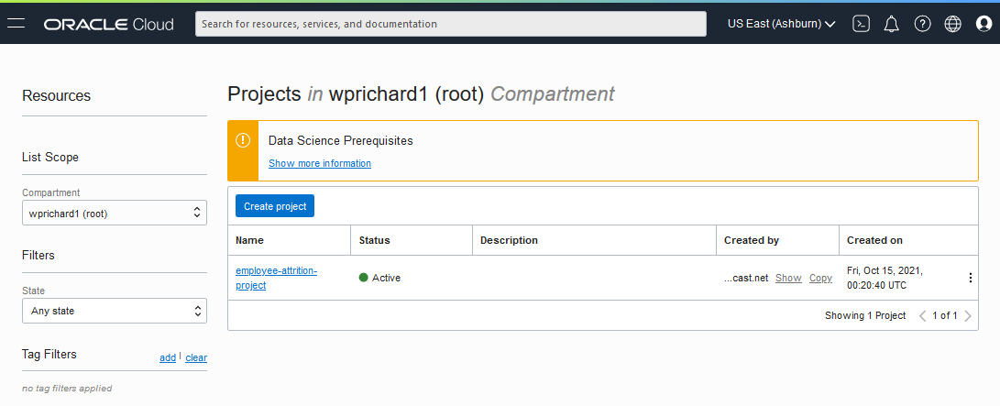
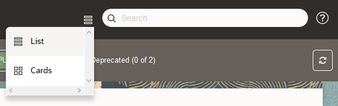
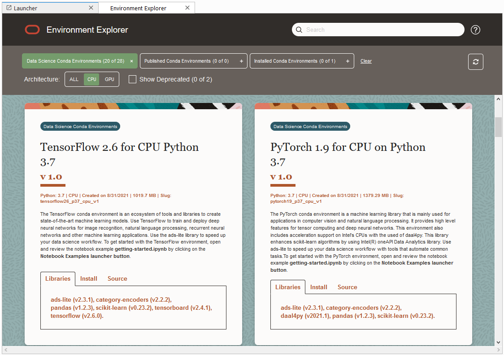
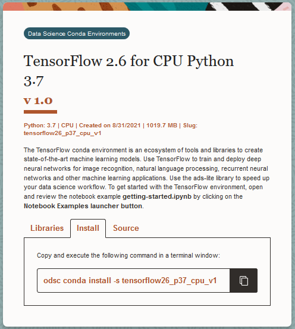
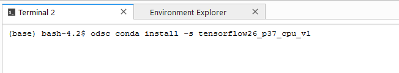
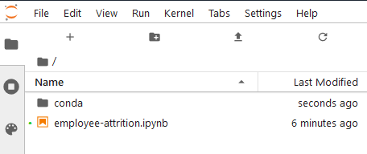
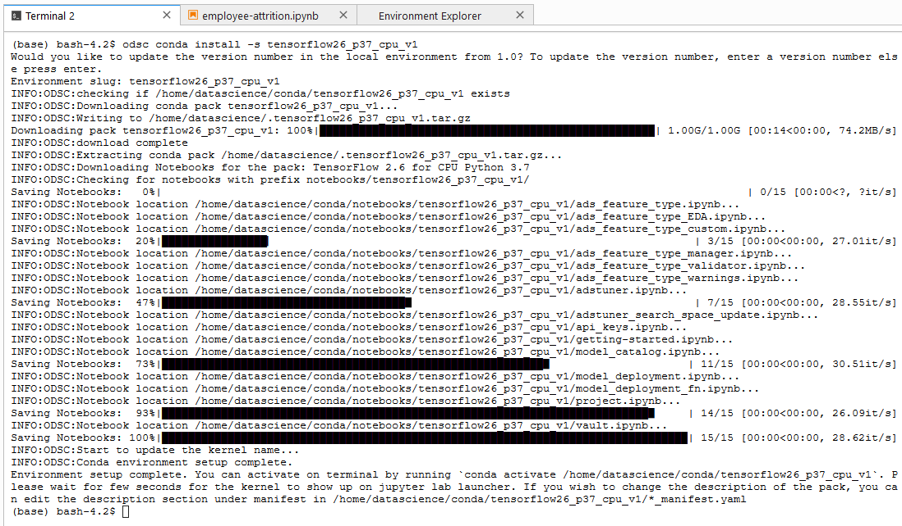
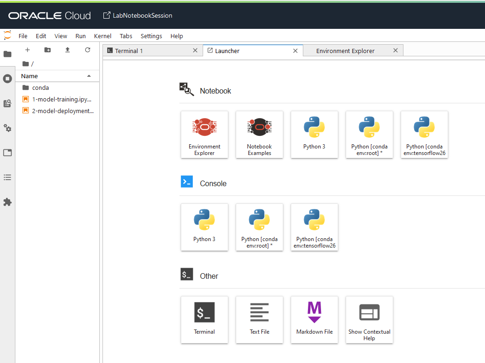
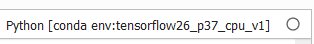

# Lab 3 - Build A Model Using Python

## Introduction

This lab will guide you through a practical example of how to train, evaluate, and catalog a machine learning model. The notebook you will use describes the details of the use case.

Since our notebook session was automatically created by the stack template, we didn't manually create it. Data Science notebook sessions are interactive coding environments for building and training models. Notebook sessions provide access to a JupyterLab environment that is managed by the Data Science service.

A notebook session is associated with a compute instance, VCN, subnet, and block storage. To provide users control over how compute and storage are consumed, the compute shape and the amount of storage are selectable and a notebook session can be deactivated to stop compute usage and reactivated later. A notebook session can be terminated when it is no longer needed.

There are two block storage drives associated with a notebook session. There is a boot volume that is initialized each time the notebook session is activated. Any data on the boot volume is lost when the notebook session is deactivated or terminated. There is an additional block storage unit that is preserved when a notebook session is deactivated, but it is destroyed when a notebook session is terminated. This block volume is represented by the ``/home/datascience`` directory and it is where the JupyterLab notebooks, data files, installed custom software, and other files should be stored.

When a notebook session is created or activated, the compute instance, block storage, VCN, and subnet are provisioned and configured. These resources can be changed by deactivating a notebook session, then selecting different configuration when activating the notebook session again. The size of the block storage can only be increased.

Estimated lab time: 15 minutes

### Objectives
In this lab you will:
* Learn how to install a conda environment in your notebook session
* Execute Python code in a notebook to explore data, prepare data, train a model, and evaluate the model.
* Store the model in the model catalog

### Prerequisites
* You are signed-in to Oracle Cloud
* You have navigated to Data Science

## **STEP 1:** Open a Project and Notebook Session

1. Confirm you have completed all the prerequisites and are viewing your Data Science project list.

  

1. Click **employee-attrition-project**.

1. Under Resources, click **Notebook Sessions** if it is not already selected.

1. Click on the notebook session named **LabNotebookSession** to open it.

1. Click on **Open**. It will open in a separate browser tab. If prompted to sign-in, provide your Oracle Cloud credentials.

  

1. Ensure you are viewing the browser tab/window displaying *LabNotebookSession*.  

  

  This is JupyterLab. It can be seen that the screen is split into two sections. By default, the left side has the file browser open but it can change based on what navigation icons are selected on the far left side of the screen. The right side of the screen contains the workspace. It will have a notebook, terminal, console, launcher, notebook examples, etc..

  There is a menu across the top of the screen. For this lab, the most interesting menu item is *Run*. It will allow you to execute code cells in the notebook. It is recommended that you manually execute the cells one at a time as you progress through the notebook. It is important that you execute them in order. To do this from the keyboard, press *shift + enter* in a cell and it will execute it and advance to the next cell. Alternatively, you can run all of the cells at once. To do this, click on Run then "Run All".

## **STEP 2:** Install a Conda Environment

A Conda environment is a collection of libraries, programs, components and metadata. It defines a reproducible set of libraries that are used with notebook session, model deployments, and jobs. The Data Science Conda environments included with the service also include many sample notebooks. The following instructions will guide you through installing a Conda that works with the prepared notebook.

  1. In the *Launcher* tab, click **Environment Explorer**.
    

  1. There is an icon next to the search bar to change the user interface from a list to cards. Switch to **Cards**.
    

  1. In the *Environment Explorer* tab, select the **Data Science Conda Environment** filter button, select **CPU** architecture filter, then scroll down until you find the **Tensor Flow 2.6 for CPU Python 3.7** conda. (If you see no results, use the refresh button on the right side of the filter bar of the Environment Explorer.)
    

  1. Select the **Install** tab and then click the **copy** button to copy the installation command.
    

  1. Go back to the *Launcher* tab and select **Terminal** to open a terminal window.

  1. Paste the command into the terminal window and hit **Return** to execute it. (The command that you previously copied is `odsc conda install -s tensorflow26_p37_cpu_v1 `)
    

  1. You will receive a prompt related to what version number you want. Press `Enter` to select the default.

  It takes about 3-5 minutes for the conda package to be installed. You can continue with the next step while you're waiting for the installation to be completed.

## **STEP 3:** Download the notebooks
Notebooks have been prepared containing all the necessary Python code to explore the data, train the model, evaluate the model, and store it in the model catalog.

  1. The files needed for this workshop are located in the **oci-data-science-ai-samples** public repository on Github. Open this [Github link](https://github.com/oracle/oci-data-science-ai-samples/archive/refs/heads/master.zip) to download a zip of the repository and save it to your local machine.

  1. Unzip the repository and find `oci-data-science-ai-samples-dsgo.zip\oci-data-science-ai-samples-master\labs\DSGo-Oct2021\notebooks\`

  1. Drag and drop the downloaded `1-model-training.ipynb` and `2-model-deployment.ipynb` from your computer's file explorer into your notebook session's root folder. You might need to unzip the repository to your local machine first.
  

  1. Before proceeding, confirm that your conda installation (from the previous step) is complete. Switch back to the terminal tab in the notebook session and confirm that your conda is now installed.
  

  1. You can also confirm it is installed by opening a Launcher tab. Go to menu bar and select File > New Launcher. On the Launcher tab you should now see a button for `Python [conda env:tensorflow26_p37_cpu_v1]`
  

## **STEP 4:** Open the Notebook
You will open a notebook and step through it.

  1. In the notebook session's file browser, open notebook **1-model-training.ipynb**

  1. Select the file browser on the left side of the user interface if it is not already visible. Double-click on **1-model-training.ipynb**. A new tab opens in the workspace on the right.

  1. Notice in the upper right corner of the notebook tab, it displays the name of the conda environment being used by this notebook. Ensure it lists the `Python [conda env:tensorflow26_p37_cpu_v1]` conda you installed. If not, you can click on the name of the conda to switch it to the right one.   

  1. Now you will work in the notebook. Scroll through each cell and read the explanations. When you encounter a `code` cell, execute it (using **shift + enter**) and view the results. For executable cells, the "\[ ]" changes to a "[\*]" while executing, then a number "[1]" when complete. Wait for execution to be completed before moving on to the next one. Continue to the end of the notebook.

  (If you run short on time, you can use the *Run* menu to run the remaining cells and the review the results.)

**You may proceed to the next lab.**
