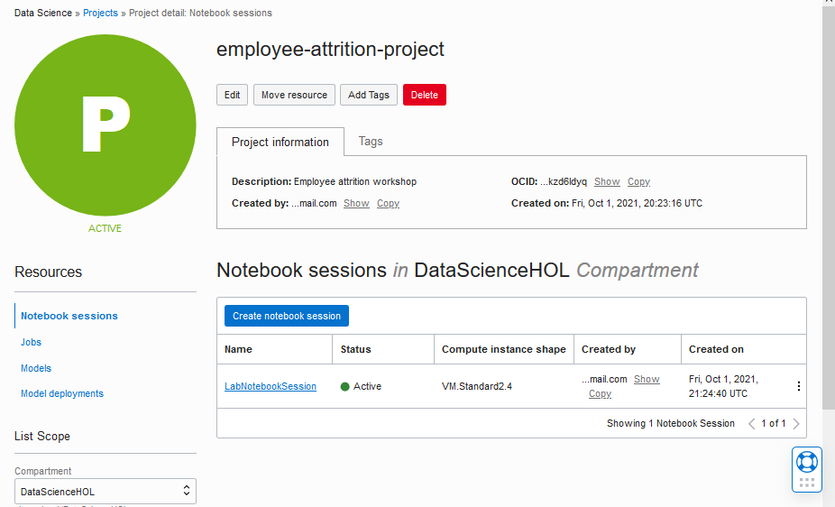
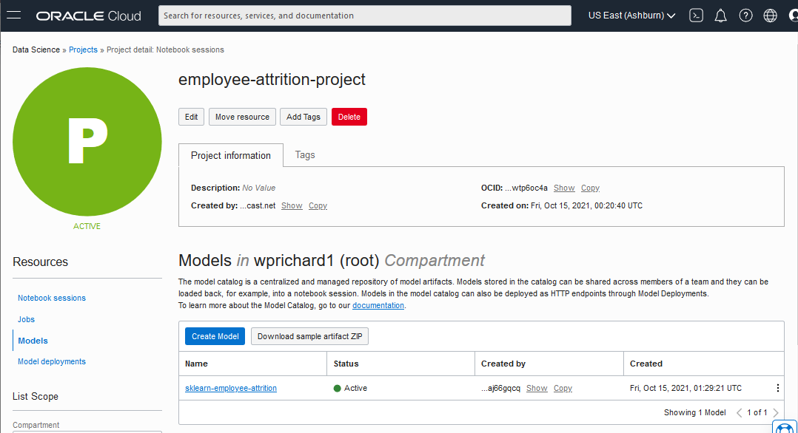
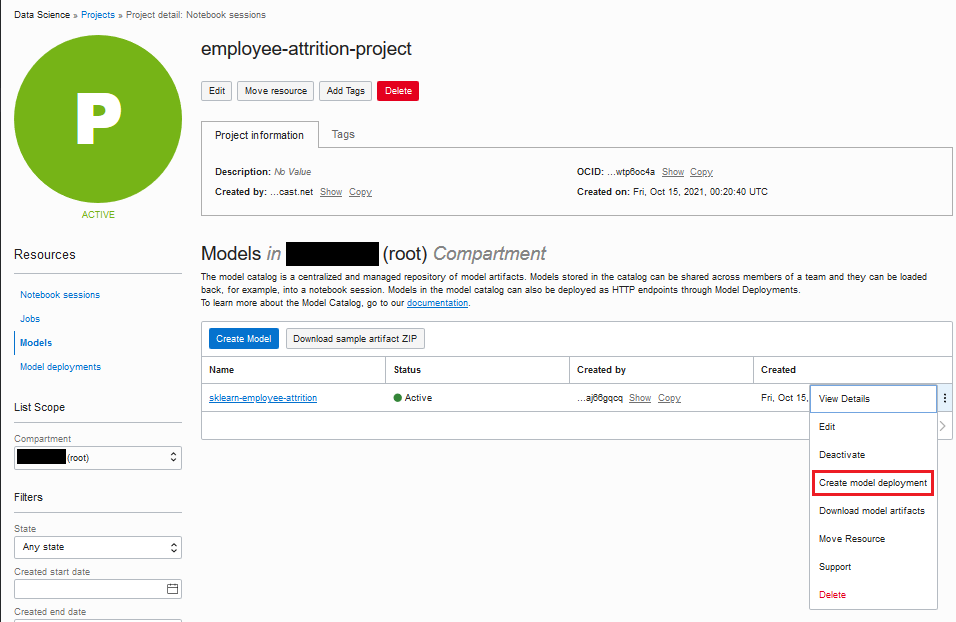
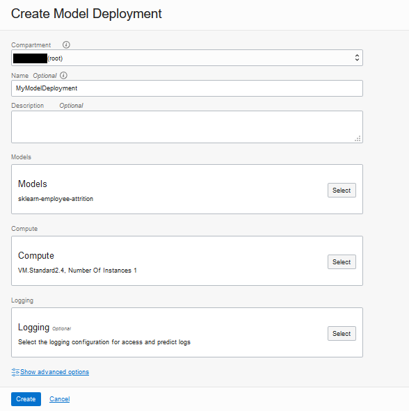
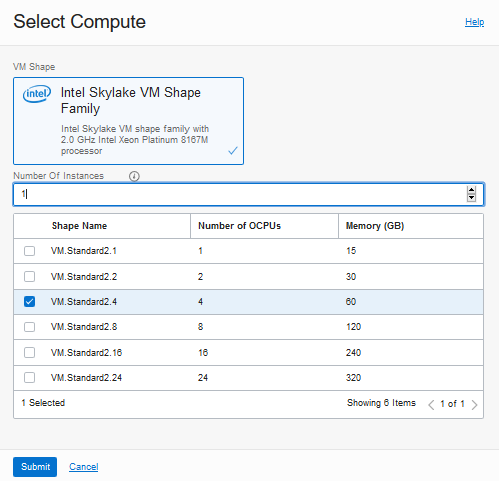
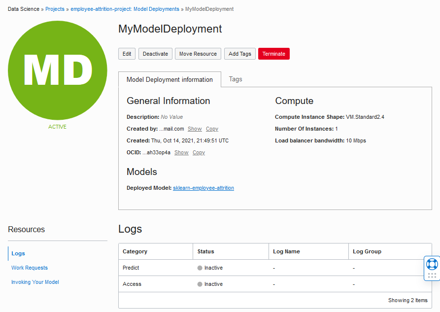
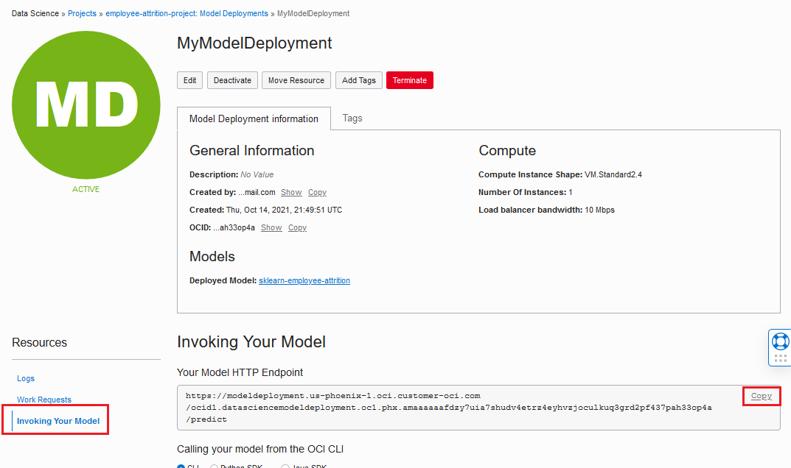
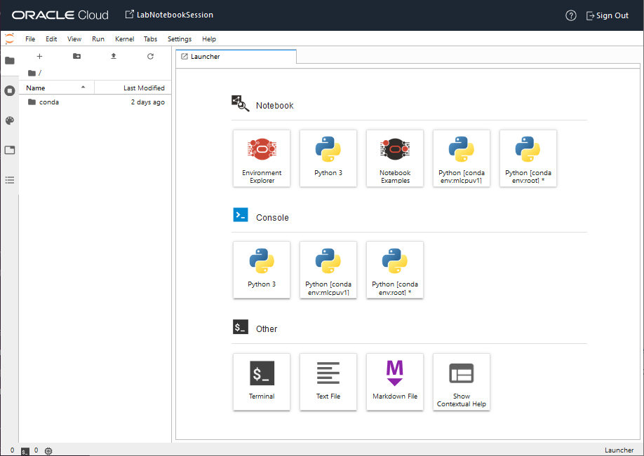

# Lab 4 - Deploy A Model and Invoke It

## Introduction

This lab will guide you through deploying a cataloged model from the OCI Console and then invoking it.

Estimated lab time: 15 minutes

### Objectives
In this lab you will:
* Learn how to deploy a model from the console
* Invoke the model endpoint

### Prerequisites
* You are signed-in to Oracle Cloud
* You have navigated to Data Science
* You have opened the Data Science project
* You have a notebook session in your project
* You have a model stored in the model catalog

## **STEP 1:** Deploy the model
Now we're going to deploy the model to its own compute instance so that it can be used. This will take the model from the catalog and create a runtime version of it that's ready to receive requests.

1. Confirm you have completed all the prerequisites and are viewing your Data Science project.

    

1. Under *Resources*, select **Models** to see the list of models in your model catalog.

    

1. Find the row containing **sklearn-employee-attrition**. On the right end of the row, click the 3-dot icon to open a pop-up menu.

1. In the pop-up menu, click **Create model deployment**. The *Create Model Deployment* dialog opens.

    

1. In the *Create Model Deployment* dialog, configure the fields as described below.

      
    - Ensure *Compartment* is set to **root**.
    - Enter *Name* as **MyModelDeployment**
    - Ensure *Models* is set to **sklearn-employee-attrition**
    - In the *Compute* box, click **Select**.
    - Enter **1** for *Number of Instances* and check **VM.Standard2.4**. Then click **Submit**.

    

    - (We will not configure Logging in this lab.)

    - Click **Create** in the Create Model deployment dialog. It takes about 10 minutes for the deployment to be provisioned and its status will be *Creating*. Wait for the status to change to *Active* to indicate the model is deployed.

    

    > **Note** - You just deployed the model through the OCI Console, but you can also deploy a model using python code in a notebook. The ADS library provides functions to do this. See [Model Deployment with ADS](https://docs.oracle.com/en-us/iaas/tools/ads-sdk/latest/user_guide/model_deployment/model_deployment.html) for more information.

1. When the model is Active, copy the HTTP endpoint URI to your clipboard (to be used in the next step). To do that look under **Resources** and click **Invoking Your Model**. Your model endpoint is displayed. Use the **Copy** button to copy it to your clipboard.

  

## **STEP 2:** Invoke the deployed model
Now that the model is deployed, we will go back to the notebook and invoke its HTTP endpoint.

1. If your **notebook session tab** in your browser is still open from the previous lab, then view it. Otherwise, follow these steps to return to it.

    - Under Resources, click **Notebook Sessions**.
    - Click on the notebook session named **LabNotebookSession** to open it.
    - Click on **Open**. It will open in a separate browser tab. If prompted to sign-in, provide your Oracle Cloud credentials.  
    

1. Ensure you are viewing the browser tab/window displaying *LabNotebookSession*.   

  

1. Open notebook **2-model-deployment.ipynb**, but don't start stepping through it yet.

1. In the next-to-the-last code block, find the statement:
   > &#35; Replace with the uri of your model deployment:  uri = ''

1. **Paste** your deployed model endpoint URI into the statement between the single quote marks.

1. Execute each code block of the notebook.

1. Review the output and see that your deployed model returned attrition predictions for the submitted input data.

Congratulations! You have successfully built, trained, cataloged, deployed, and invoked a machine learning model with OCI Data Science.

**You may proceed to the next lab.**
