# Lab 0 - Tenancy Setup & Introduction 

Estimated Lab 0 Time: 20 minutes

### Objectives

In this first lab, you will:

* sign up for an Oracle Cloud Free Tier account; 
* setup your tenancy for OCI Data Science using the OCI Resource Manager Stack feature; 
* learn about the concepts and features in OCI Data Science;
* create your first Data Science project. 

## **STEP 1:** Sign up for an Oracle Cloud Free Tier Account 

Sign up [here](https://www.oracle.com/cloud/free/). 

## **STEP 2:** Run the Data Science Stack Template 

We have created a Terraform script that can be executed throught the Resource Manager Stack resource. This Terraform script creates the basic user groups, policies, dynamic groups, networking (VCN and subnets) required to create projects and notebook sessions. The Stack also allows you to optionally launch a notebook session after teh setup is completed. We recommend that you create the notebook session. 

### **STEP 2.1:** Go to Console > Developer Services > Resource Manager > Stacks 

Click on the 3-bar menu in the top left corner of the OCI Console 

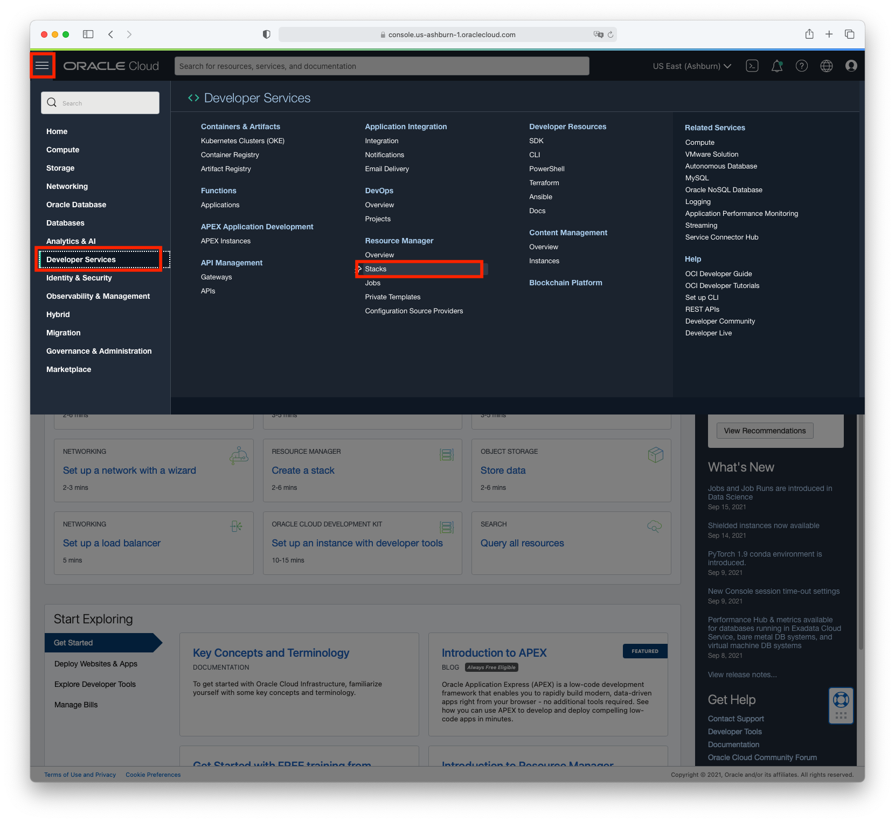


### **STEP 2.2:** Create a New Stack 

* Click on **"Create Stack"**. 

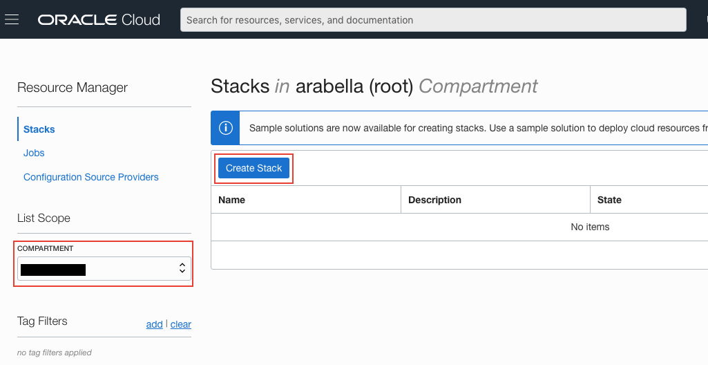

* Select a "Template" as the Origin of the Terraform Configuration. 

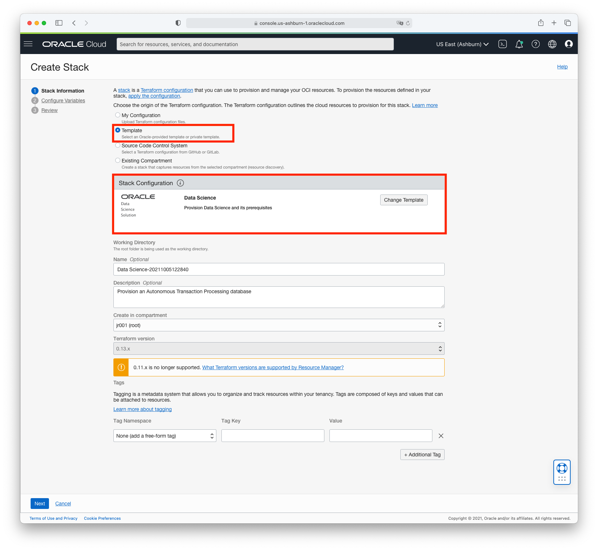

* Select the "Data Science" Template under "Stack Configuration". We also recommend that you execute the stack in the "(root)" compartment. 

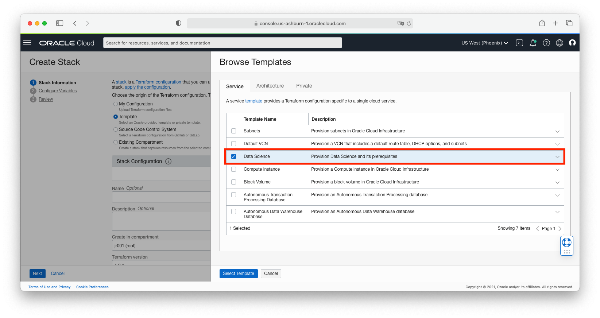

* Click Next. 

### **STEP 2.3:** Edit the Variables 

* Make the following changes to the Variables: 
  - Under "Project and Notebook Configurations", check the box next to "Create a project and notebook session?"
  - Select a VM.Standard2.2 shape for the "Notebook Compute Shape"
* Click on "Next". 

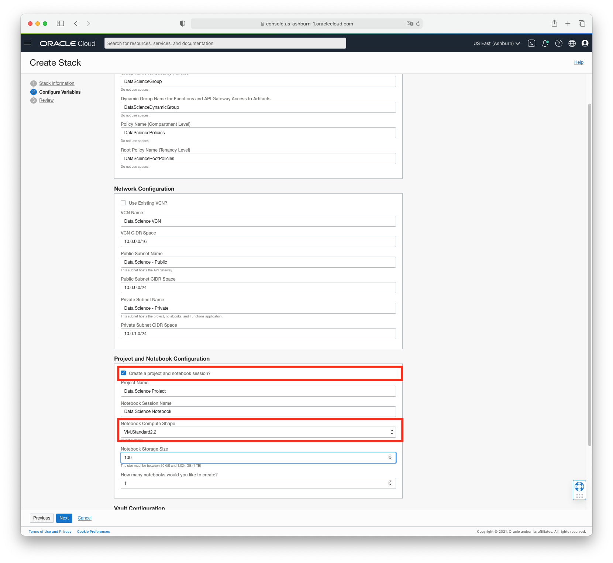

### **STEP 2.4:** Review the Stack 

* Review the stack. You should be ok. Click on "Create"

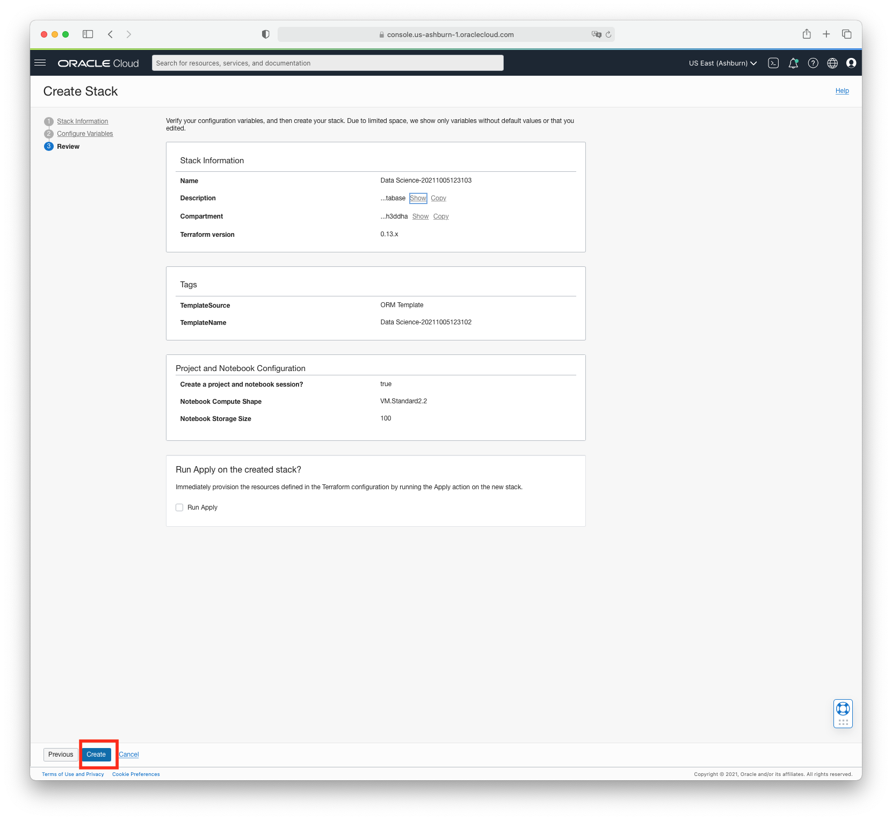 

### **STEP 2.5:** Apply the Stack 

* Click on "Apply". 

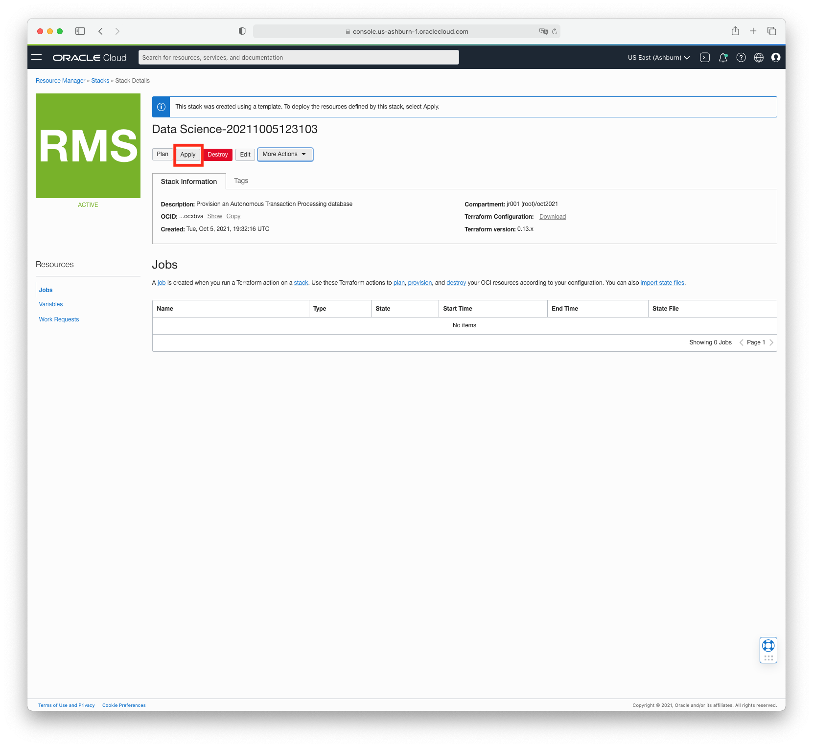

* Click on "Apply" again 

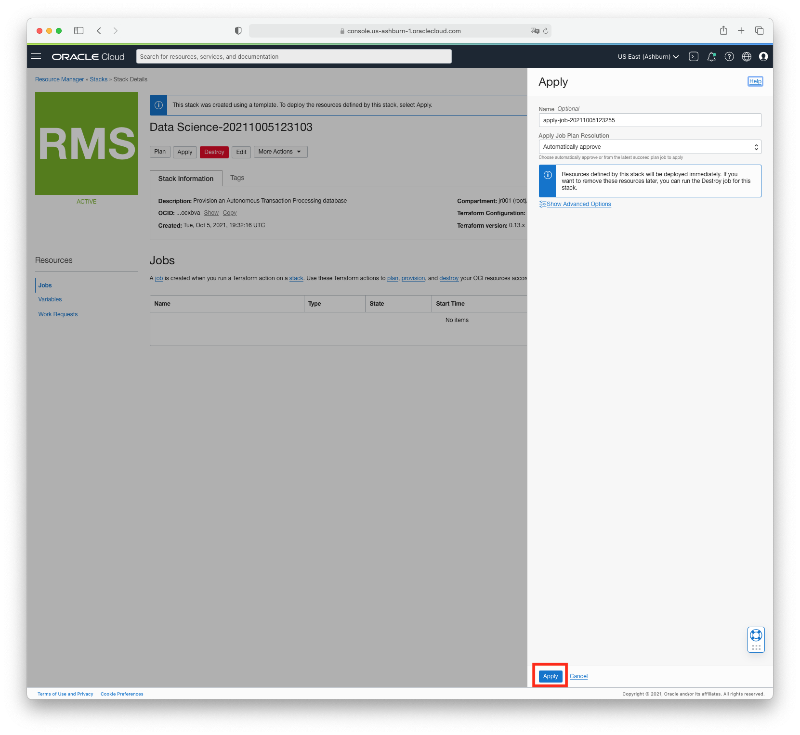

The job should be running. This will take a few minutes to complete. 

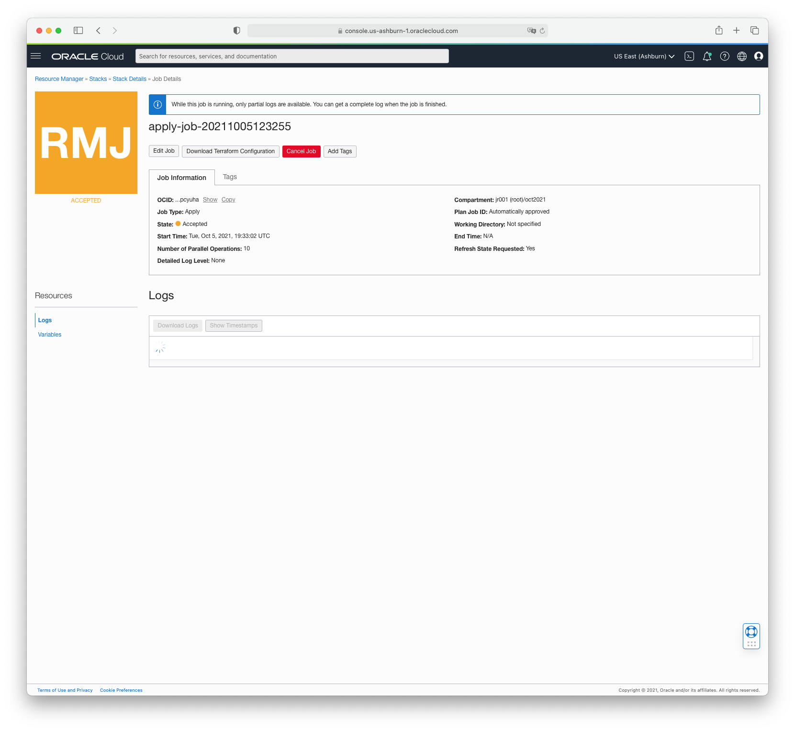

At the end of this process, the Stack creates in your selected compartment (most likely in the root compartment): 
* A **Data Science Project named "Data Science Project"**
* A **Data Science Notebook Session** named **"Data Science Notebook"** in that project

:exclamation: **IF YOU RUN INTO THIS ERROR WHILE RUNNING THE STACK** 
   
```
Error Message: During creation, Terraform expected the resource to reach state(s): ACTIVE, but the service reported unexpected state: FAILED.
```
Do not worry. The notebook creation step failed. You will simply create a notebook manually in the next lab. We are working to solve this issue. 
   
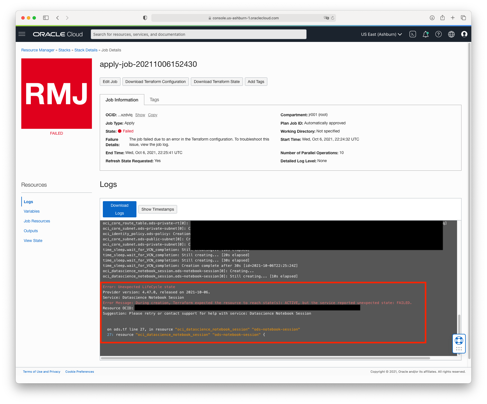


## **STEP 3:** Overview of OCI Data Science Concepts

Review the following concepts and terms to help you get started with the Data Science service.

* **Project**: Projects are collaborative workspaces for organizing and documenting Data Science assets, such as notebook sessions and models. In this workshop, each participant creates their own project.
* **Notebook Session**: Data Science notebook sessions are interactive coding environments for building and training models. Notebook sessions come with many pre-installed open source and Oracle developed machine learning and data science packages. In this workshop, each user has a notebook session containing several notebooks.
* **Accelerated Data Science SDK**: The Oracle Accelerated Data Science (ADS) SDK is a Python library that is included as part of OCI Data Science. ADS has many functions and objects that automate or simplify many of the steps in the data science workflow, including connecting to data, exploring and visualizing data, training a model with AutoML, evaluating models, and explaining models. In addition, ADS provides a simple interface to access the Data Science service's model catalog and other OCI services including Object Storage.
* **Model Catalog**: The model catalog is a place to store, track, share, and manage models.
* **Jobs**: Jobs give the data scientist the ability to execute batch jobs in either an ad hoc way or via a scheduler outside of the notebook session in a separate VM. Jobs can be used to perform batch inference, model training, feature engineering, etc. ADS also provides a rich interface to interact with Jobs.
* **Conda environment**: Condas are collections of specific libraries and other resources that simplify library management. They are used to run notebooks and deployed models.
* **Model Deployment**: This feature allows you to take a model stored in the model catalog and deployed it as an HTTP endpoint for real time inference use cases. 

  

## **STEP 4:** Access to your Data Science Project 


1. The navigation menu is accessed by clicking the 3-bar icon in the upper left corner of the page. Click the **Navigation Menu icon** in the upper left, select **Analytics & AI** from the menu, then select **Data Science** under "Machine Learning"
  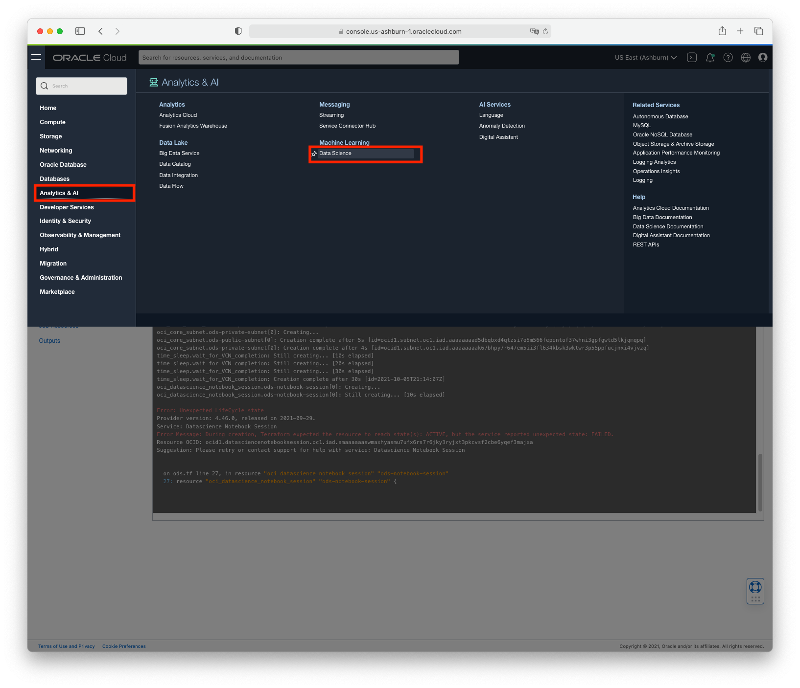

1. You should now be viewing the Data Science projects page. In this step you will familiarize yourself with the page. This lists projects that have been created in the selected compartment. Compartments allow resources to be grouped and isolated for access control and management. The list of projects can also be filtered by state and/or by tags.
  

1. For this lab, the Resource Manager Stack created the project and notebook session in the root compartment of your tenancy.
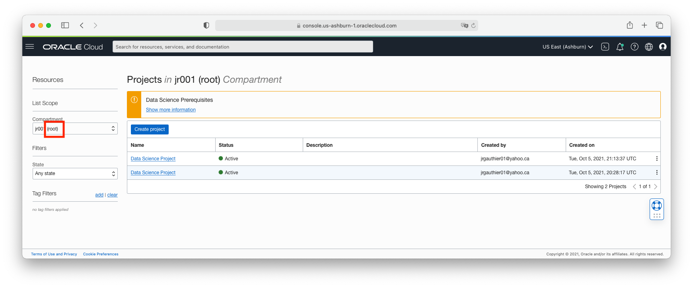

1. (Optional) You can create a new project if you want to try it out. Give it a different name from the default one that was create by the Resource Manager Stack. 
  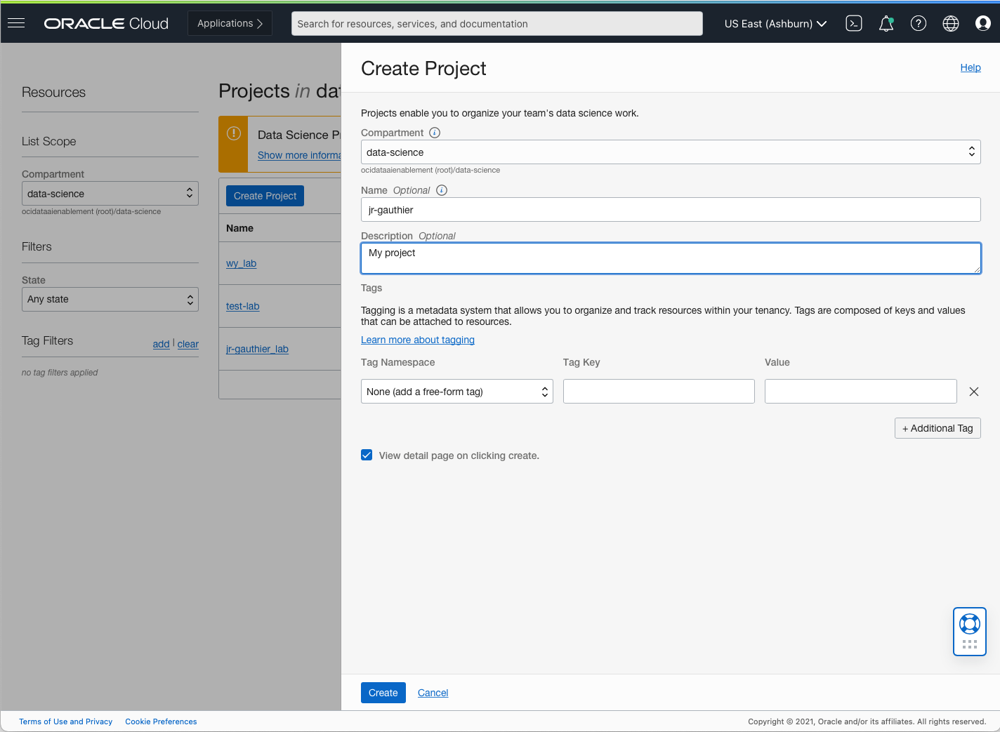

1. The project page lists project information along with resources contained in the project such as **notebook sessions**, **models**, **jobs**, and **model deployments**. We'll work with all of these throughout this Lab. 

1. Click on the project "Data Science Project" that the Resource Manager Stack created on your behalf. Now, under *Resources*, select *Notebook Sessions*.

1. In the next lab you will create a notebook session.

**You are now ready to proceed to the next lab.**


---
# Appendix - Manual Tenancy Setup 

## Create User Group
1. go to Identity & Security > Groups

1. Create a user group called DataScienceGroup 

1. Add users to the group. If this is your personal free tier tenancy, you are most likely an administrator (and you can do everything in your tenancy) so this group doesn’t matter


## Create Dynamic Group

1. Go to Identity & Security > Dynamic Groups 

1. Click on Create Dynamic Group 

1. Give the name “DataScienceDynamicGroup” 

1. Add the matching rule:
``` 
ALL {resource.type='datasciencenotebooksession',resource.compartment.id=‘<replace-with-your-compartment-ocid>’}
```
Replace with the OCID of the compartment where you will create your notebook session. Go to Identity > Compartments to create or find a compartment and retrieve the OCID value. 


## Create Policies

1. Go to Identity & Security > Policies 

1. Create a policy.

1. Include the following statements: 
```
Allow group DataScienceGroup to manage data-science-family in tenancy
Allow group DataScienceGroup to use virtual-network-family in tenancy
Allow service datascience to use virtual-network-family in tenancy
Allow dynamic-group DataScienceDynamicGroup to use virtual-network-family in tenancy
Allow dynamic-group DataScienceDynamicGroup to manage data-science-family in tenancy
```

## Create VCN + Subnet 

1. Go to Networking > Virtual Cloud Networks

1. Click on  Start VCN Wizard 

1. Select “Create VCN with Internet Connectivity". Follow the steps. 
