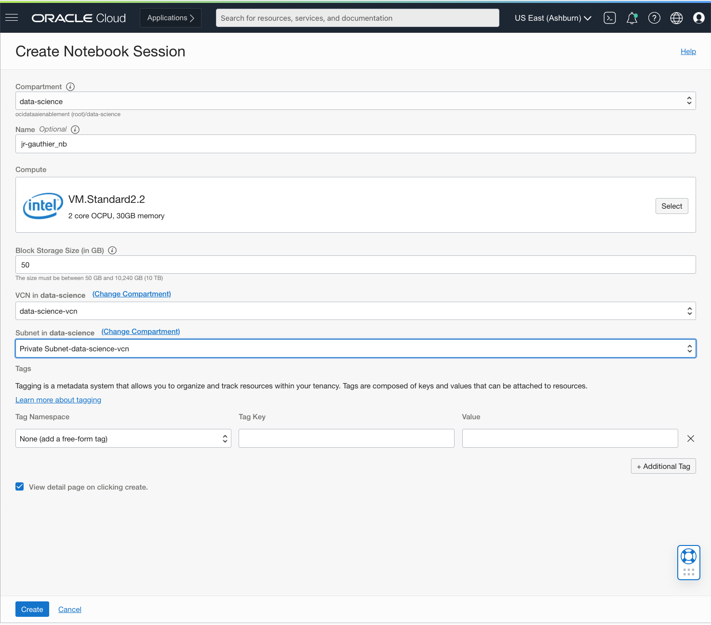
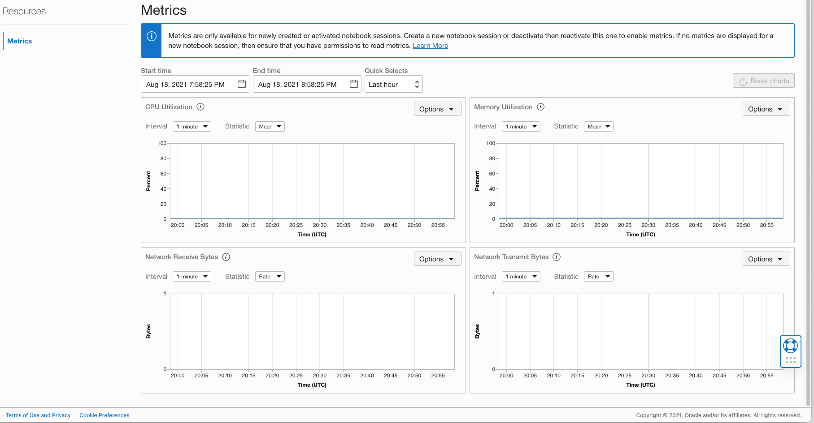
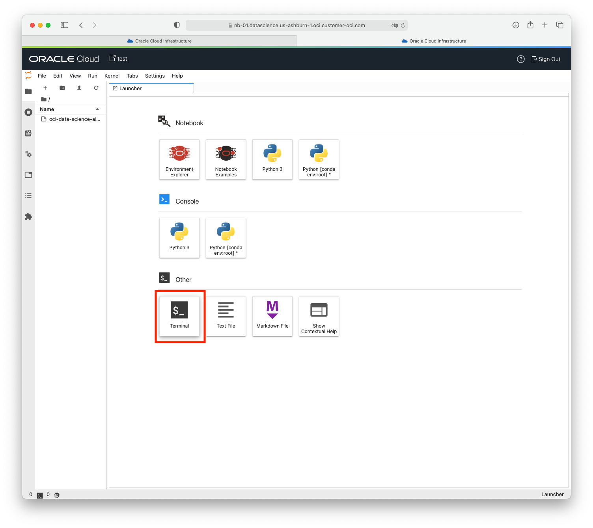

# Lab 1 - Create a Notebook Session and Copy the Repository

## Introduction

Data Science notebook sessions are interactive coding environments for building and training models. Notebook sessions provide access to a JupyterLab environment that is managed by the Data Science service. As of October 2021, OCI Data Science supports **JupyterLab version 2.2.6.**

A notebook session is associated with a virtual machine (VM) shape, a [block volume](https://docs.oracle.com/en-us/iaas/Content/Block/Concepts/overview.htm) and a VCN+subnet configuration.
Data scientists can choose the VM shape they want to run their notebook session in, they can also select the amount of storage they want to assign to their notebook session (between 50Gb and 10Tb). In addition, egress traffic from the notebook session is routed through the VCN/subnet selection made by the data scientist. This gives users flexibility to configure the network they want to access to and from a notebook session.

### Block Volumes

There are two block volume drives associated with a notebook session. There is a boot volume that is initialized each time the notebook session is activated. Any data on the boot volume is lost when the notebook session is deactivated or terminated. There is an additional block storage unit that is preserved when a notebook session is deactivated, but it is destroyed when a notebook session is terminated. This block volume is represented by the ``/home/datascience`` directory and it is where the JupyterLab notebooks, data files, installed custom software, and other files should be stored.

When a notebook session is created or activated, the compute instance, block storage, VCN, and subnet are provisioned and configured. These resources can be changed by deactivating a notebook session, then selecting different configuration when activating the notebook session again. **The size of the block storage can only be increased.**

### Activating and Deactivating Notebooks

After a notebook session is successfully created, it is in an "Active" state. When you de-activate a notebook session, metering stops on the VM shape. In other words, while the notebook session is inactive you are not being billed for the VM shape. It's like putting your notebook session on pause. While the notebook session is inactive, all the data that is stored in the block volume that you configured persist. We do meter for the block volume while the notebook session is inactive.

Once you activate the notebook session, the block volume is re-attached. You can also select a different VM shape if you want or decide to add more storage to your block volume drive.

Estimated Lab Time: 10 minutes

## Objectives
In this lab, you will:
* Use the Console to create a Data Science notebook session
* Copy code from this repo into the notebook session. 

## Prerequisites

* Successful completion of Lab 0. 

## **(OPTIONAL) STEP 1** Create a Notebook Session

In this lab you are creating a notebook session. **This step is optional if the Resource Manager Stack created a notebook session on your behalf in Lab 0**. If that is the case, you can go directly to **Step 2**. 

1. Confirm you have completed all the prerequisites and are viewing your Data Science project.

1. Click *Create Notebook Session*.
  

1. The Create Notebook Session dialog opens. In the next steps, you will enter all the fields.
  

1. Click the *Select* button to select a VM shape. We recommend that you select the *Intel SKYLAKE* radio button, and check **VM.Standard2.2**, then click the *Select* button. The [Compute Shapes](https://docs.cloud.oracle.com/en-us/iaas/Content/Compute/References/computeshapes.htm) documentation page has more details on all OCI compute shapes. The VM.Standard2.2 shape provides 2 OCPUS and 30GB of memory. It is a good starting point this lab. Alternatively, you can pick a VM.Standard.E3 shape with similar amounts of OCPUs and memory. 
  

1. Enter the block volume size of **50 GB**.

1. Select the VCN **Data Science VCN**. This is the VCN that was created by the Resource Manager Stack.

1. Select the subnet **Data Science - Private**. This is the VCN that was created by the Resource Manager Stack. **Using a private subnet is required for this lab**

1. Check *View detail page on clicking create*.

1. Click *Create*.

1. While the notebook session is being created, you will be taken to the detail page. *The notebook session will take about 4 minutes to provision*. When it is ready, the *Open* button will be enabled.
    
    
1. You will notice that the notebook session emits four metrics (CPU Utilization, Memory Utilization, Network Receive and Transmit Bytes) and is integrated with OCI Monitoring. In a separate lab you will learn how to trigger alarms when those metrics reach certain pre-defined thresholds.
        
    
## **STEP 2**: Clone this Repository to Your Notebook Session 

1. Open your notebook session. Click on "Open".


1. Open a Terminal window. 



1. Execute the following command in the terminal window: 

  ```
  git clone https://github.com/oracle/oci-data-science-ai-samples.git lab
  ```
 
1. You should see the `lab` folder in the JupyterLab file browser window on the left. The content of this lab is under: 
  ```
  /home/datascience/lab/labs/MLSummit21/
  ```

**Congratulations! You are now ready to proceed to the next lab.**