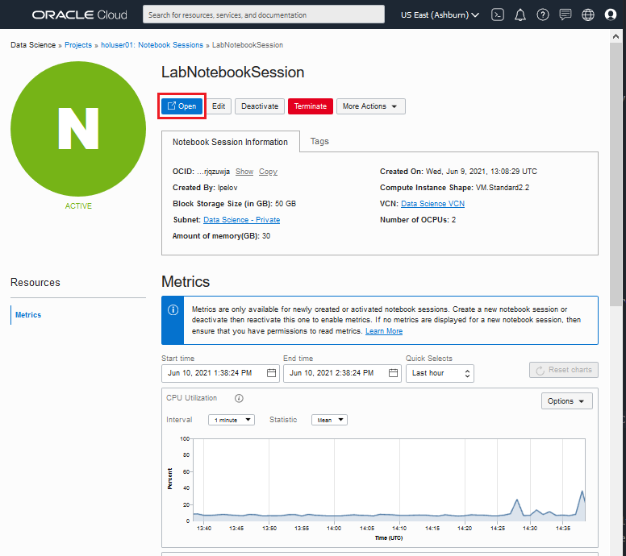
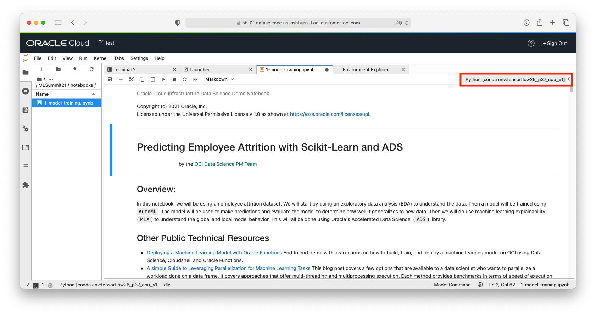

# Lab 3: Build and Train a Simple Binary Classification Model with `scikit-learn` and `ADS`

## Introduction

This lab will guide you through a practical example of how to build, train and save a machine learning model.

The dataset is a fictional data set which contains 1,470 rows. There are 36 features. 22 features are ordinal, 11 are categorical, and 3 are constant values. The features include basic demographic information, compensation level, job characteristics, job satisfaction and employee performance metrics. The data is not balanced as fewer employees leave than stay. The goal will be to predict employee retention.

While this example uses a classifier, the steps learned with this exercise are applicable to many other types of machine learning models.

Estimated lab time: 15 minutes

### Objectives

In this lab you will:

* Execute Python code in a notebook to explore data, prepare data, train a model, and evaluate the model
* Store the model in the model catalog

### Prerequisites

* Successful completion of Labs 0, 1, and 2.

## **STEP 1:** Open your Notebook Session

1. Click on **Open**. It will open in a separate browser tab. If prompted to sign-in, provide your Oracle Cloud credentials.

  

## **STEP 2:** Open the Notebook to Build an Open-Source Python Model

A notebook has been prepared containing all the necessary Python code to explore the data, train the model, evaluate the model, and store it in the model catalog. This notebook has already been configured with a conda environment.

  1. In the file browser, navigate to the directory **/home/datascience/lab/labs/MLSummit21/Notebooks/**. This directory was created in Lab 1 when you unzip this repository in your notebook session.

  1. Open the notebook **1-model-training.ipynb** (double-click on it). A new tab opens in the workspace on the right.

     Notice in the upper right corner of the notebook tab, it displays the name of the conda environment being used by this notebook. Confirm that the name you see the slugname of the TensorFlow conda environment (`tensorflow27_p37_cpu_v1`)

  

  1. Now you will work in the notebook. Scroll through each cell and read the explanations. When you encounter a `code` cell, execute it (using **shift + enter**) and view the results. For executable cells, the ""[ ]"" changes to a "[\*]" while executing, then a number when complete "[1]". (If you run short on time, you can use the *Run* menu to run the remaining cells and the review the results.)

**You can proceed to the next lab.**
