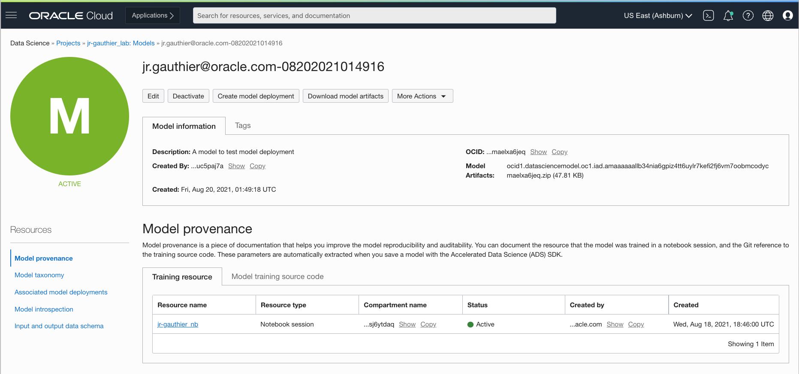
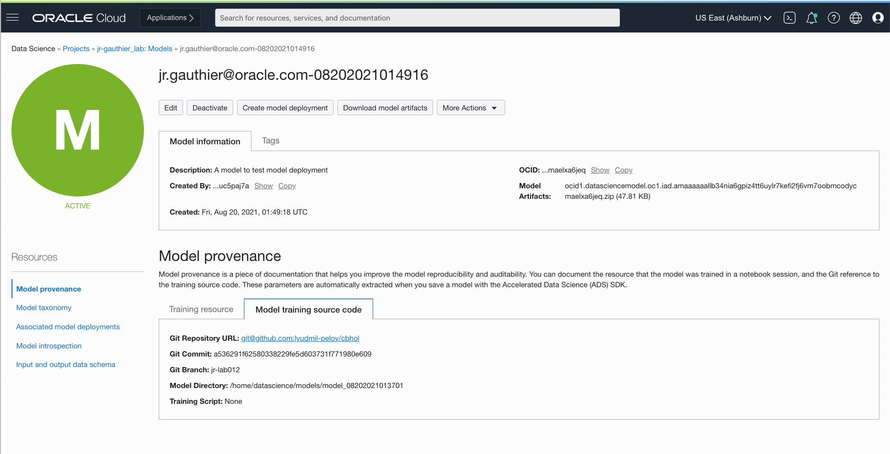
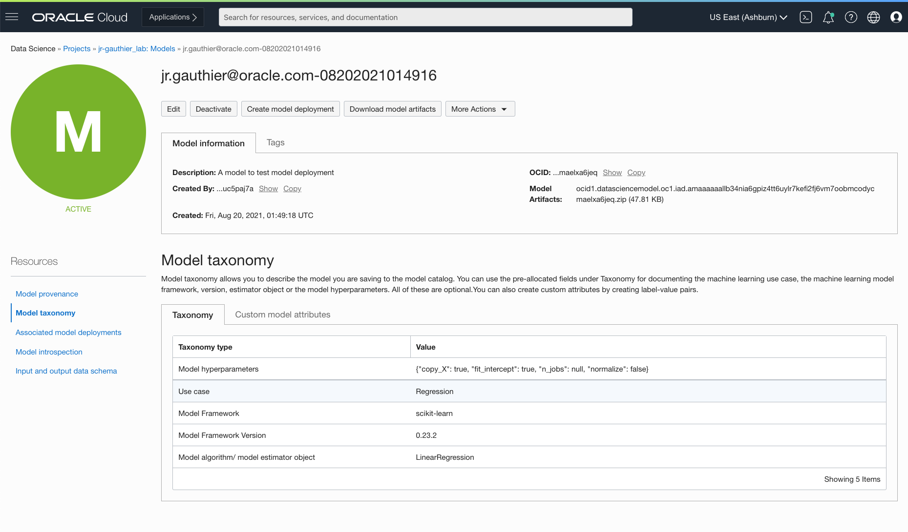
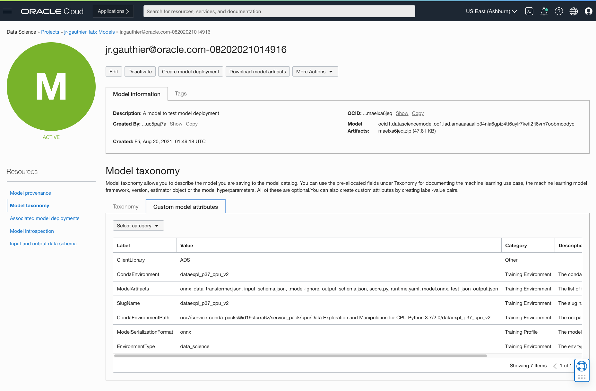
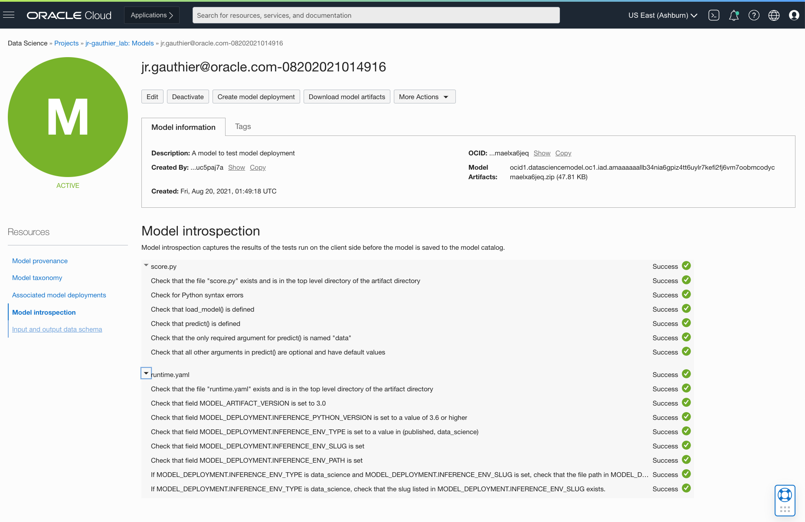
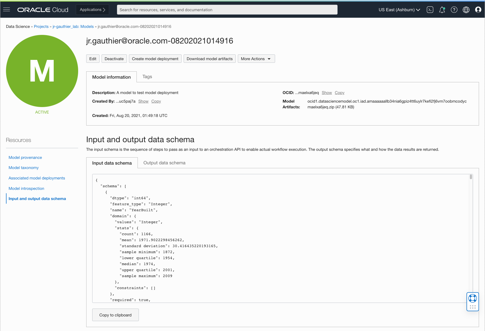
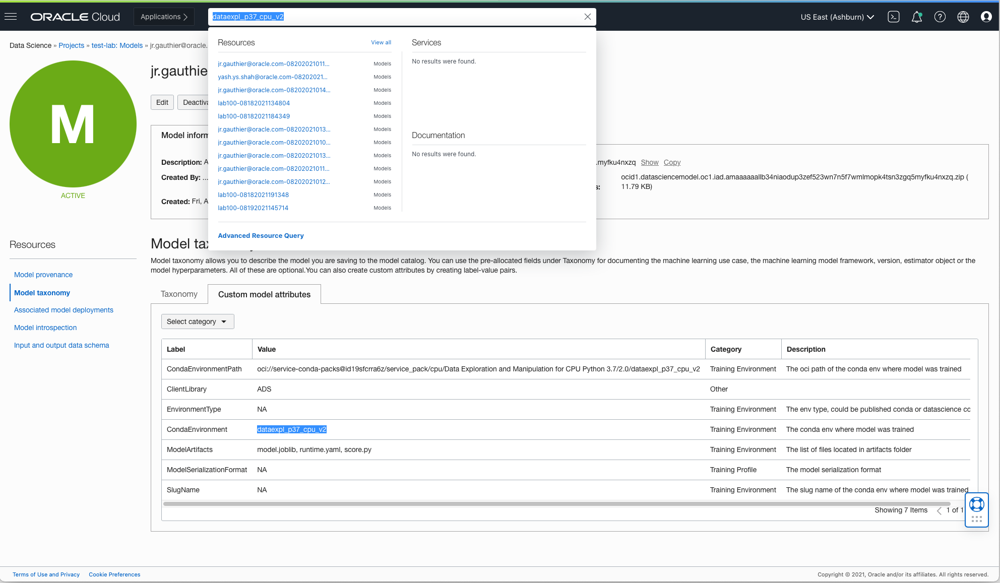

# Lab 4: Introduction to the Model Catalog

In this lab we review some of the key capabilities of the model catalog.

Data scientists and machine learning engineers aren't always diligent about [documenting their data preparation, feature engineering, and model training steps](https://towardsdatascience.com/why-you-should-document-your-work-as-a-data-scientist-a265af8a373). If you’ve worked with teams of data scientists, you’ve felt the frustration of trying to audit or reproduce a model that someone else trained months ago. Reconstructing the training dataset (which may have been incomplete), the features generated and used, the compute environment, the libraries, or the source code can be a [nightmare](https://www.wired.com/story/artificial-intelligence-confronts-reproducibility-crisis/). You never quite reproduce those first predictions, leaving you wondering why the model is different from the original.

The model catalog is a central repository of model artifacts and metadata. In the Oracle Cloud Infrastructure Data Science service, the model catalog lets data scientists share and control access to the models, and deploy them as HTTP endpoints via Data Science Model Deployment. We recently released a series of upgrades to the model catalog centered on documentation, [reproducibility](https://towardsdatascience.com/reproducible-machine-learning-cf1841606805), and auditability — three critical concepts of scientific experimentation and ML.

**Model reproducibility and auditability are very [real concerns of regulated industries](https://towardsdatascience.com/ai-and-machine-learning-governance-692b245bb6d7) who need to comply with audit rules and other traceability requirements.**

Once models are in the catalog, you can

* control their access (just like any other OCI resource) by writing policies against them.
* you can load them back in a different notebook session with ADS
* you can download them programmatically from anywhere using the OCI CLI/SDK or ADS
* you can deploy them through Data Science Model Deployment

In addition, the model catalog curates a lot of important metadata about the model to ensure that the model can be audited and reproduced. That metadata is captured automatically

Estimated lab time: 5 minutes

### Objectives

In this lab you will:

* learn how the model catalog captures and track model provenance, taxonomy, input and output data schema.
* learn how to use our public github repo to access our boilerplate model artifact code as well as a library of examples on model artifacts.

## **STEP 1:** Walk Through of the Model metadata

When a model is saved with ADS, a bunch of metadata is automatically extracted about your model object and stored in the model catalog. We will review some of the key extracted metadata. You can go through the metadata yourself by going to the models list page and select the model you just saved with the `1-model-training.ipynb` notebook in Lab 3. 

### Model Provenance

[Model provenance](https://ckaestne.medium.com/versioning-provenance-and-reproducibility-in-production-machine-learning-355c48665005) captures the necessary information required to reproduce the trained model. A good solution for tracking provenance metadata should include:
* the environment in which the model was trained as well as the list of third-party ML frameworks and libraries used to train the model
* the source code repository along with either the training script or notebook
* references to the training and validation datasets
* documented and reproducible data transformations steps that were involved in generating the training and validation datasets.

In this new iteration of the model catalog, both the resource OCID (`training_id` parameter in the `save()` method) and references to the source code are automatically captured:

and for code:

### Model Taxonomy

Model taxonomy provides a description of the use case, ML framework used, and hyperparameters

### Custom Metadata

You can always add your own custom metadata to the model object. You can do that through ADS or in the console. ADS also extracts a series of additional custom metadata on your behalf which documents the environment in which the model was trained

### Model Introspection

ADS also runs a series of introspection tests which are run on the model artifact before saving the model to the catalog. These tests checks against a series of common issues that customers encounter when writing their model artifacts. ADS captures the results and save them as part of your model metadata. You can inspect the results in the console.

### Model Input and Output Data Schemas

Lastly, ADS also automatically extracts the input and output data schemas of the model. These schemas contain a wealth of information about each feature that the model requires as well as summary statistics about the feature values

### **STEP 2:** Search Models

Models and their metadata are now fully searchable through OCI search. As an example, type **tensorflow26_py37_cpu_v1** in the search bar. This corresponds to the training environment of your model and is captured by ADS as part of the custom metadata.

#### Additional Notebook Examples

We have a notebook example called `model-catalog.ipyb` available in the "Notebook Examples" JupyterLab launcher button after you've installed the conda environment in your notebook session. The notebook example walks you through the new model catalog features in details. Alternatively we also have a [YouTube screencast](https://www.youtube.com/watch?v=WqjGz7Xckrs&list=PLKCk3OyNwIzv6CWMhvqSB_8MLJIZdO80L&index=12&t=53s) showing you how to save a model to the catalog in ADS (v2.3.1). 

## **STEP 3:** Overview of Our GitHub Repo with Sample Code

We recently released a GitHub repositority with example notebooks, example model artifacts (score.py, runtime.yaml), labs, python scripts, etc. This repository is public and available at: [http://github.com/oracle/oci-data-science-ai-samples](http://github.com/oracle/oci-data-science-ai-samples)

Star the repo and please contribute with your own examples, labs, and notebooks!

# A few Useful References On the Model Catalog

* [The Model Catalog Service Documentation](https://docs.oracle.com/en-us/iaas/data-science/using/models-about.htm)
* [Our Public GitHub Repository with Code samples, Notebooks, and Labs](https://github.com/oracle/oci-data-science-ai-samples)
* [The ADS User Documentation on the Model Catalog](https://docs.oracle.com/en-us/iaas/tools/ads-sdk/latest/user_guide/modelcatalog/modelcatalog.html)
* [Blog Post Announcing the August 2021 Release of the Model Catalog](https://blogs.oracle.com/ai-and-datascience/post/reproduce-and-audit-your-models-easily-with-a-model-catalog)
* [Our public YouTube Playlist with a variety of screencasts and live demos](https://www.youtube.com/playlist?list=PLKCk3OyNwIzv6CWMhvqSB_8MLJIZdO80L)

**You can proceed to the next lab.**
