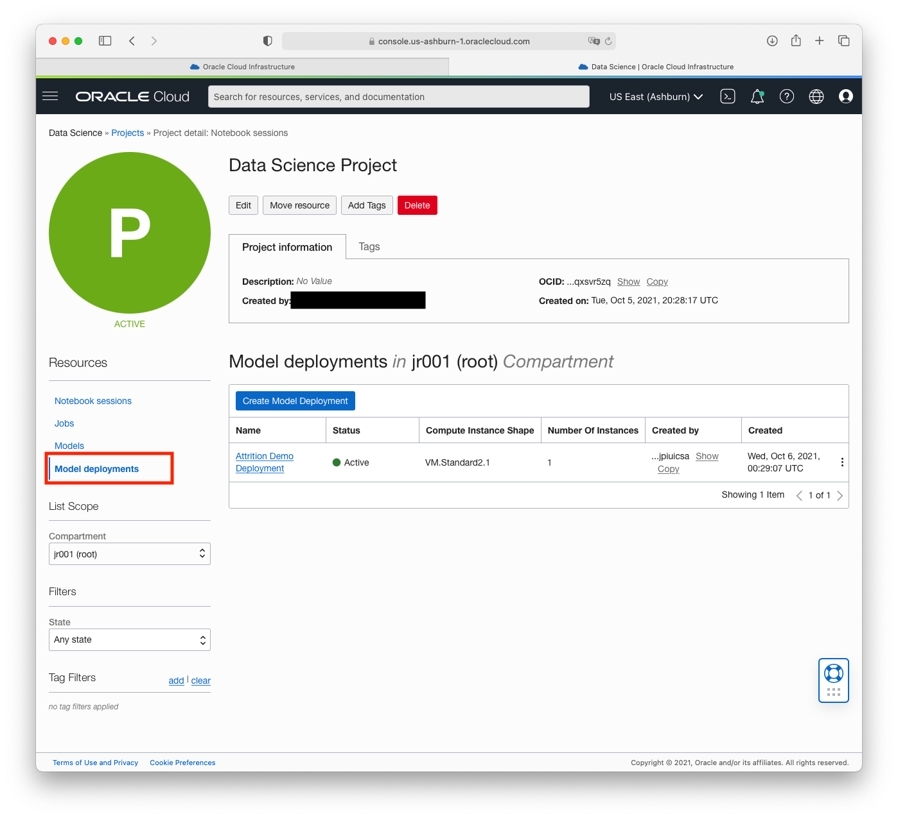
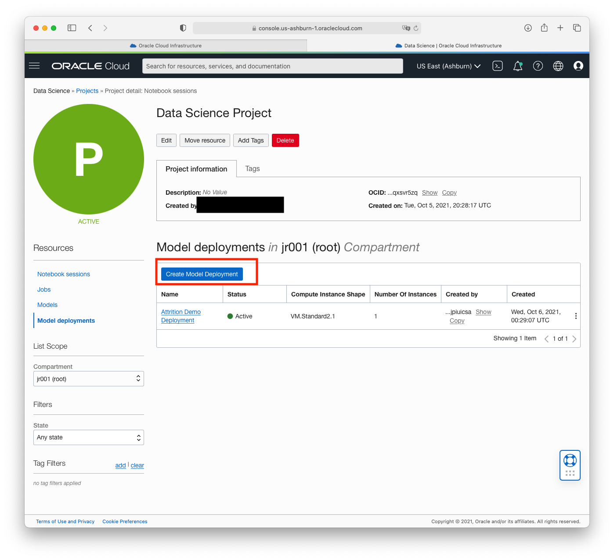
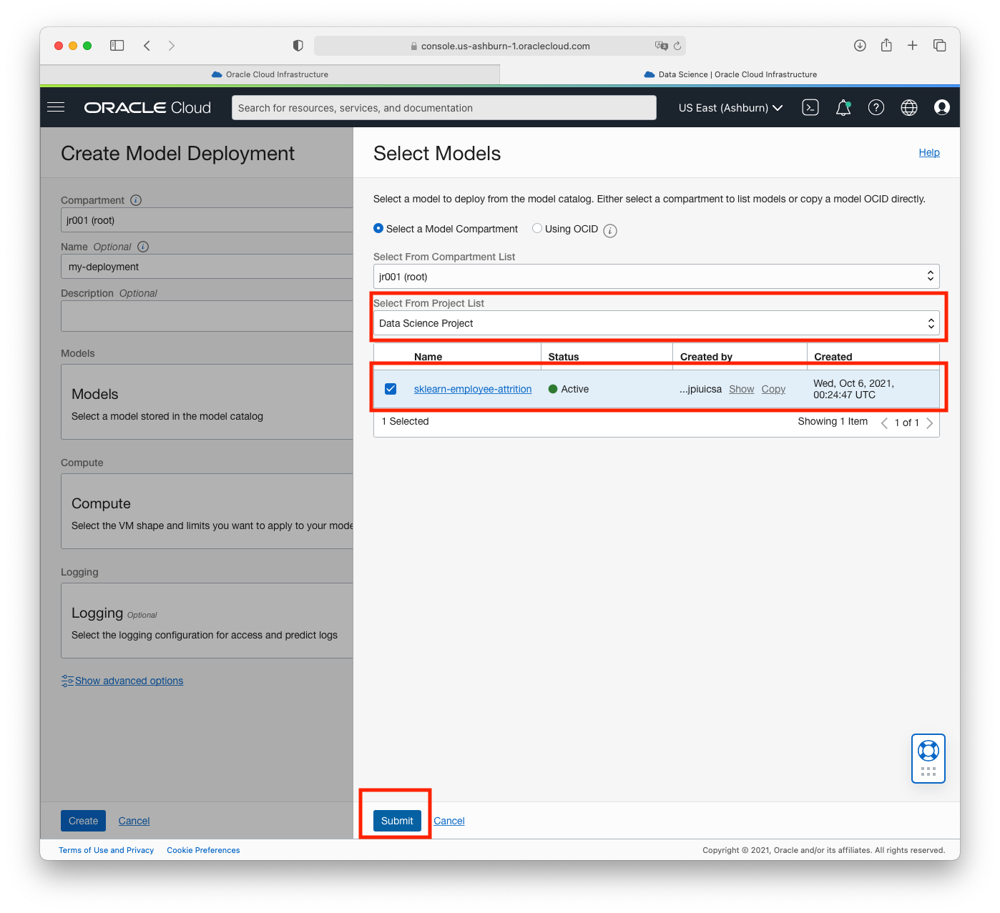
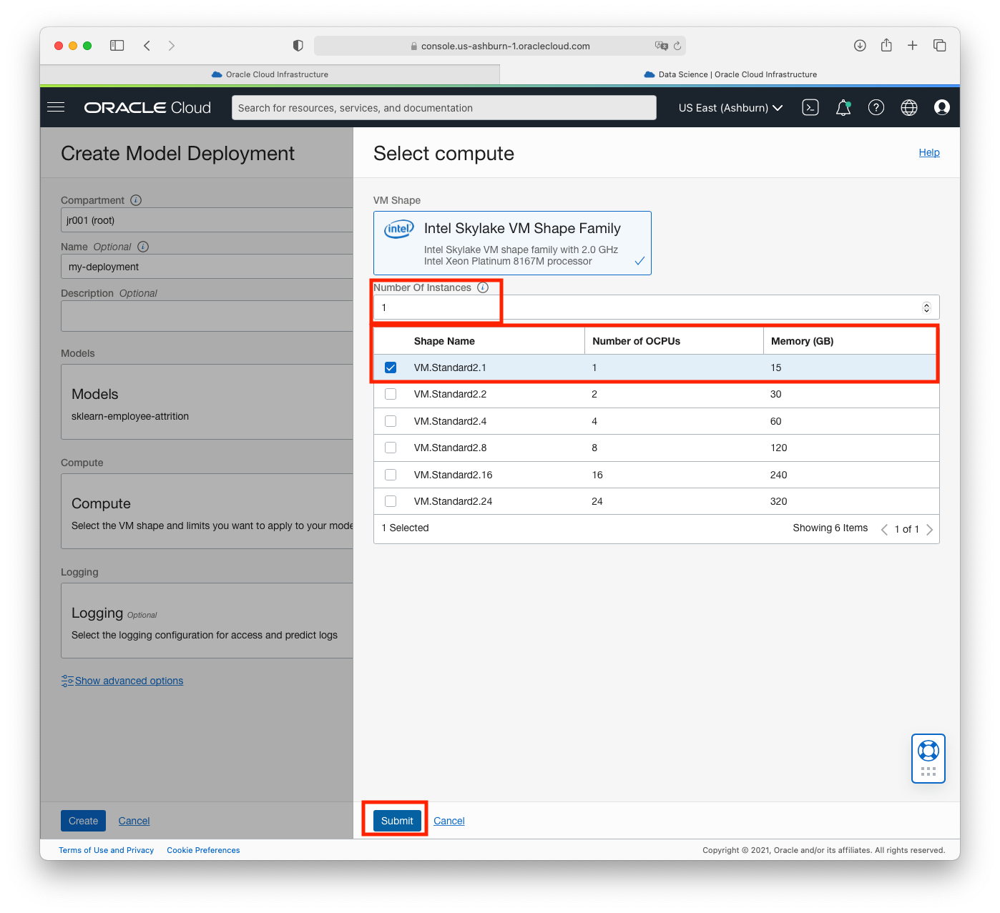
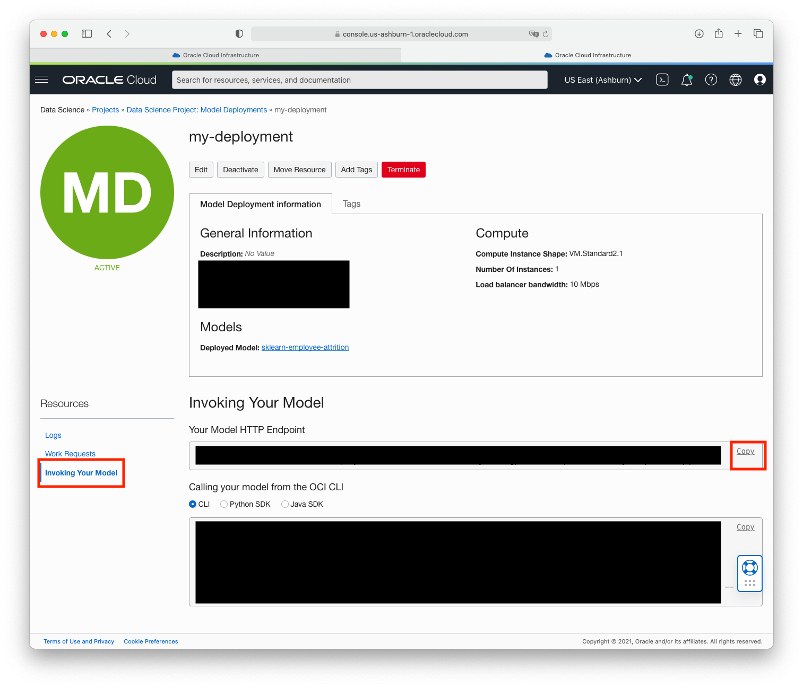
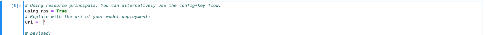

# Lab 5: Deploying Your Model For Real Time Inference 

In this lab you will learn how to take a model from the model catalog and deploy it as an `HTTP` endpoint through the [Data Science Model Deployment](https://docs.oracle.com/en-us/iaas/data-science/using/model-dep-about.htm) feature. This is a necessary when model predictions are embedded in applications and need to be consumed in real time. You will use ADS to deploy the model from a notebook. 

Estimated lab time: 5 minutes

### Objectives

In this lab you will:

* learn how the model catalog captures and track model provenance, taxonomy, input and output data schema.
* learn how to use our public github repo to access our boilerplate model artifact code as well as a library of examples on model artifacts.

## **STEP 1:** Open and Run the Notebook `2-model-deployment.ipynb`

1. In the **/home/datascience/lab/labs/MLSummit21/notebooks** directory of your notebook session, open the notebook `2-model-deployment.ipynb`

1. Follow the instructions in the notebook

## **(OPTIONAL) STEP 2:** Create a Model Deployment from the Console 

Alternatively you can deploy your model directly from the console. 

1. Go back to the **Project detail page** in the console and click on **Model Deployments** in the left menu "Resources". In the table under "Create Model Deployment", you should see the model deployment entry that you created previously in STEP 1.  

1. Click on **Create Model Deployment**. 

1. Give you model deployment a name and a description (optional)

1. Select the model you saved in the model catalog (from the `1-model-training.ipynb` notebook in Lab 3). You can filter the models by compartment and project. 

1. Select the compute shape that will be host the model server as well as the number of replica VMs in the pool. 

Skip the logging setup for now. Click on "Create". Creating a Model Deployment takes a few mins. 

## **(OPTIONAL) STEP 3:** Invoke Your Deployed Model 

The next step is to invoke the model that you successfully created in STEP 2. 

1. In the details page of your model deployment, click on **Invoking Your Model** under the "Resources" menu. Click "Copy" next to your model HTTP endpoint URI. 

1. Go back to the notebook of STEP 1 (`2-model-deployment.ipynb`) and paste the URI in the notebook cell where the `uri` variable is assigned. 

1. Run the notebook again! You successfully invoke a new model endpoint. 

**Congratulations! You can go to the next lab** 

