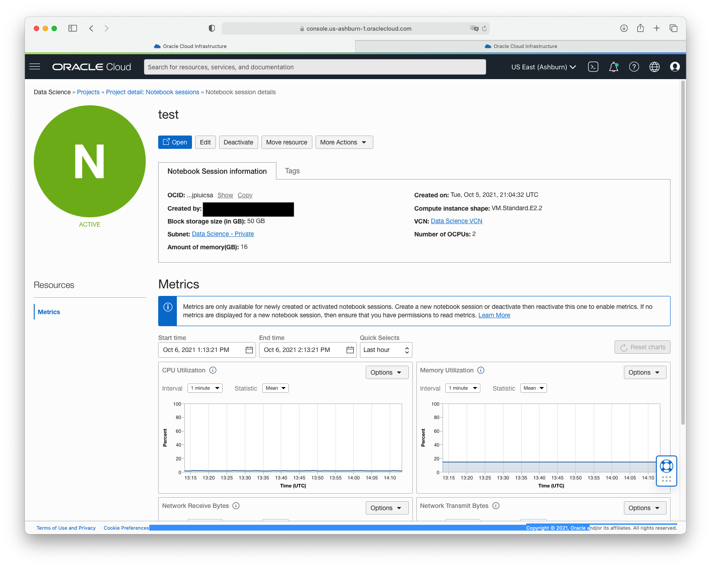
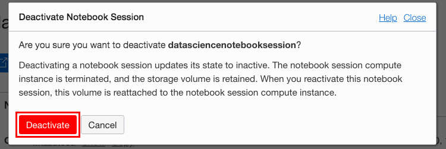
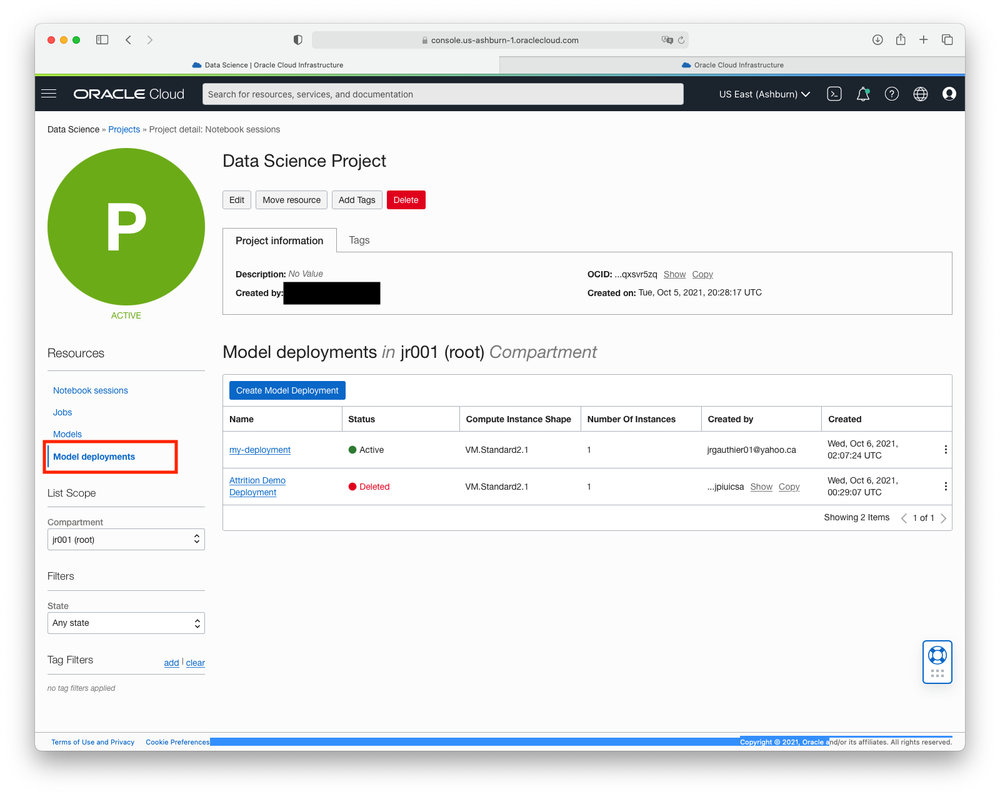
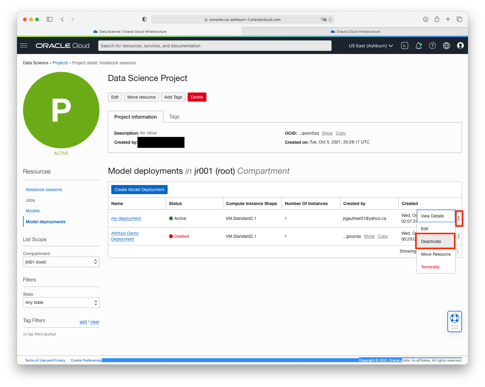

# Lab 6: Shutting Down Notebook Sessions and Model Deployments

## Introduction

When a notebook session is in an active state, there is a boot volume, block storage, and compute attached to it. When the notebook is not being used it is possible to detach the computing resource and thus reduce costs. There are two methods for shutting down a notebook session.

1. If a notebook session is **deactivated**, then the underlying computing resource is shut down and the boot volume and block storage are detached. However, the block storage, which is mounted at ``/home/datascience``, is persisted for later use, so save all your work there before deactivating. Also, any conda environment used by the notebook session will be preserved. The boot volume is *not* persisted. Deactivated notebook sessions can be activated again and the block volume is automatically reattached. During activation, you can change the compute shape, increase the size of the block volume, change the VCN, and the subnet.

1. If the notebook session and its block storage are no longer needed, then the notebook session can be **terminated**. Terminating a notebook session releases the underlying compute, boot volume and block storage. Since the boot volume and block storage are not persisted, any data on these volumes will be lost. It is not possible to reactivate a terminated notebook session.

1. If a model deployment is **deactivated**, the instances associated with the deployment are shut down. Metering and billing of the model deployment instances and load balancer stop when a model deployment is deactivated. The deployment HTTP endpoint becomes unavailable. The model deployment metadata is saved. A deactivated model deployment can be reactivated. The same model HTTP endpoint is available upon reactivation and requests can be made to that model endpoint.

1. If a model deployment is no longer needed, it can be **deleted**. This terminates all resources and billing associated with the model deployment and is not recoverable. If you configured logs, you can delete the access and predict logs that are associated with your model deployment. By default the logs are not deleted.

*Estimated Lab Time*: 5 minutes

### Objectives
In this lab, you will:
* Learn the different methods of shutting down a notebook session
* Understand the differences between deactivating and terminating a notebook session
* Become familiar with the steps to deactivate and terminate notebook sessions
* Become familiar with the steps to deactivate a model deployment

### Prerequisites
* You have at least one active running notebook session and one active model deployment. 

## STEP 1 - Deactivating Notebook Sessions
1. Go back to your project page in the OCI Console. 
    

1. Under *Resources*, select **Notebook Sessions** if not already selected.

1. Click the name of an active notebook session created in a previous lab to open the Notebook Session page.
    

1. Click **Deactivate**.
    

1. Click **Deactivate** to confirm the deactivation. The status of the notebook session changes to **Updating** and then **Inactive** and this takes 1-2 minutes.
    

## STEP 2 - Terminating Notebook Sessions

To retain the file changes in a notebook session’s boot volume and attached block volume, you must back them up before the notebook session is terminated. For example, copy the files to an object storage bucket, or commit and push changes to a Git repository outside the notebook session. All file changes in the notebook session’s boot volume and attached block volume are deleted when the notebook session is terminated.

1. You should be viewing the inactive notebook session  and you have the choices of activating or terminating it.
    

1. Click **Terminate**.
    

1. Enter the name of the notebook session to confirm and click **Terminate**.
    

1. The notebook session status changes to **Deleting** and then **Deleted** in less about a minute.
    

    

## STEP 3 - Deactivating Model Deployments

Deactivating a model deployment shuts down the instances that are associated with your deployment and stops metering and billing, but the deployment can be re-activated later.

1. Under *Resources*, select **Model deployments**

1. Click the model deployment's name or the Actions icon (three dots), and click **Deactivate**

1. The model deployment state changes to **Inactive**

Tip - While the deployment is inactive, you can change any or all options (model, compute, logging, load balancer) and save the changes.

**Congratulations, you have successfully completed the workshop!**
