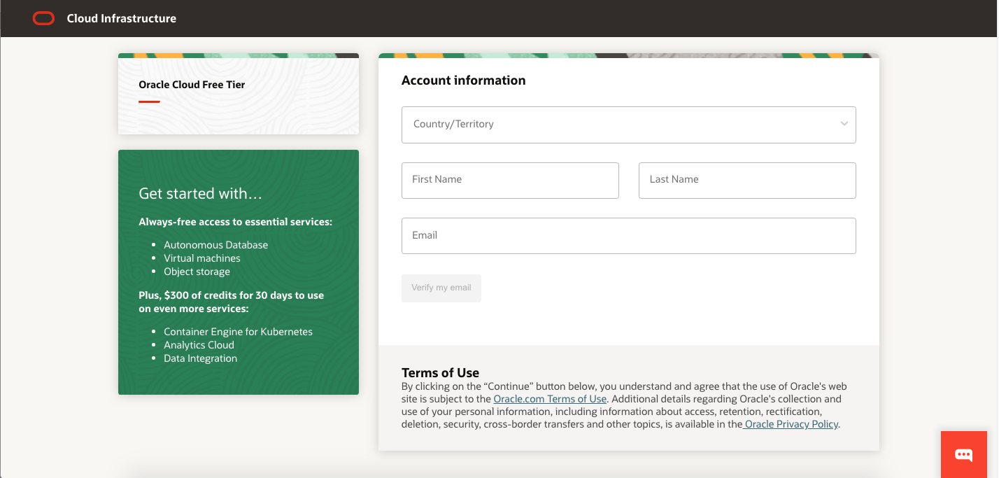
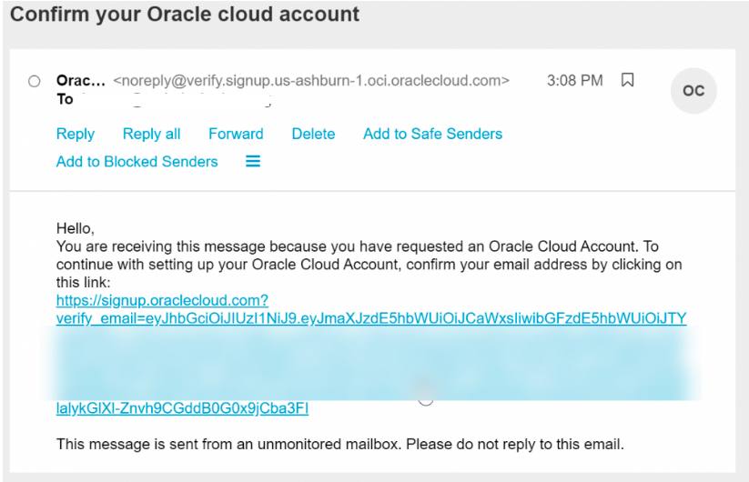
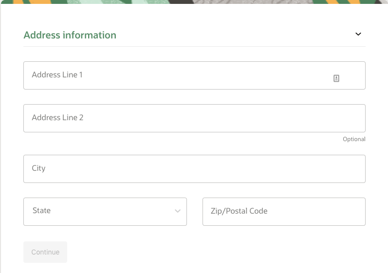
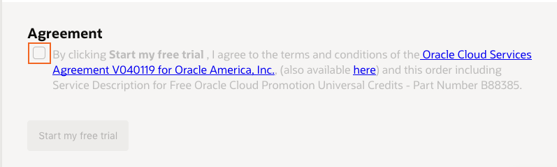
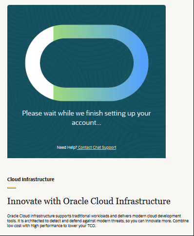
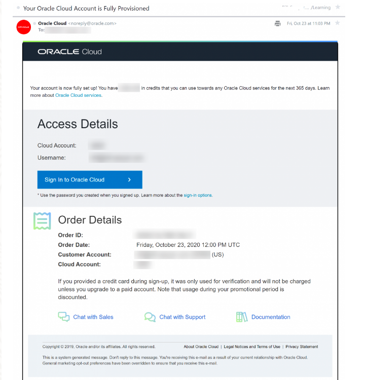
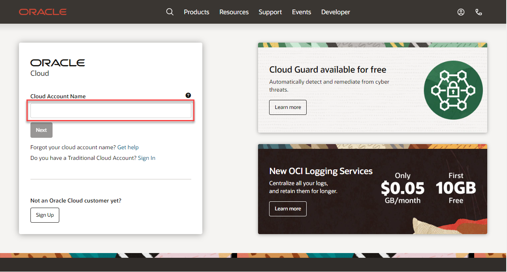
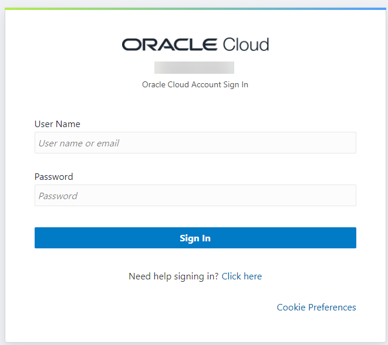
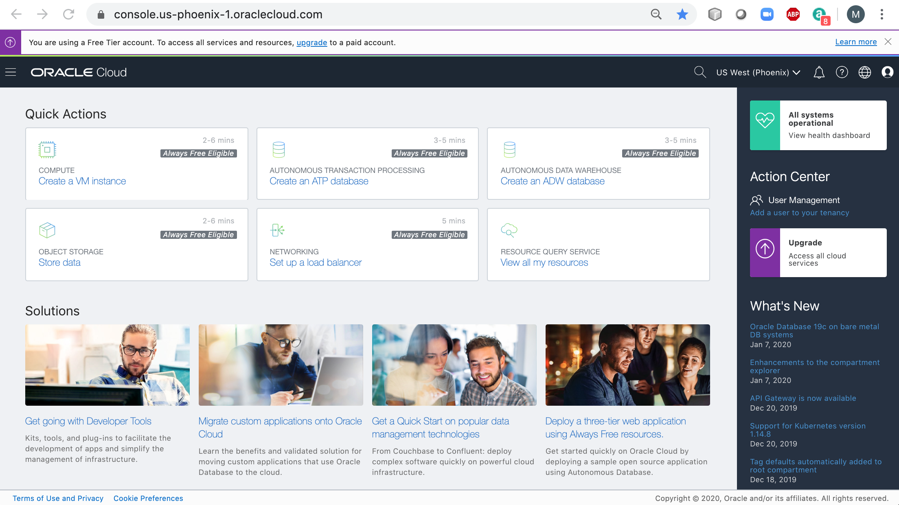

# Lab 1: Setup a tenancy for OCI Vision
## Introduction
To do the lab, you will need an Oracle Cloud account. This procedure will guide you through the steps of getting an Oracle Cloud Free Tier account and signing in. Then you will prepare the new OCI tenancy to use OCI Vision.

### Existing Cloud Accounts
If you already have access to an Oracle Cloud account, including an Oracle Cloud account using [Oracle Universal Credits](https://docs.oracle.com/en/cloud/get-started/subscriptions-cloud/csgsg/universal-credits.html), skip to **Task 2** to sign in to your cloud tenancy.

### Objectives
* Sign-up for a free Oracle cloud account
* Sign-in to your Oracle cloud account

### Prerequisites
* A valid email address (the same one you used for the event registration)
* Ability to receive SMS text verification (only if your email isn't recognized)

## **TASK 1:** Create Your Free Trial Account
> **Note**: Interfaces in the following screenshots might look different from the interfaces you will see.

If you already have a cloud account with unused cloud credits, skip to **Task 2**.

1. Open up a web browser to access the Oracle Cloud account registration form at [signup.cloud.oracle.com](https://signup.cloud.oracle.com).

   You will be presented with a registration page.
    
1.  Enter the following information to create your Oracle Cloud Free Tier account.
    * Choose your **Country**
    * Enter your **Name** and **Email**.
    * Check the box to indicate you are human and complete the captcha

1. Once you have entered a valid email address, select the **Verify my email** button.
    The screen will appear as follows after you select the button:
    

1. As a participant in this event, you are being offered an Oracle Cloud Trial with $500 in free cloud credits for 30 days. You will see a popup for this offer. Click the **Select Offer** button.
  

1. Go to your email. You will see an account validation email from Oracle in your inbox. The email will be similar to the following:
    

1. Select the link (if possible) or copy and paste the link into your browser.

1. Enter the following information to create your Oracle Cloud Free Tier account.
    - Choose a **Password**. Remember what you entered. You'll need this later to sign in.
    - Enter your **Company Name**
    - Your **Cloud Account Name** will be generated automatically based on your inputs, but you can change that name by entering a new value. Remember what you entered. You'll need this name later to sign in.
    - Choose a **Home Region**. Your Home Region cannot be changed once you sign-up. Select *US East (Ashburn)*
    - Click **Continue**
    

1.  Enter your Address information.  Click **Continue**.
  

1. Check the box under Agreement to start your free trial.
  

  > **Note** - if you selected the offer for the free Cloud Trial above, you will not be asked for a payment verification method.

1. You will have to wait briefly while your account is setup.

  

1. Then you will be redirected to the OCI Console. We'll use the console in the next task.

1. You'll also receive two emails from Oracle. One email will be the initial notification that provisioning is underway and it will list **important information** you will need in this workshop:
   - Cloud account
   - Username
   - Link (button) to access your account

   The other email will be a notification that provisioning is complete. Here is a copy of the final notification:
  

## **TASK 2:** Sign in to Your Account
When you sign up for an Oracle Cloud account, a user is created for you in Oracle Identity Cloud Service with the username and password you selected at sign up. You can use this single sign-on option to sign in to Oracle Cloud Infrastructure and then navigate to other Oracle Cloud services without reauthenticating. This user has administrator privileges for all the Oracle Cloud services included with your account.

1. Use the **account access link in your confirmation email** (this provides a shortcut to the sign-in for your account and region).  Enter your user name and password and click **Sign In**. Your username is your email address. The password is what you chose when you signed up for an account.

  

  Alternatively, go to [cloud.oracle.com](https://cloud.oracle.com) . Enter your **Cloud Account Name** and click **Next**. This is the name you chose while creating your account in the previous section. It's NOT your email address. If you've forgotten the name, see the confirmation email.
    
    - Click **Continue** to sign in using the *oraclecloudidentityservice*.

   

   - Enter your Cloud Account credentials and click **Sign In**. Your username is your email address. The password is what you chose when you signed up for an account.

     

1. You are now signed in to Oracle Cloud!

    

[Proceed to the next lab](./Lab-2-analyze-vision.md).
