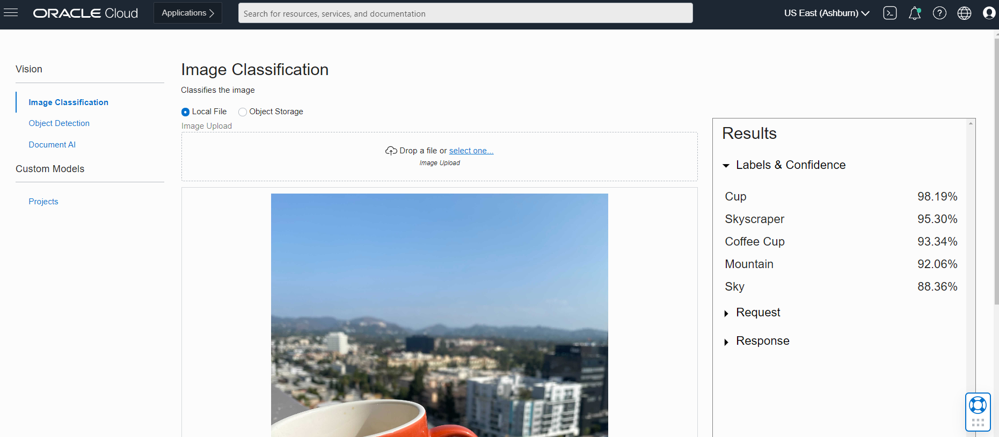

# Use Vision Service through the OCI Console

## Introduction
In this session, we will walk through the OCI Console to familiarize ourselves with the Vision Service. We'll discuss the data requirements and formats, and provide some sample datasets as examples. We will also show you how to upload to Oracle object storage for later to train a custom model.

### Objectives

In this lab, you will:
- Understand the data requirements and data formats for analyzing images.
- Be able to download prepared sample datasets and upload the downloaded dataset into OCI (Oracle Cloud Infrastructure) object storage.
- Get familiar with the OCI console and be able to demo key vision features with it.

### Prerequisites

* A trial or paid Oracle cloud account

## **Manual Policy Setup** (not needed if stack template works)

Before you start using OCI Vision, your tenancy administrator should set up the following policies by following below steps:

1. Navigate to Policies

  Log into OCI Cloud Console. Using the Burger Menu on the top left corner, navigate to Identity & Security and click it, and then select Policies item under Identity.
    


1. Create Policy

  Click Create Policy
    


1. Create a new policy with the following statements:

  If you want to allow all the users in your tenancy to use vision service, create a new policy with the below statement:
    ```
    <copy>allow any-user to use ai-service-vision-family in tenancy</copy>
    ```
    


  If you want to limit access to a user group, create a new policy with the below statement:
    ```
    <copy>allow group <group-name> to use ai-service-vision-family in tenancy</copy>
    ```
    

## **Task 1:** Understand Data Requirements

The vision service works with multiple formats of image data in order to detect objects, assign labels to images, extract text, and more. The service accepts data through Object Storage and locally stored images (if using via OCI console).

The service offers sync and async APIs to analyze images, with data requirements for each detailed below:

| API | Description | Supported Input Format |
| --- | --- | --- |
| sync API (analyzeImage, analyzeDocument) | Analyzes individual images | * JPG, PNG, (PDF and Tiff for analyzeDocument)<br>* Up to 8 MB<br>* Single image input |
| async API  <br>/jobs/startImageAnalysisjob  <br>/jobs/start | Analyze multiple images or multi-page PDFs | * JPG, PNG (PDF and Tiff for analyzeDocument)<br>* Up to 2000 images input<br>* Supports multi-page PDF |

## **Task 2:** Upload Data to Object Storage

This is an optional set of steps if you want to test OCI Vision with your own sample images.

1. Create an Object Storage Bucket (This step is optional in case the bucket is already created)

  a. First, From the OCI Services menu, click Object Storage.
    

  b. Then, Select Compartment from the left dropdown menu. Choose the compartment matching your name or company name.
    

  c. Next click Create Bucket.
    

  d. Next, fill out the dialog box:
    * Bucket Name: Provide a name <br/>
    * Storage Tier: STANDARD

  e. Then click Create
    

1. Upload image files into Storage Bucket

  a. Switch to OCI window and click the Bucket Name.

  b. Bucket detail window should be visible. Click Upload
    

  c. Click on Upload and then browse to file which you desire to upload.
    


  More details on Object storage can be found on this page. [Object Storage Upload Page](https://oracle.github.io/learning-library/oci-library/oci-hol/object-storage/workshops/freetier/index.html?lab=object-storage) to see how to upload.

## **Task 3:** Demo Vision Service using the OCI Console

1. Navigate to the Vision Page of OCI Console

  

1. Use Document AI features

  a. On the Vision page, select “Document AI” on the left navigation menu and provide a document or image from local storage or OCI object storage. This invokes analyzeDocument API after the image is provided. Raw text extracted by our pre-trained multi-tenant model is displayed on the right.

    

  b. Features you can test out:

    | Feature | Description | Details on Console |
    | --- | --- | --- |
    | OCR (Optical Character Recognition) | Locates and digitizes text information from images | Text will appear under the "raw text" header of the results pane of the console [\[Reference\]](./images/ocr.png) |
    | Document Image Classification | Classifies documents into different types based on their visual appearance, high-level features, and extracted keywords | Classification along with confidence score appears directly under "Results" pane [\[Reference\]](./images/dic.png) |
    | Language Classification | Classifies the language of document based on visual features | Classification along with confidence score appears under document classification in Results pane [\[Reference\]](./images/language-classification.png) |
    | Table extraction | Extracts content in tabular format, maintaining row/column relationships of cells | Toggle to the Table tab to get table information [\[Reference\]](./images/table-extraction.png) |
    | Searchable PDF output | Embeds a transparent layer on top of document image in PDF format to make it searchable by keywords | You need to test on a PDF document to use this feature. When you've selected a PDF, the searchable PDF button will be clickable. Clicking on it will download an OCR PDF to your computer. [\[Reference\]](./images/searchable-pdf-output.png) |

1. Use Image Analysis Features

  a. On the Vision page, select “Image Classification” or "Object Detection" on the left navigation menu and provide an image from local storage or OCI object storage. This invokes analyzeImage API after the image is provided.

    

  b. Features you can test out:

    | Feature | Description | Details on Console |
    | --- | --- | --- |
    | Image classification | Categorizes object(s) within an image | Select "Image Classification." Labels and confidence scores will appear under the Results pane. [\[Reference\]](./images/image-classification.png) |
    | Object detection | Locates and identifies objects within an image | Select "Object Detection." Objects, confidence score, and highlighted bounding box will all appear under the Results pane. Clicking on one of the labels on the results pane will also highlight where on the image that object was detected. [\[Reference\]](./images/object-detection.png) |

Congratulations on completing this lab!

[Proceed to the next lab](#next).
