# Lab 2: Use Vision Service through the OCI Console

## Introduction
In this session, we will walk through the OCI Console to familiarize ourselves with the Vision Service. We'll discuss the data requirements and formats, and provide some sample datasets as examples. We will also show you how to upload to Oracle Object Storage for later to train a custom model.

### Objectives

In this lab, you will:
- Setup the OCI environment either through **Stacks** (preferred) or through Manual Policy setup
- Understand the data requirements and data formats for analyzing images.
- Be able to download prepared sample datasets and upload the downloaded dataset into OCI (Oracle Cloud Infrastructure) object storage.
- Get familiar with the OCI console and be able to demo key vision features with it.

### Prerequisites

* A trial or paid Oracle cloud account

## **Stack Setup** (preferred method)
A stack is a blueprint for a collection of cloud resources that can be automatically provisioned using Terraform in the OCI Console. OCI contains a stack template for OCI Vision that we will use to quickly configure the environment.

1. In the OCI Console, use the three-bar icon in the upper left corner of the page to open the menu. Go to **Developer Services** and under *Resource Manager* select **Stacks**.

  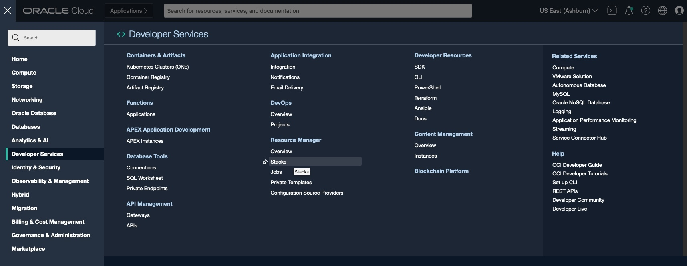

2. Select compartment **\<cloud account> (root)**, then click **Create Stack**.

  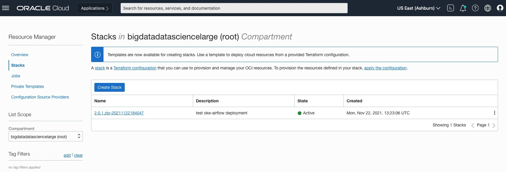

3. In the *Create Stack* dialog, select the **Template** radio button.

  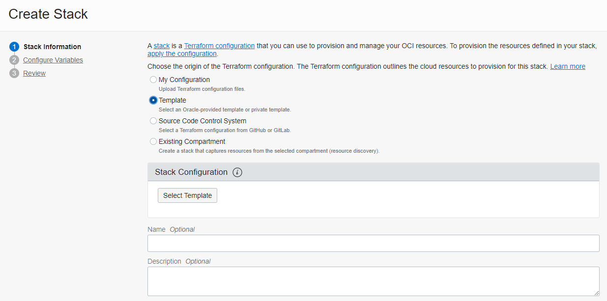

4. Click **Select Template**

5. In the *Browse Templates* dialog, on the *Service* tab, check **Vision**, then click **Select Template**.

  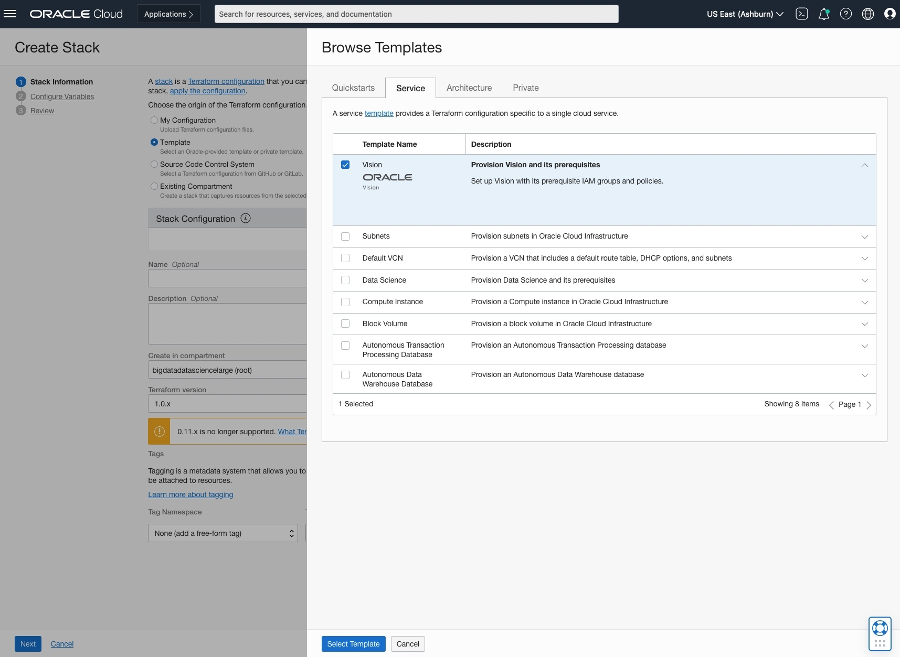

6. Back in the *Create Stack* dialog, change the **Description** to *Provision Vision and its Prerequisites* or something descriptive for you.

  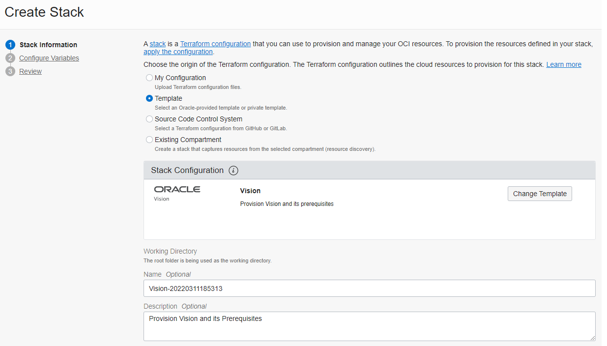

7. Ensure **Compartment** is set to the name of your **root** compartment

8. Click **Next**.

9. On the next _Configure Variables_ page, check **Use custom models** and **Use batch analysis** checkboxes and click **Next**


    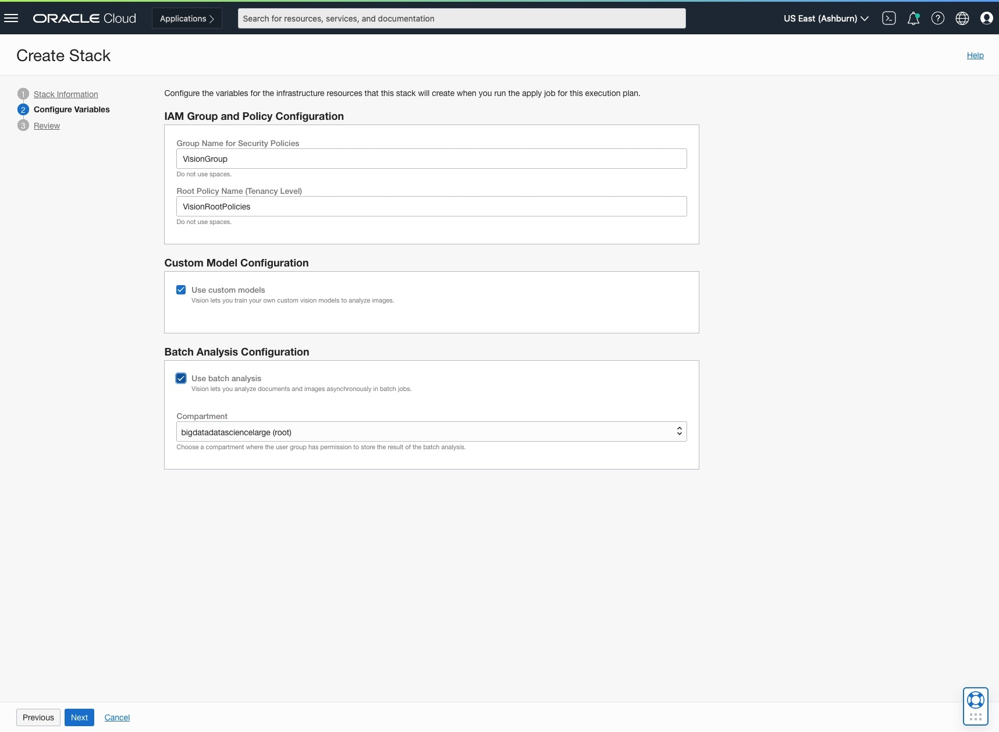

10. On the Review page, check **Run Apply**, then click **Create**.  The stack creation will run for a few minutes and then complete on its own.  You can skip the **Manual Policy Setup** below and start **Task 1**

  

## **Manual Policy Setup** (not needed if stack setup steps are completed.  Skip ahead to Task 1)

Before you start using OCI Vision, your tenancy administrator should set up the following policies by following below steps:

1. Navigate to Policies

  Log into OCI Cloud Console. Using the Burger Menu on the top left corner, navigate to Identity & Security and click it, and then select Policies item under Identity.
    


1. Create Policy

  Click Create Policy </br>
  


1. Create a new policy with the following statements:

  If you want to allow all the users in your tenancy to use vision service, create a new policy with the below statement:
  ```
    allow any-user to use ai-service-vision-family in tenancy
  ```
  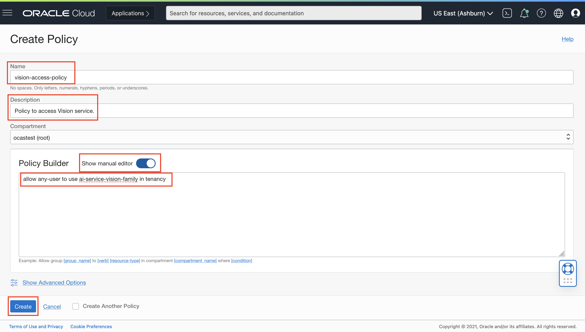


  If you want to limit access to a user group, create a new policy with the below statement: </br>
  ```
      allow group <group-name> to use ai-service-vision-family in tenancy
  ```
  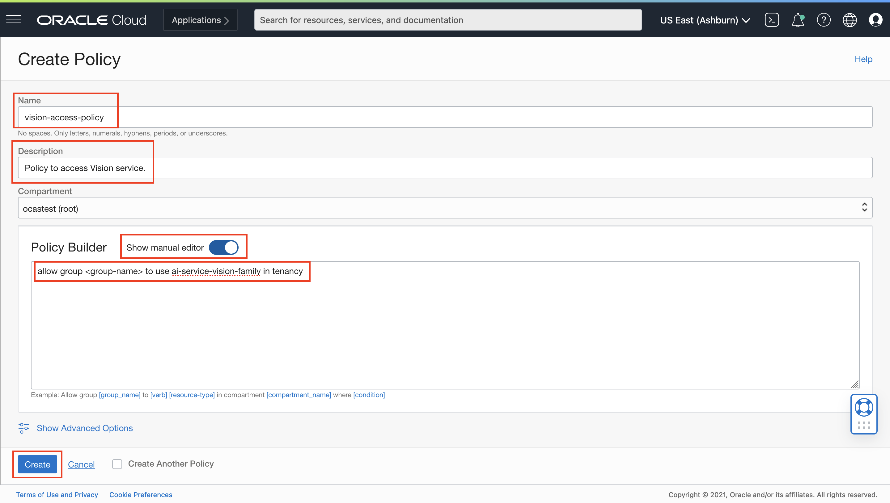

## **Task 1:** Understand Data Requirements

The vision service works with multiple formats of image data in order to detect objects, assign labels to images, extract text, and more. The service accepts data through Object Storage and locally stored images (if using via OCI console).

The service offers sync and async APIs to analyze images, with data requirements for each detailed below:

| API | Description | Supported Input Format |
| --- | --- | --- |
| sync API (analyzeImage, analyzeDocument) | Analyzes individual images | * JPG, PNG, (PDF and Tiff for analyzeDocument)<br>* Up to 5 MB<br>* Single image input |
| async API  <br>/jobs/startImageAnalysisjob  <br>/jobs/start | Analyze multiple images or multi-page PDFs | * JPG, PNG (PDF and Tiff for analyzeDocument)<br>* Up to 2000 images input<br>* Supports multi-page PDF |

## **Task 2:** Upload Data to Object Storage

This is the set of steps to follow to test OCI Vision with your own sample images.

1. Create an Object Storage Bucket (This step is optional in case the bucket is already created)

  a. First, from the OCI Services hamburger menu on the left, click **Storage** and then **Buckets**.
    

  b. Then, Select Compartment from the left dropdown menu. Choose the compartment matching your name or company name.
    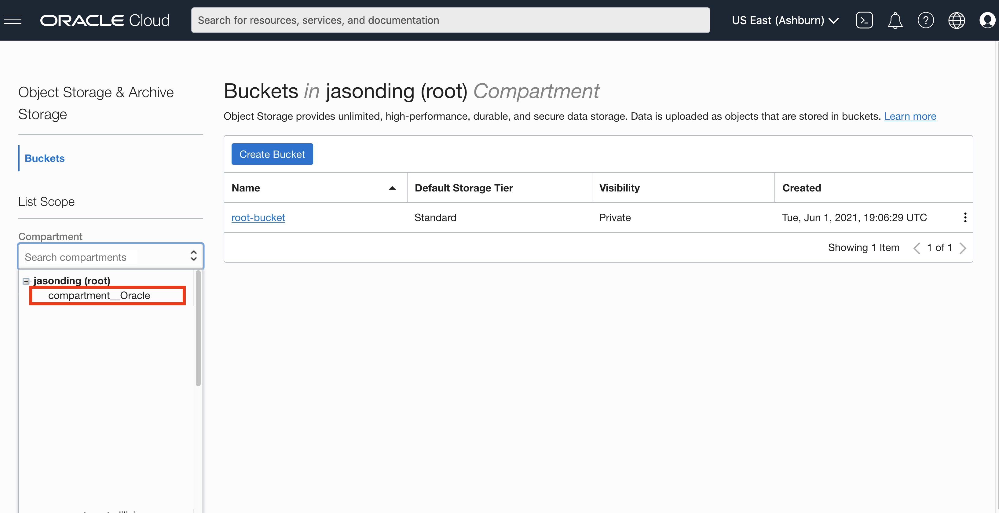

  c. Next click **Create Bucket**.

  d. Next, fill out the dialog box:
  * Bucket Name: Provide a name called **pidaydemo** for convenience.  If you do not name it _pidaydemo_, please make a note of your name and remember to refer to it wherever the subsequent labs refer to the _pidaydemo_ bucket <br/>
  * Storage Tier: STANDARD

  e. Then click Create
    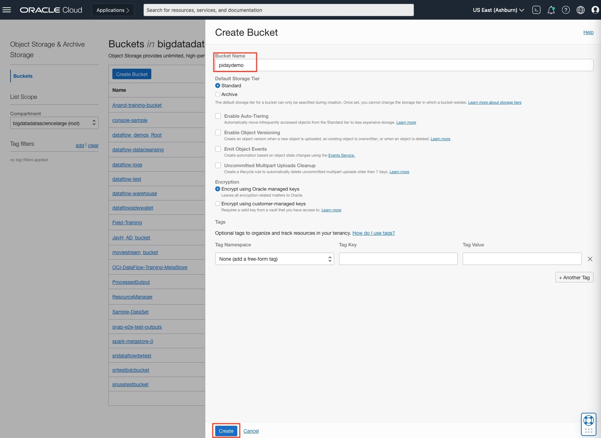

</br>2. Upload image files into Storage Bucket. </br>
> **Note:** It is important to follow these steps correctly to prevent problems with Lab 3 and Lab 4.  

  a. Download the set of images that you will use from the following two folders, and store it on your local computer in separate folders called **lab-3** and **lab-4** for convenience: [Lab 3](./Sample-Images/Lab-3) and [Lab 4](./Sample-Images/Lab-4). The images are in zip files so you will need to unzip to view the images.

  b. Switch to OCI window and click the Bucket Name for the Bucket that you just created, whether it was **pidaydemo** or any custom name you gave it.

  c. Bucket detail window should now be visible. Click the dropdown called **More Actions** then **Create New Folder**.  Create a folder called **lab-3** and another one called **lab-4**
    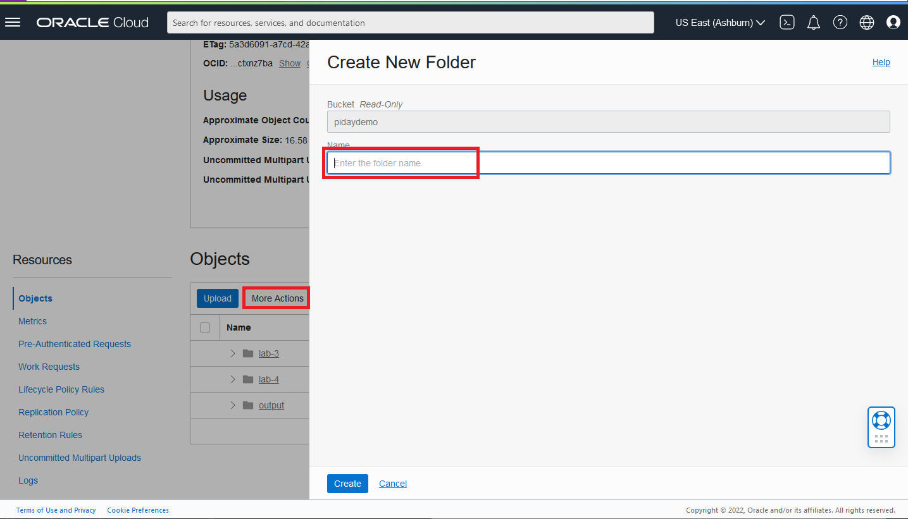

  d. Click the **lab-3** folder name and then click Upload.  Browse to the folder in your computer in which you downloaded the files for **lab-3**.  Drag and drop all files into the bucket.  Click on Upload to complete the upload process.  
    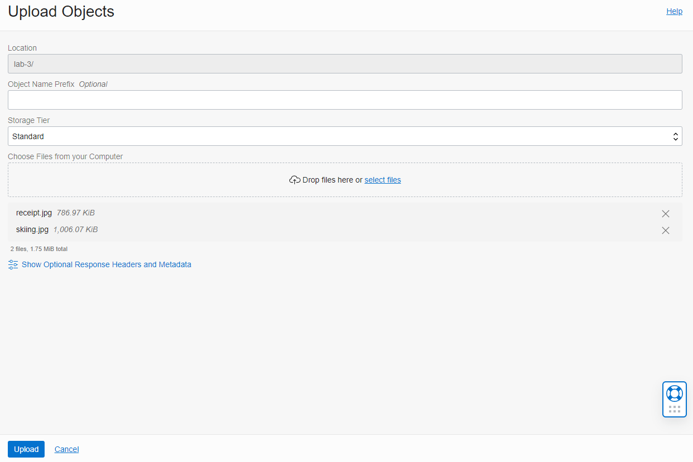

  e. Repeat the process for all the files for the **lab-4** folder too.  

  f. In the same way that you created folders for **lab-3** and **lab-4**, create another folder called **output** that will be used in a later lab.

  More details on Object storage can be found on this page. [Object Storage Upload Page](https://oracle.github.io/learning-library/oci-library/oci-hol/object-storage/workshops/freetier/index.html?lab=object-storage) to see how to upload.

## **Task 3:** Demo Vision Service using the OCI Console

### 1. Navigate to the Vision Page of OCI Console

  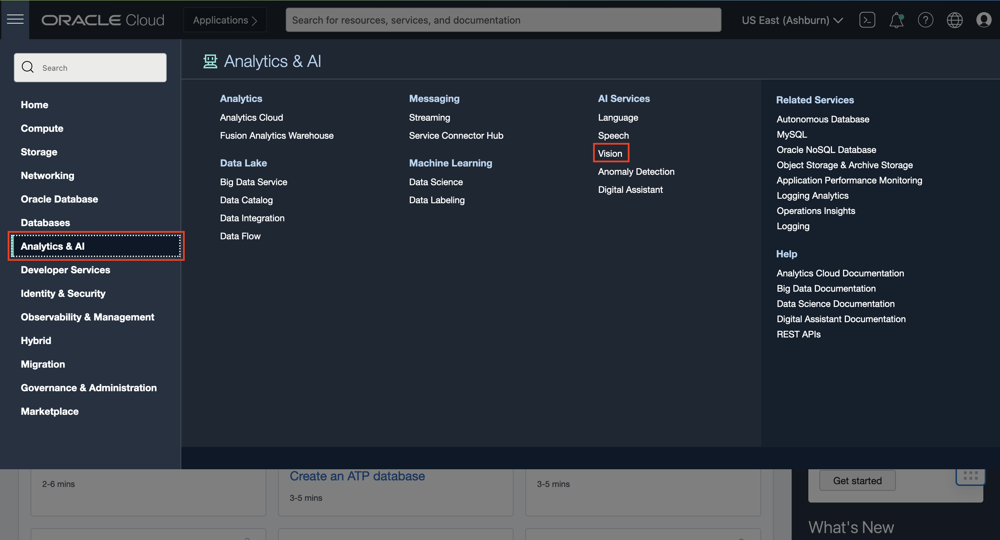

### 2. Use Document AI features

  a. On the Vision page, select **Document AI** on the left navigation menu.  Document AI has a pre-built example receipt image that extracts both Key Values and Raw Text that are displayed on the right.  Alternatively, you can also provide a document or image from local storage or OCI object storage. This invokes analyzeDocument API after the image is provided.

  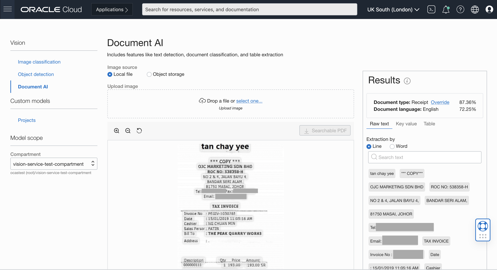

  b. Features you can test out:

  | Feature | Description | Details on Console |
  | --- | --- | --- |
  | OCR (Optical Character Recognition) | Locates and digitizes text information from images | Text will appear under the "raw text" header of the results pane of the console [\[Reference\]](./images/ocr.png) |
  | Document Image Classification | Classifies documents into different types based on their visual appearance, high-level features, and extracted keywords | Classification along with confidence score appears directly under "Results" pane [\[Reference\]](./images/dic.png) |
  | Language Classification | Classifies the language of document based on visual features | Classification along with confidence score appears under document classification in Results pane [\[Reference\]](./images/language-classification.png) |
  | Table Extraction | Extracts content in tabular format, maintaining row/column relationships of cells | Toggle to the Table tab to get table information [\[Reference\]](./images/table-extraction.png) |
  | Key Value Extraction (Receipts) | Extracts values for predefined fields in a receipt | Analyze a receipt and select key value [\[Reference\]](./images/key-value-receipt.png) |
  | Searchable PDF output | Embeds a transparent layer on top of document image in PDF format to make it searchable by keywords | You need to test on a PDF document to use this feature. When you've selected a PDF, the searchable PDF button will be clickable. Clicking on it will download an OCR PDF to your computer. [\[Reference\]](./images/searchable-pdf-output.png) |

### 3. Use Image Analysis Features

  a. On the Vision page, select "Object Detection" on the left navigation menu and a default image will be processed. This invokes analyzeImage API after the image is provided. There is a second sample image of a person in a hardhat. The custom application in a later lab will analyze a batch of images similar to this.

  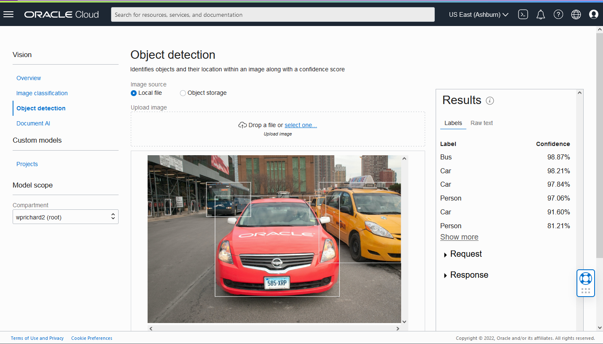

  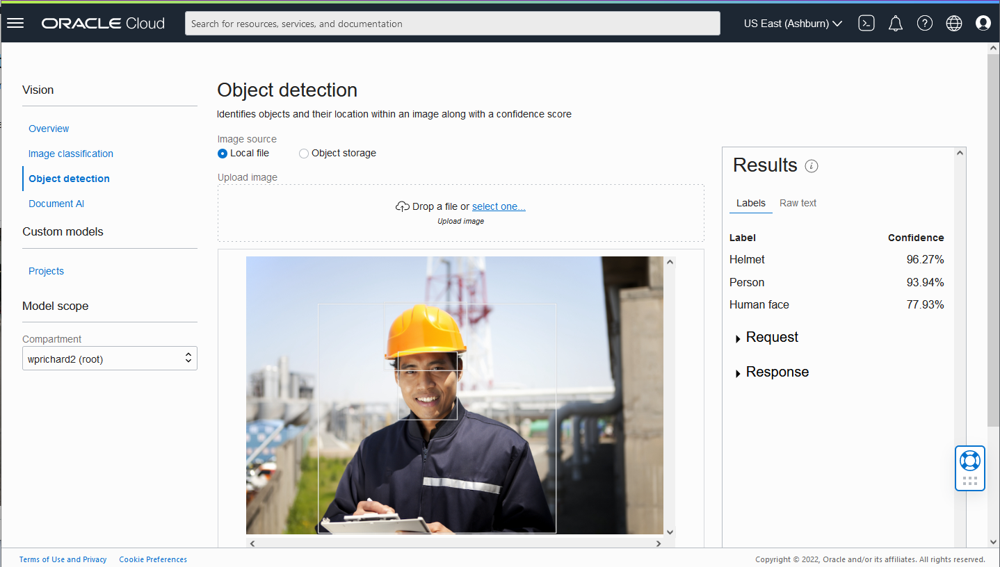

  b. Features you can test out.  We recommend completing **Object Detection** below as part of **Lab 4** that follows, and then doing _Image Classification_ on your own.  

  | Feature | Description | Details on Console |
  | --- | --- | --- |
  | Image classification | Categorizes object(s) within an image | Select "Image Classification." Labels and confidence scores will appear under the Results pane. [\[Reference\]](./images/image-classification.png) |
  | Object detection | Locates and identifies objects within an image | Select "Object Detection." Objects, confidence score, and highlighted bounding box will all appear under the Results pane. Clicking on one of the labels on the results pane will also highlight where on the image that object was detected. [\[Reference\]](./images/object-detection.png) |
  | OCR (Optical Character Recognition) | Locates and digitizes text information from images | Text will appear under the "raw text" header of the results pane of the console [\[Reference\]](./images/ocr.png) |

Congratulations on completing this lab!

[Proceed to the next lab](./Lab-3-vision-rest.md).
