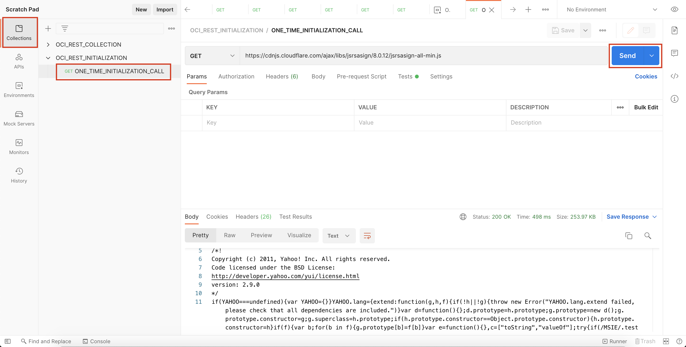

# Lab 4: Access OCI Language with REST APIs

## Introduction


In this lab session, we will show you how to access OCI Language using POSTMAN.

Postman is a GUI-based REST API invocation tool that is very popular among developers.

*Estimated Lab Time*: 10 minutes

### Objectives:
* Learn how to access Language Service through REST APIs.

### Prerequisites:
* Basic knowledge of REST API calls.
* Postman GUI in your local setup. If you don't have POSTMAN, please download it from [POSTMAN](https://www.postman.com/downloads/)

## **TASK 1:** Setting Up Postman for OCI REST APIs
We have provided some scripts and steps below that can be used to allow invoking OCI REST APIs through Postman. Please follow the steps in the order described.

1. Import the environment into Postman

Download the [OCI Environment](./files/OCI_Environment.postman_environment.json) and import the environment into Postman using the 'Import' button at the top.
    

Make sure to set OCI_Environment as the active environment.
    

1. Set the Variables  
Open and edit the newly imported environment (OCI_Environment), and set the variables tenancyId, authUserId, keyFingerprint and private Key. These are same that are found in the .oci file you created in the Lab 3 (Task 3->Step4).

Make sure to set both Initial Value and Current Value of the variables(set both as the same value).

Click the Save button to commit your changes to the environment.
    

1. Import the Collections
Download and import [OCI REST INITIALIZATION](./files/OCI_REST_INITIALIZATION.postman_collection.json) and [OCI REST COLLECTION](./files/OCI_REST_COLLECTION.postman_collection.json) into Postman using the 'Import' button at the top.

1. Execute OCI REST Initializer
From the OCI REST INITIALIZATION collection, invoke the Initializer GET for 'jsrsasign-all-min.js' , which imports and initializes a required library jsrsasign for encryption and digital signatures. This is a one-time setup task.
    

<!-- ### 5. Add Request in OCI REST COLLECTION

Add Request in the OCI REST COLLECTION Folder


Enter Name and click 'Save to OCI REST COLLECTION'


Just make sure that the OCI REST calls are executed as part of the OCI REST COLLECTION, as that collection contains the necessary javascript code to generate OCI's authentication header -->

## **TASK 2:** Invoke Language OCI REST APIs

Invoke Language OCI REST APIs by clicking any one of the requests in the OCI REST COLLECTION. Enter the text you want to analyze in the body as shown below:
    ```
    <copy>{
        "text" : "American football was derived from the European games of rugby and soccer. Unlike the game of soccer, however, American football focuses more on passing and catching the ball with the hands as opposed to kicking the ball with the feet. Standard American football field is 120 yards in length and 160 feet in width. They are hash marks on every yards and every 10 yards. American football is quickly become more popular then baseball and fan bases are increasing rapidly. Jerry Rice, Tom Brady and Lawrence Taylor are few top player of this sports."
    }<copy>
    ```

Below in the example shown to invoke Detect Language Service.
    

OCI Language Service EndPoints for all the services:

```
# Language Detection
https://language.aiservice.us-ashburn-1.oci.oraclecloud.com/20210101/actions/detectDominantLanguage

# Key Phrase Extraction
https://language.aiservice.us-ashburn-1.oci.oraclecloud.com/20210101/actions/detectLanguageKeyPhrases

# Named Entity Recognition
https://language.aiservice.us-ashburn-1.oci.oraclecloud.com/20210101/actions/detectLanguageEntities

# Text Classification
https://language.aiservice.us-ashburn-1.oci.oraclecloud.com/20210101/actions/detectLanguageTextClassification

# Aspect-Based Sentiment Analysis
https://language.aiservice.us-ashburn-1.oci.oraclecloud.com/20210101/actions/detectLanguageSentiments

```

[Proceed to the next lab](#next).
