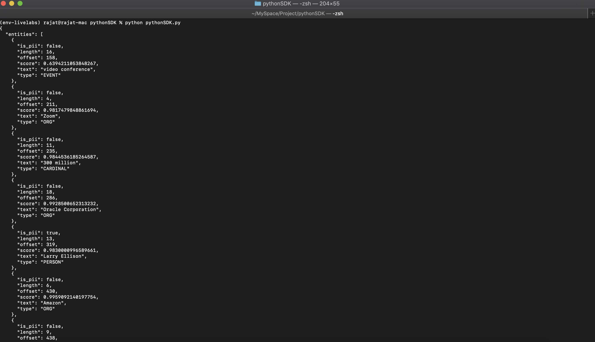

# Lab 4: Access OCI Vision with the Vision Python SDK

## Introduction

Oracle Cloud Infrastructure provides a number of Software Development Kits (SDKs) to facilitate development of custom solutions. SDKs allow you to build and deploy apps that integrate with Oracle Cloud Infrastructure services. Each SDK also includes tools and artifacts you need to develop an app, such as code samples and documentation. In addition, if you want to contribute to the development of the SDKs, they are all open source and available on GitHub.

You can invoke OCI Vision capabilities through the OCI SDKs.  In this lab session, we will show how to use the Python SDK to call the Vision service.

[SDK for Python](https://docs.oracle.com/en-us/iaas/Content/API/SDKDocs/pythonsdk.htm#SDK_for_Python)

*Estimated Lab Time*: 10 minutes

### Objectives:

* Learn how to use Vision SDKs to communicate with our Vision service endpoints.

<!-- ### Prerequisites:
* Familiar with Python programming is required
* Have a Python environment ready in local
* Familiar with local editing tools, vi and nano
* Installed with Python libraries: `oci` and `requests` -->


## **TASK 1:** Setup API Signing Key and Config File
**Prerequisite: Before you generate a key pair, create the .oci directory in your home directory to store the credentials.**

Mac OS / Linux:

```
<copy>mkdir ~/.oci</copy>
```
Windows:
```
<copy>mkdir %HOMEDRIVE%%HOMEPATH%\.oci</copy>
```

Generate an API signing key pair

1. Open User Settings

  Open the Profile menu (User menu icon) and click User Settings.
    

1. Open API Key

  Navigate to API Key and then Click Add API Key.
    

1. Generate API Key

  In the dialog, select Generate API Key Pair. Click Download Private Key and save the key to your .oci directory and then click Add.
    


4. Generate Config File

  Copy the values shown on the console.
    

    Create a config file in the .oci folder and paste the values copied.
    Replace the key_file value with the path of your generated API Key.
    


To Know more visit [Generating API KEY](https://docs.oracle.com/en-us/iaas/Content/API/Concepts/apisigningkey.htm) and [SDK and CLI Configuration File](https://docs.oracle.com/en-us/iaas/Content/API/Concepts/sdkconfig.htm#SDK_and_CLI_Configuration_File)

## **TASK 2:** Prerequisites and Setup for Python

Please follow the steps in the order described.
Before you go any further, make sure you have Python 3.x version and that it’s available from your command line. You can check this by simply running:
```
<copy>python --version</copy>
```
If you do not have Python, please install the latest 3.x version from [python.org ](https://www.python.org)

Additionally, you’ll need to make sure you have pip available. You can check this by running:
```
<copy>pip --version</copy>
```
If you installed Python from source, with an installer from python.org, or via Homebrew you should already have pip. If you’re on Linux and installed using your OS package manager, you may have to install pip separately.


1. Create virtualenv

  To create a virtual environment, run the venv module as a script as shown below
```
<copy>python3 -m venv <name of virtual environment></copy>
```
2. Activate virtualenv

  Once you’ve created a virtual environment, you may activate it.

Mac OS / Linux:
```
<copy>source <name of virtual environment>/bin/activate</copy>
```
Windows:
```
<copy><name of virtual environment>\Scripts\activate</copy>
```
3. Install OCI

  Now Install oci by running:
```
<copy>pip install oci</copy>
```


## **TASK 3:** OCI Vision Service SDK Code Sample

#### Python Code
```Python
<copy>
### Import Packages
# When using the conda environment ```generalml_p37_cpu_v1```, you will need to upgrade the ```oci``` package with the command ```pip install oci --upgrade``` in the conda environment.
# You can enter the conda environment with the command ```conda activate /home/datascience/conda/generalml_p37_cpu_v1```.
# You can install the conda environment with the command ```odsc conda install -s generalml_p37_cpu_v1```.
# Doing will create you some dependency issues but for the purposes of this exercise, these dependency issues will not matter.

import time
import oci
import json
import re

from oci.ai_vision import AIServiceVisionClient
from oci.ai_vision.models.create_image_job_details import CreateImageJobDetails
from oci.ai_vision.models.image_classification_feature import ImageClassificationFeature
from oci.ai_vision.models.image_object_detection_feature import ImageObjectDetectionFeature
from oci.ai_vision.models.image_text_detection_feature import ImageTextDetectionFeature
from oci.ai_vision.models.input_location import InputLocation
from oci.ai_vision.models.object_list_inline_input_location import ObjectListInlineInputLocation
from oci.ai_vision.models.object_location import ObjectLocation
from oci.ai_vision.models.object_storage_document_details import ObjectStorageDocumentDetails
from oci.ai_vision.models.output_location import OutputLocation
from oci.object_storage import ObjectStorageClient

### Define Variables
namespace_name = "orasenatdpltintegration03"
bucket_name = "PiDayBucket"
compartment_id = "ocid1.compartment.oc1..aaaaaaaai35zencvv26qto22rmzjp4feabv3p7zpycp7ltlktn4bonnrhkra"
input_prefix = "Sample-Images"
output_prefix = "Final-Results"

# Auth Config Definition
config = oci.config.from_file('~/.oci/config')

# AI Vision Client Definition
ai_vision_client = oci.ai_vision.AIServiceVisionClient(config)

### Get Images from Object Storage Using Object Storage Client
# List Objects in Bucket
object_storage_client = ObjectStorageClient(config)
object_list = object_storage_client.list_objects(
    namespace_name = namespace_name,
    bucket_name = bucket_name,
    prefix = input_prefix
)

# Create List of All Testing Images
image_list = []
for i in object_list.data.objects:
    if i.name.endswith('.jpg'):
        object_location = ObjectLocation()
        object_location.bucket_name = bucket_name
        object_location.namespace_name = namespace_name
        object_location.object_name= i.name
        image_list.append(object_location)

### Vision AI
# Send the Request to Service with Multiple Features
image_classification_feature = ImageClassificationFeature()
image_object_detection_feature = ImageObjectDetectionFeature()
image_text_detection_feature = ImageTextDetectionFeature()
features = [image_classification_feature, image_object_detection_feature, image_text_detection_feature]

# Setup Input Location
object_locations1 = image_list
input_location = ObjectListInlineInputLocation()
input_location.object_locations = object_locations1

# Setup Output Location
output_location = OutputLocation()
output_location.namespace_name = namespace_name
output_location.bucket_name = bucket_name
output_location.prefix = output_prefix

# Details Setup
create_image_job_details = CreateImageJobDetails()
create_image_job_details.features = features
create_image_job_details.compartment_id = compartment_id
create_image_job_details.output_location = output_location
create_image_job_details.input_location = input_location

# Send the testing images to Vision service by calling creat_image_job API to get analyze images and it returns json responses
res = ai_vision_client.create_image_job(create_image_job_details=create_image_job_details)

# Final Prefix Variable
final_prefix= output_prefix+"/"+res.data.id+"/"+namespace_name+"_"+bucket_name+"_"+input_prefix+"/"

# Logic to perform the following statistics:
# 1. Count the number of persons and hardhats in each image, and total up the counts
# 2. Report the person and hardhat counts, and the number of images processed
# 3. Also, list the names of images where the person count and hardhat count don’t match

# Sleep for 90 Seconds
print("Please wait 90 seconds for images to be analyzed.")
time.sleep(90)

person_count=0
hat_count=0
image_counter=0
no_match_list=[]

# List all JSON responses received by Vision AI
object_storage_client = ObjectStorageClient(config)
object_list = object_storage_client.list_objects(
    namespace_name = namespace_name,
    bucket_name = bucket_name,
    prefix = final_prefix
) 

# Count number of persons and number of hats 
for i in object_list.data.objects:
    image_counter=image_counter+1
    body=object_storage_client.get_object(namespace_name, bucket_name, object_name=i.name)
    dict_test= json.loads(body.data.content.decode('utf-8'))
    for j in dict_test['imageObjects']:
        if (j['name'] =='Person' or j['name']=='Man' or j['name']=='Woman' or j['name']=='Human'):
            person_count =person_count +1
        if (j['name'] =='Helmet'):
            hat_count=hat_count+1
            
    if (person_count!=hat_count):
        no_match_list.append(i.name)
        

print ("Number of persons found in images:", person_count,"\n")
print ("Number of hats found in images:", hat_count, "\n")
print ("Number of images processed:", image_counter, "\n")     
print ("Name of images where hat count is not equal to total number of persons:\n")

for i in no_match_list:
    i=re.sub(final_prefix,'',i)
    i=re.sub('.json','',i)
    print(i)
</copy>
```
Follow below steps to run Python SDK:

### 1. Download Python Code.

Download [code](./files/language.py) file and save it your directory.

### 2. Execute the Code.
Navigate to the directory where you saved the above file (by default, it should be in the 'Downloads' folder) using your terminal and execute the file by running:
```
<copy>python language.py</copy>
```
### 3. Result
You will see the result as below
    


## Learn More
To know more about the Python SDK visit [Python OCI-Vision](https://docs.oracle.com/en-us/iaas/tools/python/2.58.0/api/ai_vision/client/oci.ai_vision.AIServiceVisionClient.html)

Congratulations on completing this lab!

[Proceed to the next lab](#next).
