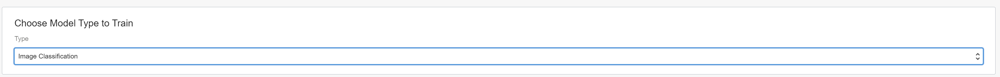
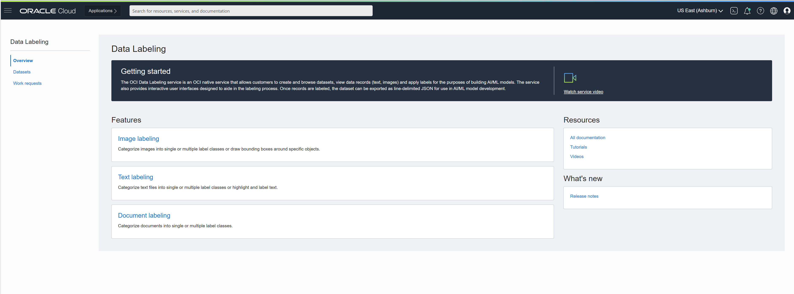
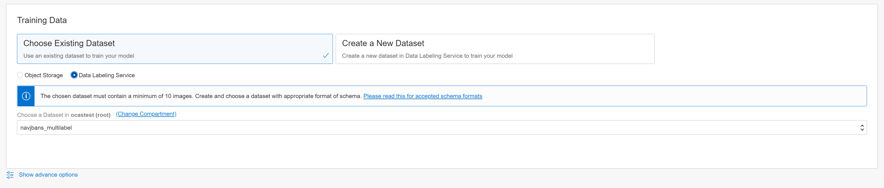
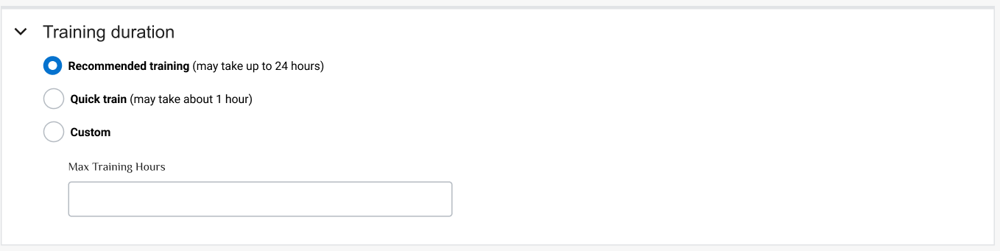
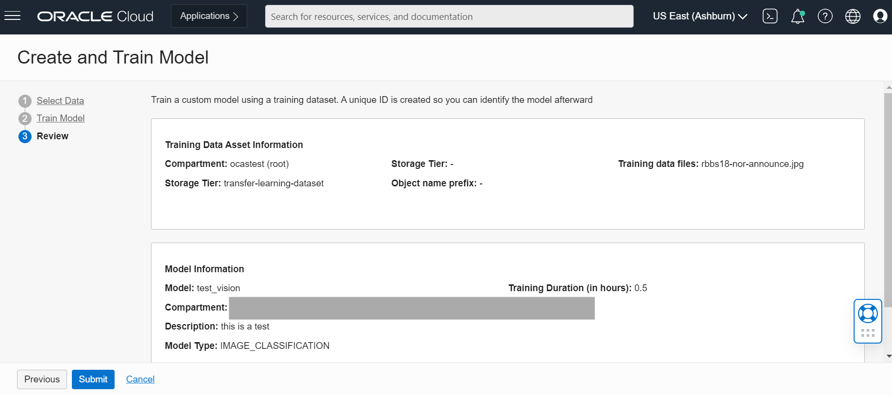

# Lab 5: Create a custom model through the console

## Introduction
In this session, we will show you how to create a vision project, select your training data, and train a custom model all without the need for any machine learning experience.

*Estimated Time*: 15+ minutes depending on how long you train your model

### Objectives

In this lab, you will:
- Learn how to create vision project.
- Understand the schema for training data.
- Learn how to train an image classification or object detection model through the OCI console.

### Prerequisites
- Familiar with OCI Object Storage to upload data.

## **Policy Setup**

Before you can start using OCI Vision you need to have permission to access the service. If you don't have permission to access the service, follow the Stack Setup instructions in [Lab 2](./Lab-2-analyze-vision.md).

## **Task 1:** Create Dataset

1. Open the OCI Console, select the burger menu, select **Analytics & AI**, select **Data Labeling**.

    

1. Select **Datasets** and select **Create Dataset**.

    

## **Task 2:** Create a Project

A Project is a way to organize multiple models in the same workspace.

1. Log into OCI Console. Using the burger menu on the top left corner, navigate to **Analytics and AI** in the menu and select it, and then select **Vision** under AI Services. Clicking the Vision service will navigate you to the Vision service Console page. Once here, select **Projects** under the "Custom Models" header on the left side of the OCI Console.

    

1. Select **Create Project** and name the project "vision_demo".

    

1. Once the details are entered, select **Create**. If the project is successfully created it will show up in projects pane.

## **Task 3:** Select Model Type

AI Vision Service supports training of an on-demand custom model for Object Detection, Image Classification, and Document Image Classification features. You can select one of these three options in the drop down.

## **Task 4:** Select Training Data

1. To train a custom model, you will need training data. There are two main options depending on if you already have an annotated dataset, or only have raw (unlabeled) images.

    

1. **Create a New dataset**: If you do not have any annotated images (you only have raw images you'd like to train your model on), select "Create a New Dataset".

    

    This will drive you to OCI Data Labeling service, where you can easily add labels or draw bounding boxes over your image content. To learn more about how to annotate images using OCI Data Labeling service, you can review documentation here [Adding and Editing Labels (oracle.com)](https://docs.oracle.com/en-us/iaas/data-labeling/data-labeling/using/labels.htm).

    

1. **Choose existing dataset**: If you have an existing annotated dataset, you can select it by clicking "Choose Existing Dataset." If you've previously annotated images using OCI Data Labeling service, select that button and select the dataset file of your choice. If you have annotated your images using some 3rd party tool, you can upload that dataset file to object storage and select via the "object storage" button.

    

## **Task 5:** Train your Custom Model

In the "train model" step, you will name your model, add a description of it, and optionally, specify a training duration.

## **Task 6:** Review and Submit

In the "review" step, you can verify that all of your information is correct and go back if you want to make adjustments (on training time, for example). When you want to start training, click "submit" and this will kick of the process. You can then check on the status of your model in the project where you created it.

### Congratulations on completing this lab and workshop!
