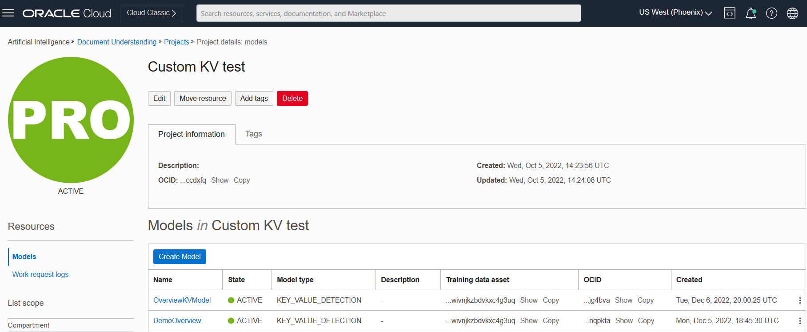
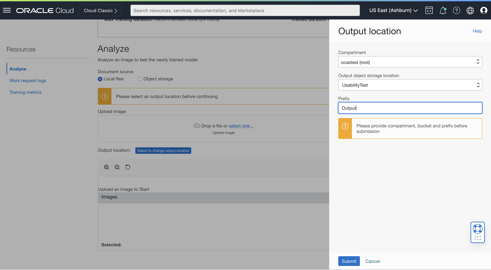
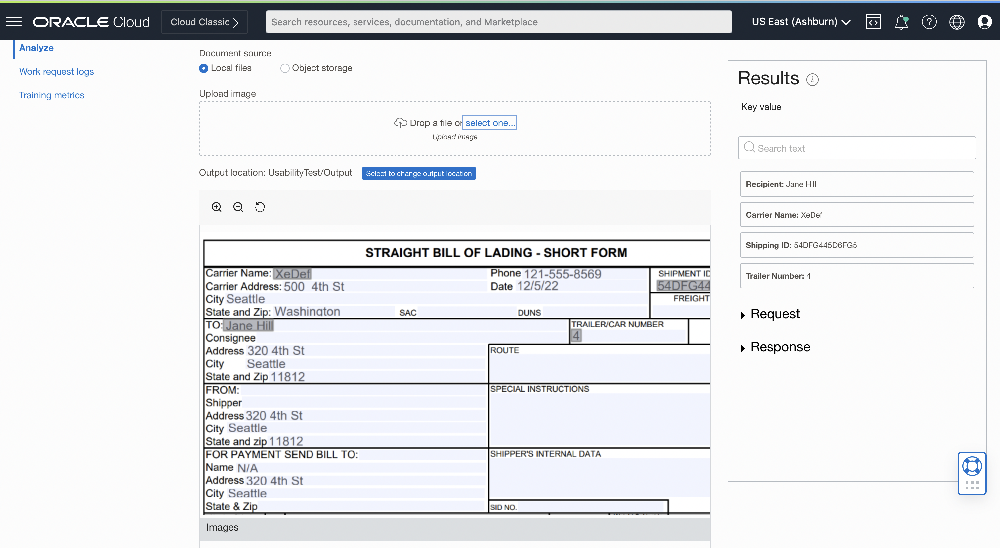

# Lab 3: Call your model in the OCI Console
## Introduction

In this lab, you will use the OCI Console to invoke the model created in the previous lab.

Estimated Time: 10 minutes

### Objectives

In this workshop, you will:

* Get to know how to call the key value extraction model created in [previous lab](./lab-02-model_training.md).

## Task 1: Navigate to Model Details page
* Navigate to the project space you created in the previous lab, and look for the model you created. It will be in one of four states, "active" "in progress" "failed" or "deleted".
* Once the model is active, click on the name to access its model details page

## Task 2: Invoke model through OCI console
* Once on your model's details page, select **"Analyze"** under _Resources_ header on the left hand side of the console.
* Click on **"Select to change output location"** to give output location. 

* From the dropdown list give the compartment.
* Select the bucket created in Lab1(Task 1) under Output object storage location. 
* Give a prefix, where the output documents have to be stored.

* Once the output location is given, call your model by uploading the document from local.

## **Summary**

Congratulations!  
In this lab, you have learnt how to call a trained model through the OCI console.

You may now **proceed to the next lab**.

[Proceed to the next section](./lab-04-notebook_sdk.md).
