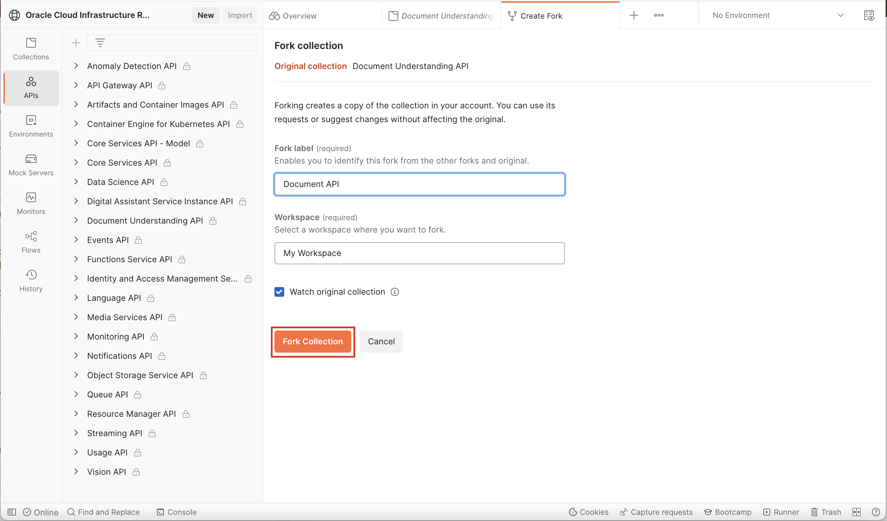
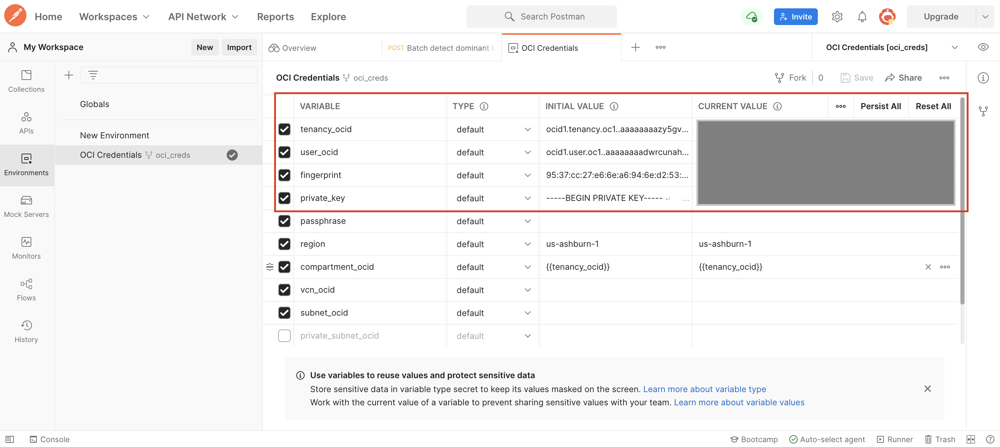
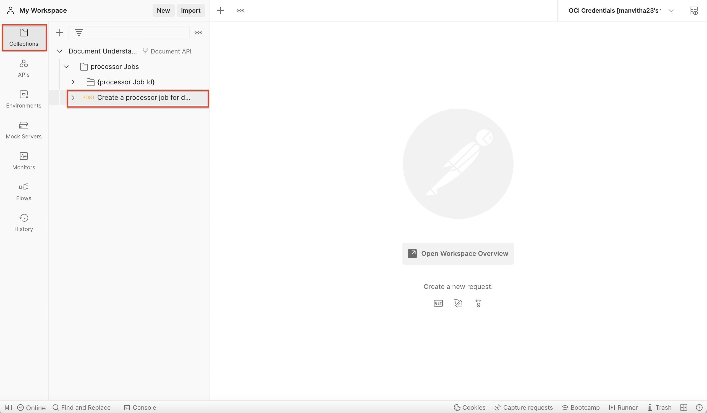
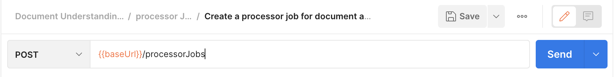
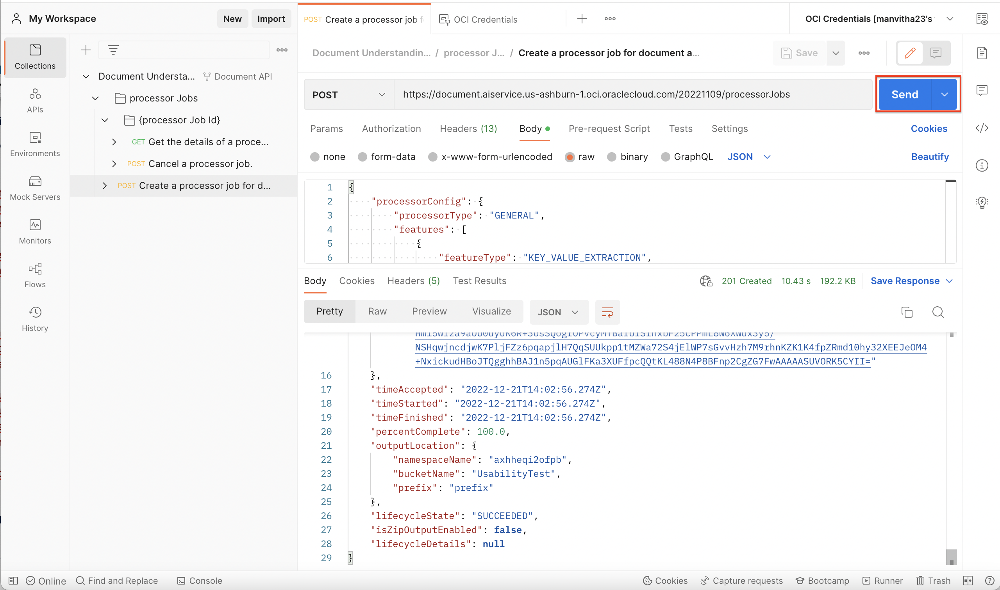
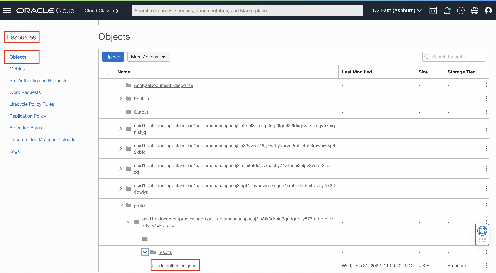

# Lab 5: Call your model through REST API using Postman
## Introduction

In this lab, we will use Document Understanding Services in Postman.

Estimated Time: 15 minutes


### Objectives

In this workshop, you will:

* Learn how to call the model using REST API calls through postman.

### Prerequisites:

* Basic knowledge of REST API calls.
* Postman GUI in your local setup. If you don't have POSTMAN, please download it from [POSTMAN](https://www.postman.com/downloads/).

## TASK 1: Setting Up Postman for OCI Document Service REST APIs

* Visit the [OCI Postman workspace](https://www.postman.com/oracledevs/workspace/oracle-cloud-infrastructure-rest-apis/api/79bbefd7-4bba-4370-b741-3724bf3c9325) and login with your credentials.
* Fork the Document Understanding API collection in your workspace by navigating to Document Understanding API collection and clicking the **"Fork"** option.


* Enter a name to identify the forked Document Understanding API collection, select the workspace you want to fork the collection to, and click **"Fork Collection"**.



* Fork the OCI Credentials Environment in your workspace by navigating to Environments and clicking the **"Fork"** option.


* Enter a name to identify the forked OCI credentials environment, select the workspace you want to fork the collection to, and click **"Fork Collection"**.


* Navigate to your workspace and open the newly forked environment (OCI Credentials), and set the variables tenancyId, authUserId, keyFingerprint, and private Key. These are the same value that are found in the .oci file you created in Lab 4 (Task 2). 
* Make sure to set both Initial Value and Current Value of the variables(set both as the same value).
* Click the Save button to commit your changes to the environment.



## TASK 2: Invoke Document Understanding OCI REST APIs

* Navigate to **"Create a processor job for document analysis"** section under _"processor Jobs"_.



* Update the base url with "https://document.aiservice.{region}.oci.oraclecloud.com/20221109" and region being the one in which model is created.

  (sample url: https://document.aiservice.us-ashburn-1.oci.oraclecloud.com/20221109/processorJobs)



* Navigate to **"raw"** under _"body"_ section to enter the payload for request. Change the format to _"JSON"_.


* Edit the payload given below according to your model ID, data(in inputLocation), outputLocation, and compartment ID.
  * modelId can be found in the details of the model created in Lab1(Task 2).
  (Note: data should be base64 encoded)
  ```
  {
    "processorConfig": {
      "processorType": "GENERAL",
        "features": [
          {
            "featureType": "KEY_VALUE_EXTRACTION",
            "modelId": <model_id>
          }
        ]
      },
    "inputLocation": {
      "sourceType": "INLINE_DOCUMENT_CONTENT",
      "data": <base64 encoded document>
    },
    "outputLocation": {
      "bucketName": <name of the bucket>,
      "namespaceName": <namespace under which model exists>,
      "prefix": "prefix"
    },
    "compartmentId": <ID of the compartment where the model is created>
  }
  ```

* Enter the payload in the postman and click on "send". 
* We will get the response with the request details and Processor job details. In the response **"lifecycleState"** should be in <code>SUCCEEDED</code> state.



* The output JSON file can be found in the "outputLocation" specified by the user. 
* Navigate to the bucket mentioned in the ouputLocation and click on Objects under the Resources section. 
* You will find the output file similar to the one shown below in the following path: "prefix/{Processorjob_ID}/_/results/defaultObject.json". 
  (Note: Processorjob_ID can be found denoted as "id" in the response obtained in the previous step)



* Sample Output JSON file: [defaultObject.json](./defaultObject.json).

## **Summary**

Congratulations! </br>
In this lab, you have learnt how to invoke the model through postman.

Hurray!! You have successfully completed this workshop. In this workshop you had learnt:
* To create and label a dataset.
* To create and train a model in OCI console.
* Call model through different platforms like OCI console, Datascience Notebook(through preview SDK), and Postman.

## Stay in Touch!

* Read our blog posts at [https://blogs.oracle.com/ai-and-datascience/](https://blogs.oracle.com/ai-and-datascience/).

* [Watch our tutorials on YouTube](https://www.youtube.com/playlist?list=PLKCk3OyNwIzv6CWMhvqSB_8MLJIZdO80L).

* Our service documentation is also available at [https://docs.oracle.com/en-us/iaas/data-science/using/data-science.htm](https://docs.oracle.com/en-us/iaas/data-science/using/data-science.htm).
