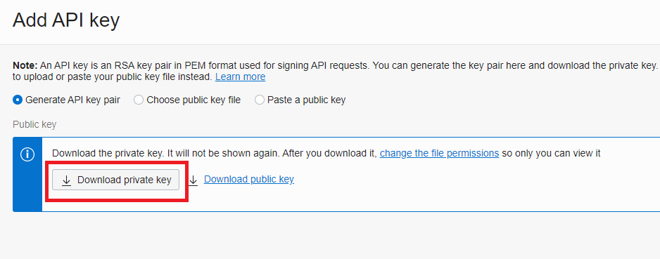
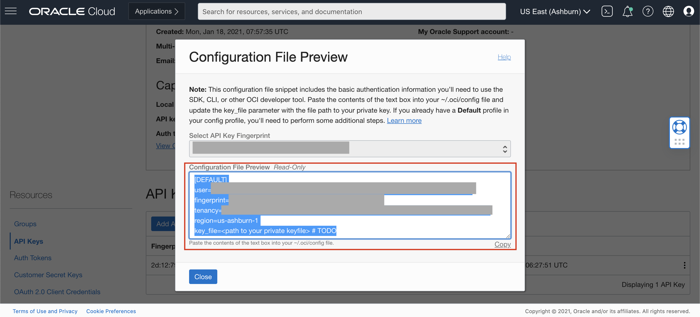
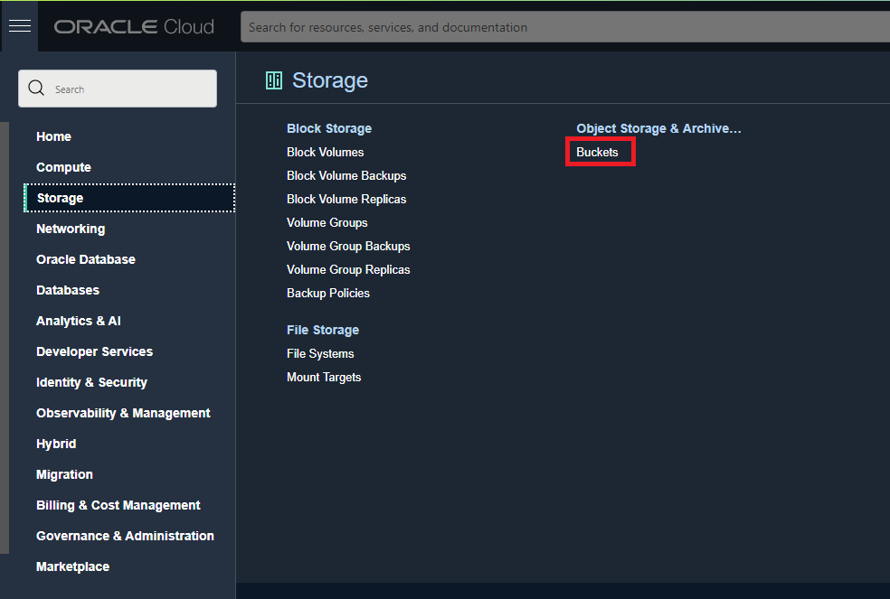

# Lab 4: Access OCI Document Understanding with the OCI Python SDK

## Introduction

In this lab you will use the OCI Python SDK to extract information from documents.

[SDK for Python](https://docs.oracle.com/en-us/iaas/Content/API/SDKDocs/pythonsdk.htm#SDK_for_Python)

*Estimated Lab Time*: 30 minutes

### Objectives:

* Learn how to use OCI Python SDK to communicate with our Document Understanding service.


## **TASK 1:** Setup API Signing Key and Config File
If this is your first time using the OCI SDK, you'll need to create a config file. If you've already done this, you can skip to the next step.

1. Create the .oci folder. Open an admin command prompt or Terminal and run the following command.

    Windows:
    ```
    mkdir %HOMEDRIVE%%HOMEPATH%\.oci
    ```

    Mac OS / Linux:
    ```
    mkdir ~/.oci
    ```

1. Generate an API signing key pair

    > **Note**: If you completed lab 3, you already created an API Key. If that's the case, navigate to the key and skip to step f. below.

    a. Open My Profile

    Open the **Profile** menu (User menu icon) and click **your user name**.

      

    b. Open API Keys

    Navigate to **API keys** and then Click **Add API Key**.

      

    c. Generate API Key

    In the dialog, select **Generate API key pair**. Click **Download Private Key**.

      

    d. Save Private Key

    Save the private key that downloaded to your **.oci** directory.

    e. Add the API Key

    Click **Add**.

      

    f. Generate Config File

    Use the 3 dots on the row where the key is listed and select **View Configuration file**. Copy the values shown on the *Configuration File Preview*. You will paste them into a file in the next step.

            

3. Create a file with the name *config* (with no extension) in the .oci folder and paste the values previously copied. Save your changes.

     Replace the **key_file value** with the path of your generated private key.

      


To Know more visit [Generating API KEY](https://docs.oracle.com/en-us/iaas/Content/API/Concepts/apisigningkey.htm) and [SDK and CLI Configuration File](https://docs.oracle.com/en-us/iaas/Content/API/Concepts/sdkconfig.htm#SDK_and_CLI_Configuration_File)


## **TASK 2:** Add Sample Documents to Object Storage

1. Download the [Lab-4 sample documents](./sample-documents/lab4) and upload them to your Object Storage bucket.

2. Login to the OCI Console and navigate to your Object Storage Buckets

  

3. Choose an existing bucket or create a new bucket called "DocumentDemo".

## **TASK 3:** OCI Document Understanding Service SDK Code Sample

1. Create a new file on your local machine called "invoicekv.py" and add it to C:\Users\<user>\AppData\Local\Programs\Python\<Python version>\Scripts folder or add it to your Desktop if you are using a Mac.

2. Copy the python code from below into "invoicekv.py".

#### Python Code

The following sample code involves essentially three steps:
* call CreateProcessorJob to process your sample invoice
* call GetProcessorJob to get the status of the job (until final status)
* call GetObject to get the response from Object Storage

```Python
### Import Packages
import oci
import uuid
import base64

# Setup basic variables
# Auth Config
CONFIG_PROFILE = "DEFAULT"
config = oci.config.from_file('~/.oci/config', CONFIG_PROFILE)

# Compartment where processor job will be created (required)
COMPARTMENT_ID = "<enter-your-compartment-ocid-here>"  # e.g. "ocid1.compartment.oc1..aaaaaaaae5j73axsja5fnahbn23ilop3ynjkcg77mcvgryddz4pkh2t5ppaq";

def create_processor_job_callback(times_called, response):
    print("Waiting for processor lifecycle state to go into succeeded state:", response.data)

# Setup input location where document being processed is stored.
object_location = oci.ai_document.models.ObjectLocation()
object_location.namespace_name = "<enter-your-objectstorage-namespace-here>"  # e.g. "axhh9gizbq5x"
object_location.bucket_name = "<enter-your-bucket-name-here>"  # e.g "demo_examples"
object_location.object_name = "<enter-your-object-name-here>"  # e.g "key_value_extraction_demo.jpg

aiservicedocument_client = oci.ai_document.AIServiceDocumentClientCompositeOperations(oci.ai_document.AIServiceDocumentClient(config=config))

# Document Key-Value extraction Feature
key_value_extraction_feature = oci.ai_document.models.DocumentKeyValueExtractionFeature()

# Setup the output location where processor job results will be created
output_location = oci.ai_document.models.OutputLocation()
output_location.namespace_name = "<enter-your-objectstorage-namespace-here>"  # e.g. "axk2tfhlrens"
output_location.bucket_name = "<enter-your-bucket-name-here>"  # e.g "output"
output_location.prefix = "<enter-your-prefix-here>"  # e.g "demo"

# Create a processor_job for invoice key_value_extraction feature. 
# Note: If you want to use another key value extraction feature, set document_type to "RECIEPT" "PASSPORT" or "DRIVER_ID". If you have a mix of document types, you can remove document_type
create_processor_job_details_key_value_extraction = oci.ai_document.models.CreateProcessorJobDetails(
                                                    display_name=str(uuid.uuid4()),
                                                    compartment_id=COMPARTMENT_ID,
                                                    input_location=oci.ai_document.models.ObjectStorageLocations(object_locations=[object_location]),
                                                    output_location=output_location,
                                                    processor_config=oci.ai_document.models.GeneralProcessorConfig(features=[key_value_extraction_feature],
                                                                                                                   document_type="INVOICE"))

print("Calling create_processor with create_processor_job_details_key_value_extraction:", create_processor_job_details_key_value_extraction)
create_processor_response = aiservicedocument_client.create_processor_job_and_wait_for_state(
    create_processor_job_details=create_processor_job_details_key_value_extraction,
    wait_for_states=[oci.ai_document.models.ProcessorJob.LIFECYCLE_STATE_SUCCEEDED],
    waiter_kwargs={"wait_callback": create_processor_job_callback})

print("processor call succeeded with status: {} and request_id: {}.".format(create_processor_response.status, create_processor_response.request_id))
processor_job: oci.ai_document.models.ProcessorJob = create_processor_response.data
print("create_processor_job_details_key_value_extraction response: ", create_processor_response.data)

print("Getting defaultObject.json from the output_location")
object_storage_client = oci.object_storage.ObjectStorageClient(config=config)
get_object_response = object_storage_client.get_object(namespace_name=output_location.namespace_name,
                                                       bucket_name=output_location.bucket_name,
                                                       object_name="{}/{}/{}_{}/results/{}.json".format(
                                                           output_location.prefix, processor_job.id,
                                                           object_location.namespace_name,
                                                           object_location.bucket_name,
                                                           object_location.object_name))
print(str(get_object_response.data.content.decode()))
```

3. Update variables

    Open the python script and update all of the below variables.

      ```Python
      COMPARTMENT_ID = "<enter-your-compartment-ocid-here>"
      object_location.namespace_name = "<enter-your-objectstorage-namespsace-here>"  # e.g. "axhh9gizbq5x"
      object_location.bucket_name = "<enter-your-bucket-name-here>"  # e.g "demo_examples"
      object_location.object_name = "<enter-your-object-name-here>"  # e.g "key_value_extraction_demo.jpg"
      output_location.namespace_name = "<enter-your-objectstorage-namespsace-here>"  # e.g. "axk2tfhlrens"
      output_location.bucket_name = "<enter-your-bucket-name-here>"  # e.g "output"
      output_location.prefix = "<enter-your-prefix-here>"  # e.g "demo"
      ```

4. Execute the code

    Navigate to the directory where you saved the above file using your terminal or the command line and execute the file by running the following command (from the /Scripts folder):
    
    Windows:
    ```
    python invoicekv.py
    ```
    
    Mac OS / Linux:
    ```
    python3 invoicekv.py
    ```

5. Result

    You will see the following results (edited for brevity):

    ```
    Calling create_processor with create_processor_job_details_key_value_extraction: {
    "compartment_id": "",
    "display_name": "",
    "input_location":
    "output_location": {
    "bucket_name": "Demo",
    "namespace_name": "axhheqi2ofpb",
    "prefix": "none"
    },
    
    processor call succeeded with status: 201 and request_id: "".
    create_processor_job_details_key_value_extraction response:  {
    "compartment_id": "",
    "display_name": "",
    "id": "",
    "input_location": null,
    "lifecycle_details": null,
    "lifecycle_state": "SUCCEEDED",
    "output_location": {
        "bucket_name": "",
        "namespace_name": "",
        "prefix": ""
    },
    "percent_complete": 100.0,
    "processor_config": {
        "document_type": INVOICE,
        "features": [
        {
            "feature_type": "KEY_VALUE_EXTRACTION"
        }
        ],
        "is_zip_output_enabled": false,
        "language": null,
        "processor_type": "GENERAL"
    },
    "time_accepted": "2022-12-05T14:23:48.218000+00:00",
    "time_finished": "2022-12-05T14:23:48.218000+00:00",
    "time_started": "2022-12-05T14:23:48.218000+00:00"
    }
    Getting defaultObject.json from the output_location
    {
    "documentMetadata": {
        "pageCount": 1,
        "mimeType": "image/png"
    },
    "pages": [
        {
        "pageNumber": 1,
        "dimensions": {
            "width": 1372,
            "height": 1732,
            "unit": "PIXEL"
        },
        "documentFields": [
            {
            "fieldType": "KEY_VALUE",
            "fieldLabel": {
                "name": "VendorAddress",
                "confidence": 0.99862003
            },
            "fieldValue": {
                "valueType": "STRING",
                "text": "657 Clifford Street Allentown, PA",
                "boundingPolygon": {
                "normalizedVertices": [
                    {
                    "x": 0.08454810495626822,
                    "y": 0.10219399538106236
                    },
                    {
                    "x": 0.21793002915451895,
                    "y": 0.10219399538106236
                    },
                    {
                    "x": 0.21793002915451895,
                    "y": 0.13048498845265588
                    },
                    {
                    "x": 0.08454810495626822,
                    "y": 0.13048498845265588
                    }
                ]
                },
                "wordIndexes": [
                3,
                4,
                5,
                9,
                10
                ],
                "value": "657 Clifford Street Allentown, PA"
            }
            },

    ```

Confirm the results by looking at each image.

You can also take a look at the JSON output in your Oracle Object Storage bucket.

## Learn More
* To try other features, you can refer to the full collection of sample python code [here](https://github.com/oracle-samples/oci-data-science-ai-samples/tree/master/ai_services/document_understanding/python)

Congratulations on completing this lab!
