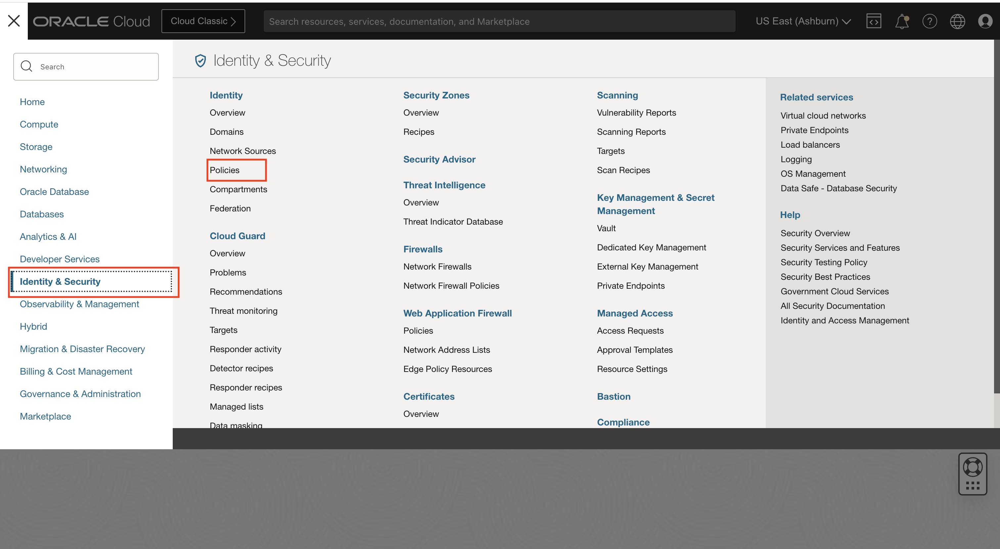
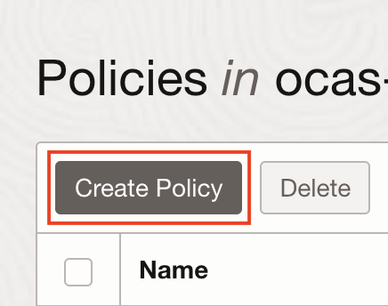
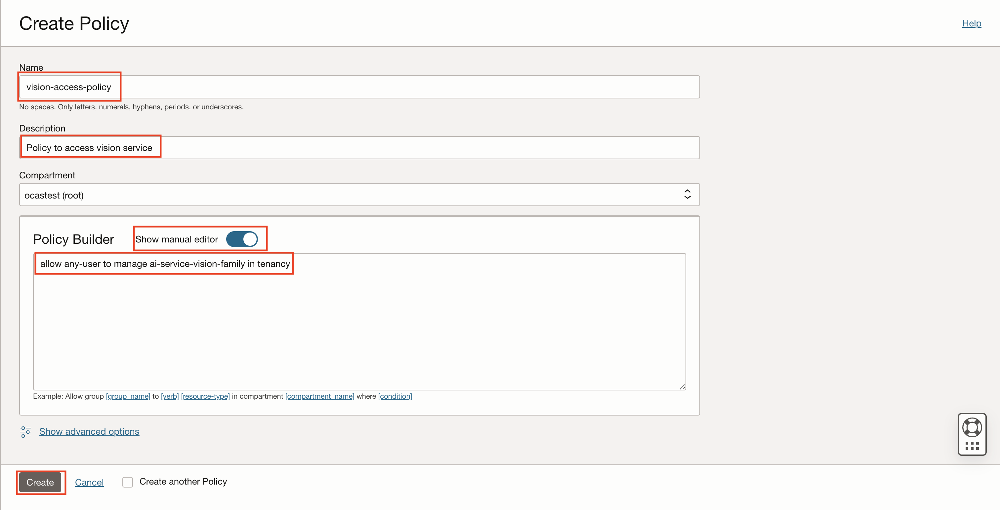

# Lab 0: Configure Policies for Stored Video Service

## Introduction

In this lab, you will use the OCI Console to set up the policies required for Stored Video Service.

Estimated Time: 10 minutes


### Objectives

* Get familiar with the OCI Console and be able to configure your policies required for this livelabs.

## Task: Policy Setup
Follow these steps to configure the required policies:
 (Note: Make sure you create the policies in the tenancy you are using for remaining tasks of this livelabs)

### 1. Navigate to Policies
Log into OCI Cloud Console. Using the Burger Menu on the top left corner, navigate to Identity & Security and click it, and then select Policies item under Identity.



### 2. Create Policy

Click Create Policy.



### 3. Set compartment to your root compartment and toggle on the manual editor
    
Configure as shown below: 


### 4. Create a Policy to grant users Video APIs access

Add the below statement to allow all the users in your tenancy to use stored video service:
```
allow any-user to manage ai-service-vision-family in tenancy
```

 

If you want to limit access to a user group, create a policy with the below statement:
```
allow group <group-name> to use ai-service-vision-family in tenancy
```
where "group-name" is the name of the user group that is created for some specific users in the "Identity & Security->Groups" section in OCI console.

### 5. Policy to access input video files in object storage

If you want to analyze videos stored in your tenancy's object storage bucket, add the below statement to grant object storage access permissions to the group:
```
allow group <group-name> to use object-family in tenancy
```
    
If you want to restrict access to a specific compartment, you can use the following policy instead: 
```
allow group <group-name> to use object-family in compartment <input-bucket-located-object-storage-compartment>
```

### 6. Policy to access output location in object storage

Stored Video Service stores results in your tenancy's object storage. Add the following policy to grant object storage access permissions to the user group who requested the analysis of videos:

```
allow group <group-name> to manage object-family in compartment <output-bucket-located-object-storage-compartment>
```

### 7. Policy to grant users access to Data Science

Data Science service allows us to create and access Data Science Notebook.

Add the below statement to allow the user group in your tenancy to use data science:
```
allow group <group-name> to manage data-science-family in tenancy
```

### 8. Policy to grant users access to Virtual Cloud Network

The Notebook session will be created inside a subnet, for which we need a Virtual Cloud Network that contains a subnet.

Add the below statement to allow the user group in your tenancy to use VCN:
```
allow group <group-name> to use virtual-network-family in tenancy
```

### 9. Policy to access virtual network in data science service

```
allow service datascience to use virtual-network-family in tenancy
```

## **Summary**

Congratulations! </br>
In this lab, you have learnt how to set up your policies required for Stored Video Service.

You may now **proceed to the next lab**.

[Proceed to the next section](./lab-01-notebook-sdk.md).
