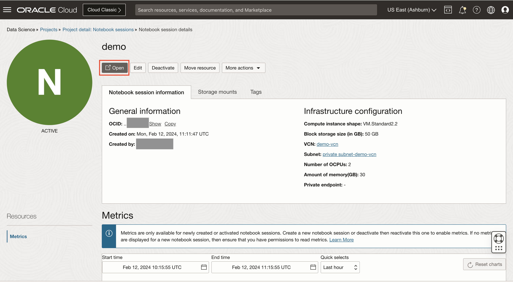
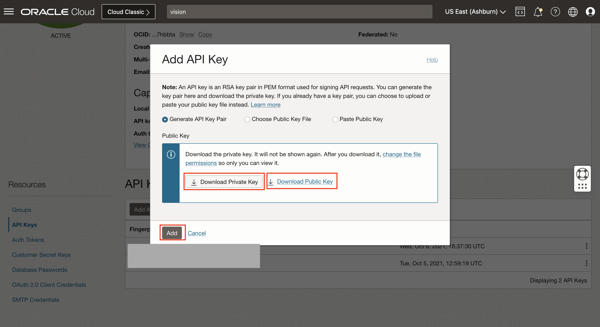
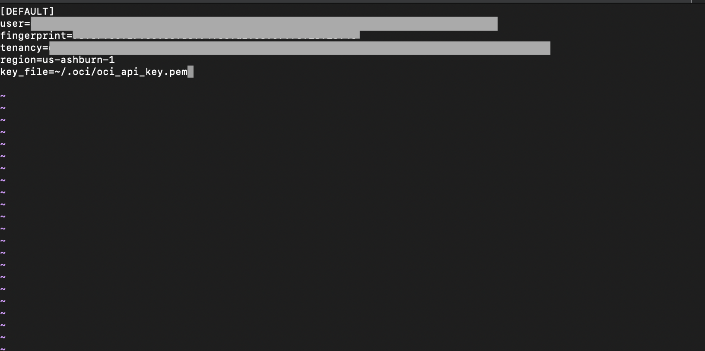

# Lab 1: Access Stored Video Service in DataScience Notebook Session
## Introduction

In this lab session, we will show you how to access Stored Video services in a Data Science Notebook.

Estimated Time: 40 minutes


### Objectives

In this lab, you will:

* Get to know how to create a Data Science notebook in the OCI console.
* Learn to setup API Signing Key and Config File.
* Learn how to use Stored Video Services within a Data Science notebook.

### Prerequisites

* Before you can start using Data Science, your tenancy administrator should set up the following networking, dynamic group.
  * Create a VCN and subnets using Virtual Cloud Networks > Start VCN Wizard > VCN with Internet Connectivity option. The Networking Quickstart option automatically creates the necessary private subnet with a NAT gateway.
  * Create a dynamic group with the following matching rule: ALL { resource.type = 'datasciencenotebooksession' }
  * Create a Dynamic Group Policy in the root compartment with the following statement:
    ```
    allow dynamic-group <dynamic-group> to manage data-science-family in tenancy
    ```

    where dynamic-group represents the name of your dynamic group.

* Access to OCI preview SDK (request access by emailing aparna.chaturvedi@oracle.com).

## Task 1: Navigate to the Data Science Notebook Session

* Using the Burger Menu on the top left corner, navigate to _Analytics and AI menu_ and click it, and then select **"Data Science"** under _Machine Learning_. 


* Select the Compartment in which want to create your project. 
* Click **"Create Project"** to create a new project. 


* Enter name and click **"Create Button"**.


* Click **"Create Notebook Session"** to create a new Notebook session. 


* Enter Notebook details: Select a name. Choose Intel Skylake VM.Standard2.2 as the shape. Set block storage to 50 GB. Select the subnet with Internet connectivity. (Select private subnet if you have used VCN Wizard to create VCN)


* The Notebook Session VM will be created. This might take a few minutes. When created you will see a screen like the following. Open the notebook session that was provisioned.



## Task 2: Setup API Signing Key and Config File

Generate an API signing key pair

* Open the Profile menu (User menu icon) and click User Settings.


* Navigate to API Key and then Click **"Add API Key"**.


* In the dialog, select **"Generate API Key Pair"**. Click Download Private Key, save the key file, and then click Add.



* Copy the values shown on the console.


* Create a config file and paste the values copied. Replace the key_file value with the path of your generated API Key.



  The private key and config files will be utilized in the next tasks.

  To know more visit [Generating API KEY](https://docs.oracle.com/en-us/iaas/Content/API/Concepts/apisigningkey.htm) and [SDK and CLI Configuration File](https://docs.oracle.com/en-us/iaas/Content/API/Concepts/sdkconfig.htm#SDK_and_CLI_Configuration_File).

* Open the Notebook session you created in Task 1. Open the Terminal by clicking the Terminal icon in the Launcher Tab.
* In the terminal, create a .oci directory in the Data Science notebook session.
  ```
  mkdir ~/.oci
  ```

* Upload the Config file and the Private Key to the Notebook Session by clicking on the Upload Files Icon you just created.

  In the terminal, move those files to the .oci folder.
  ```
  mv <path of the config file> ~/.oci/
  ```
  ```
  mv <path of the private key> ~/.oci/
  ```


## Task 3: Call your model

* Download and upload the file [Stored_Video_Service.ipynb](./notebooks/Stored_Video_Service.ipynb) in the notebook.


* Open the Notebook that you've just uploaded. Now go through each of the cells and run them one by one. You can click Shift+Enter on each cell to run the code in the cell.

* After running all the cells in order, the final cell should store the output as **"video_response.json"** in the output directory.

This notebook demonstrates how you can productively use the Stored Video service through the notebook.

## **Summary**

Congratulations! </br>
In this lab, you have learnt how to access Stored Video Service through OCI preview SDK.


