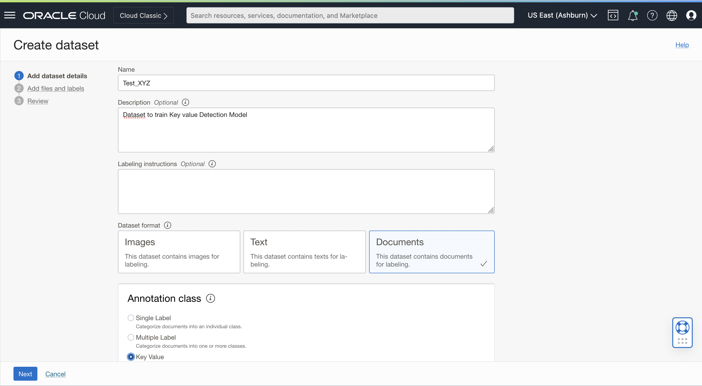
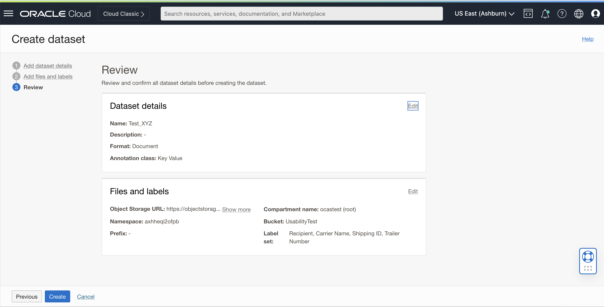
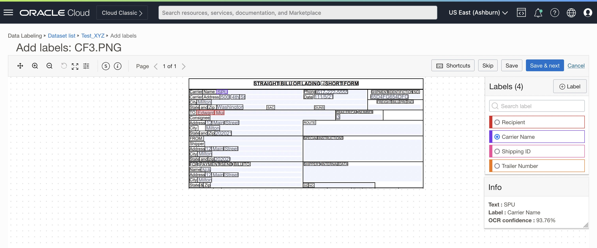

# Lab 1: Label a dataset in OCI Data Labeling Service
## Introduction

In this lab, you will use the OCI Console to create dataset in Data Labelling Service.

Estimated Time: 20 minutes

### Objectives

In this workshop, you will:

* Get to know how to create a new dataset for Key Value Extraction model 
* Label the documents in the created datset

## **Task 1:** Create a new Dataset for a Key Value Extraction Model

You will be creating a custom key value detection model for this session with documents from the [data folder](./data).

Create a new dataset with the following guidelines
* Navigate to **Data Labeling Page** on OCI Console

* On the Data Labeling Page, select **"Datasets"** on the left navigation menu and click on **"Create dataset"**

* Name it _“Test_YourName”_
* This will be a key-value detection dataset

* Choose to upload these documents as local files

* Save this dataset under the bucket UsabilityTest

* Upload the files that are downloaded above

* You want to detect the values for **"Recipient" "Carrier Name" "Shipping ID"** and **"Trailer Number"** from these sample documents

* Review and click on **"Create"**

## **Task 2:** Label the documents in your Dataset

Now that your dataset is generated, begin labeling your dataset. Click on the name of the document to annotate it.

* Start labeling all the labels

  * Recipient

  * Carrier Name

  * Shipping ID

  * Trailer Number

* Annotate all 6 documents

* You can check the labelled values by clicking on Ⓢ icon

## **Summary**

Congratulations!  
In this lab you have learnt how to create a dataset and how to annotate the documents in the dataset.

You may now **proceed to the next lab**.

[Proceed to the next section](./lab-02-model_training.md).
