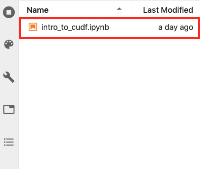
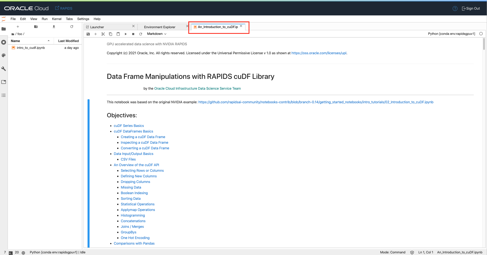
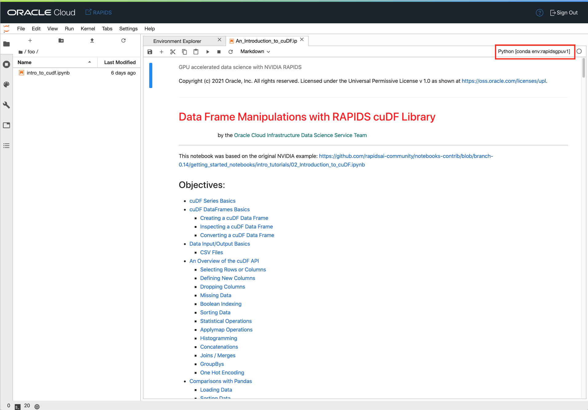
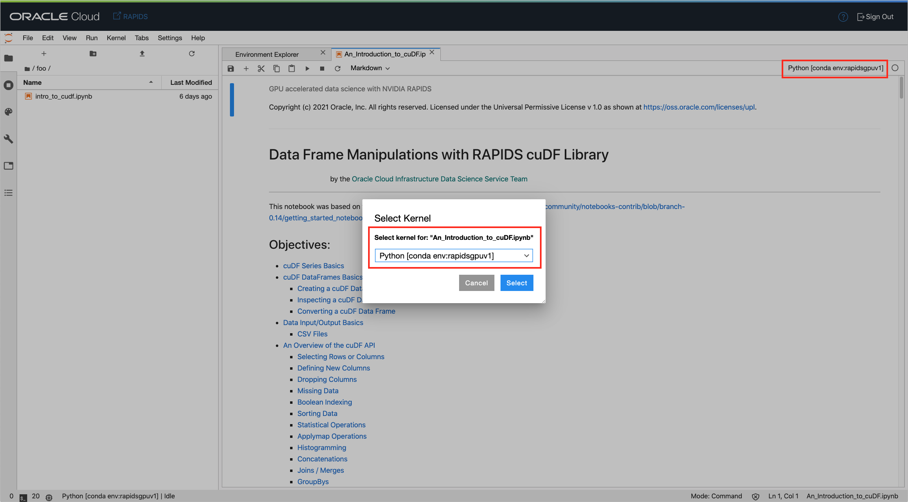

# RAPIDS dataframe ETL library (cuDF)

## Introduction

[RAPIDS cuDF](https://github.com/rapidsai/cudf) stands for CUDA data frame and is probably the first library you will need when using RAPIDS. cuDF is similar to pandas in that it handles data frames. It's built on top of Apache Arrow, which supports columnar data formats. You can do most of the standard operations you can do with pandas or Dask with cuDF. cuDF supports the standard NumPy data types (dtypes). Operations run with cuDF are typically much faster than the equivalent run with either Pandas or Dask. Typically the performance gain increases as the dataset gets larger.

*Estimated Lab Time*: 20 minutes

### Objectives
In this lab, you will:
* Learn how to transfer a notebook file to a running notebook session.
* Learn how to open a notebook and execute cells in JupyterLab and perform other basic operations in a notebook.
* Learn how to use cuDF to perform basic operations on series and data frames.
* Read and write data to CSV files.
* Get familiar with the cuDF API and apply a variety of transformations to rows and columns of a data frame.
* Perform performance comparisons between cuDF and Pandas.

### Prerequisites
This lab assumes that you have:
* A Data Science notebook session running on a GPU VM shape.
* The NVIDIA RAPIDS 0.16 conda environment installed in the notebook session. 

## **STEP 1:** Download the cuDF Notebook

Now that JupyterLab is open, it can be seen that the screen is split into two sections. By default, the left side has the file browser open but it can change based on what navigation icons are selected on the far left side of the screen. The right side of the screen contains the workspace. It will have a notebook, terminal, console, launcher, Notebook Examples, etc..

There is a menu across the top of the screen. For this lab, the most interesting menu item is **Run**. It will allow you to execute code cells in the document. It is recommended that you manually execute the cells one at a time as you progress through the notebook. It is, generally important, that you execute them in order. To do this from the keyboard, press *shift + enter* in a cell and it will execute it and advance to the next cell. Alternatively, you can run all of the cells at once. To do this, click on Run then "Run Selected Cells".

1. Launch a terminal window from the JupyterLab launcher tab

  

2. The next step is to pull a notebook file in your notebook session. There are two ways to do this:

      - Copy and paste the following command in the terminal window and press "Enter".

      ``curl -L -o intro_to_cudf.ipynb https://bit.ly/3bzCwhO``

      The new notebook will be named `intro_to_cudf.ipynb`.

      - Alternatively, you can click on this link:

      [https://bit.ly/3bzCwhO](https://bit.ly/3bzCwhO)

      and download the file to your local machine. Simply drag-and-drop the file in the JupyterLab file browser window to the left.

      

3. Confirm that the notebook is available in your notebook session. The notebook file should appear in the file browser.

   

## **STEP 2:** Open the Notebook

1. Open the file `intro_to_cudf.ipynb` by double-clicking on it. This operation may take a couple of seconds depending on your browser. A new tab opens with the notebook:

   

2. Ensure that the notebook is running in the right JupyterLab kernel. Verify this by looking at the kernel button located in the top right corner of your notebook tab.
   The kernel should be `rapidsgpuv1` which corresponds to the slug name of the RAPIDS conda environment.

   

   If the kernel name differs from `rapidsgpuv1`, switch the kernel by clicking on the kernel name (red box in the previous screenshot). You can pick a kernel from the list shown in the modal window.

   

   You should be all set now to run the notebook. Before running the notebook, you can optionally open `gpustat` and `htop` in terminal windows to monitor Python processes running on GPUs and CPUs respectively.

3. **(Optional)** I would recommend that you monitor the GPU usage while running the various RAPIDS commands by using the [utility tool `gpustat`](https://github.com/wookayin/gpustat). `gpustat` works with NVIDIA GPUs and provide a simpler interface to `nvidia-smi`.
   Launch a new terminal window and drag the newly created terminal window **tab** toward the bottom of your JupyterLab browser window. Adjust the height of the terminal window. You should end up with something similar to what is in this screenshot:

   

   In that terminal window, execute:

   `gpustat -i 3`

   This command will refresh `gpustat` metrics every 3 seconds.

4. **(Optional)** To monitor the CPU processes I recommend that you run `htop` in a separate terminal window. Launch a new terminal window, drag the new terminal window tab towards the bottom of your JupyterLab browser window. Move the tab to the right of the gpustat terminal window such that the two terminal windows are side-by-side at the bottom of the JupyterLab browser window. You should end up with something similar to this:

  

  Execute the command in the new terminal window:

  `htop`

  You should see two side-by-side terminal windows. Similar to this:

  

  These two windows are useful to monitor and confirm that the GPU and the CPUs are being truly utilized by various commands. It's also useful to monitor Python processes in general to diagnose potential issues at runtime.

## **STEP 3:** Running the cuDF notebook

1. Click on the `intro_to_cudf.ipynb` notebook tab. This will activate the notebook file.

1. Read through the notebook. When you encounter a chunk of code, click in the cell and press *shift + enter* to execute it. When the cell is running a ``[*]`` will appear in the top left corner of the cell. When it is finished, a number will appear in ``[ ]``, for example ``[1]``.
    
    

2. Execute the cells in order. If you run into problems and want to start over again, click the **restart** button then click **Restart**.
    
    

3. Throughout the notebook, useful instructions and additional links are provided to various sections of the cuDF documentation. Feel free to execute one cell at a time or all of them at once. We also included a table of content at the top of the notebook to help you navigate through the notebook. cuDF is a powerful library with an API that is very similar to Pandas and Dask. In the section "Comparisons with Pandas" we included a few simple performance comparisons between Pandas and cuDF. These comparisons include simple commands like loading a csv file, sorting a column, or performing simple data aggregations.

**Congratulations! You have successfully completed the lab**

You may now *proceed to the next lab*.

## A Few Tips When Running Notebooks on GPUs

* It is always a good idea to monitor Python processes running on the GPU using a CLI tool like `gpustat`. When you are running low on available GPU memory, stop the kernels that are associated with the notebooks that are running computations on the GPU. This will automatically free up the GPU memory consumed by that notebook.

## Acknowledgements

* **Author**: [Jean-Rene Gauthier](https://www.linkedin.com/in/jr-gauthier/), Sr. Principal Product Data Scientist
* **Last Updated By/Date**:
    * [Jean-Rene Gauthier](https://www.linkedin.com/in/jr-gauthier/), Sr. Principal Product Data Scientist, January 2021

