# Train Models Faster with the RAPIDS Machine Learning Library (cuML)

## Introduction

[RAPIDS cuML](https://github.com/rapidsai/cuml) is the machine learning library of RAPIDS. It closely follows the scikit-learn API and provides implementations for the following algorithms:

* DBSCAN and K-means for clustering analysis.
* PCA, tSVD, UMAP, and TSNE for dimensionality reduction.
* Linear regression with lasso, ridge, and elasticnet regularization for linear modeling of both regression and classification use cases.  
* Random Forest for both regression and classification use cases.
* K-Nearest neighbors for both classification and regression use cases.
* SVC and epsilon-SVR.
* Holt-winters exponential smoothing and ARIMA modeling for time series.
* and more.

cuML is well suited to do "bread-and-butter" machine learning work and for training models on tabular dataset. You can train most of the algorithms listed at scale using more than one GPU using Dask. You can benefit from this distributed approach by launching notebook sessions on VM.GPU3.2 or VM.GPU3.4 shapes.

In this lab, you will be introduced to two clustering algorithms, K-means and DBSCAN, that are implemented as part of cuML. The notebook introduces each algorithm and provides a comparison benchmark between implementations in scikit-learn and cuML.

*Estimated Lab Time*: 20 minutes

### Objectives
In this lab, you will:
* Get familiar with the K-means and DBSCAN clustering algorithms.
* Apply those clustering algorithms on a synthetic dataset.
* Learn how to use the scikit-learn and cuML implementations of those algorithms.
* Compare the performance of the K-means and DBSCAN algorithms when trained on CPUs versus GPUs.

### Prerequisites
This lab assumes that you have:
* A Data Science notebook session running on a GPU VM Shape.
* The NVIDIA RAPIDS 0.16 conda environment installed in the notebook session.

## **STEP 1:** Download the cuML Notebook

1. Launch a terminal window from the JupyterLab launcher tab

  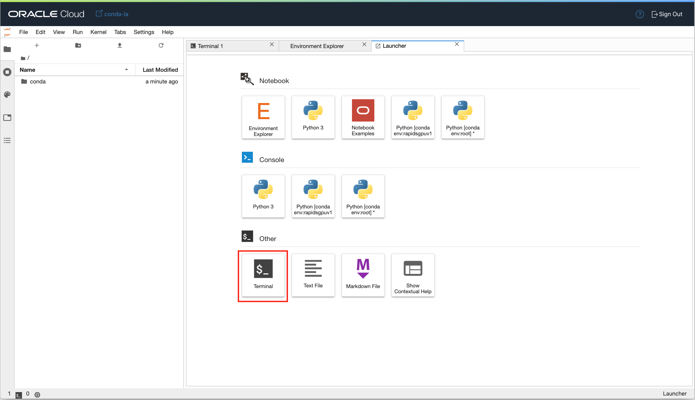

2. The next step is to pull a notebook file in your notebook session. There are two ways to do this:

      - Copy and paste the following command in the terminal window and press "Enter".

      ``curl -L -o intro_to_clustering.ipynb https://bit.ly/3ir4Cx9``

      The new notebook will be named `intro_to_clustering.ipynb`.

      - Alternatively, you can click on this link:

      [https://bit.ly/3ir4Cx9](https://bit.ly/3ir4Cx9)

      and download the file to your local machine. Simply drag-and-drop the file in the JupyterLab file browser window to the left.

      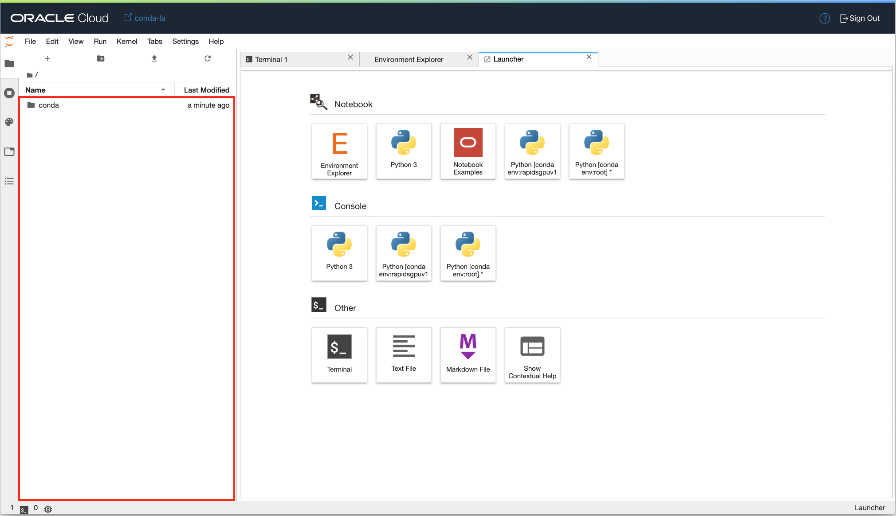

3. Confirm that the notebook is available in your notebook session. The notebook file should appear in the file browser.

   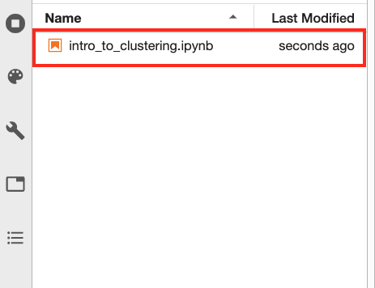

## **STEP 2:** Open the Notebook

1. Open the file `intro_to_clustering.ipynb` by double-clicking on it. This operation may take a couple of seconds depending on your browser. A new tab opens with the notebook:

   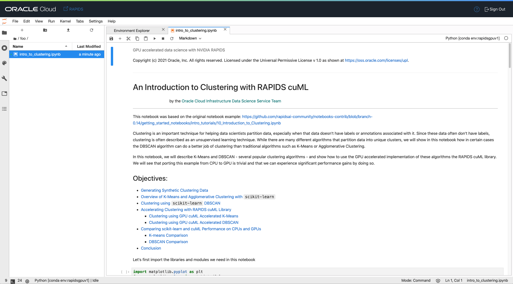

1. Ensure that the notebook is running in the right JupyterLab kernel. Verify this by looking at the kernel button located in the top right corner of your notebook tab.
   The kernel should be `rapidsgpuv1` which corresponds to the slug name of the RAPIDS conda environment.

   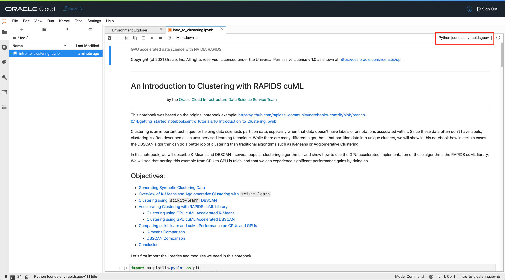

   If the kernel name differs from `rapidsgpuv1`, switch the kernel by clicking on the kernel name (red box in the previous screenshot). You can pick a kernel from the list shown in the modal window.

   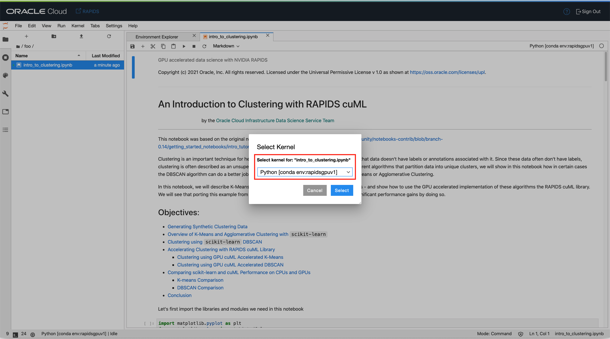

   You should be all set now to run the notebook. Before running the notebook, you can optionally open `gpustat` and `htop` in terminal windows to monitor Python processes running on GPUs and CPUs respectively.

1. **(Optional)** I would recommend that you monitor the GPU usage while running the various RAPIDS commands by using the [utility tool `gpustat`](https://github.com/wookayin/gpustat). `gpustat` works with NVIDIA GPUs and provide a simpler interface to `nvidia-smi`.
   Launch a new terminal window and drag the newly created terminal window **tab** toward the bottom of your JupyterLab browser window. Adjust the height of the terminal window. You should end up with something similar to what is in this screenshot:

   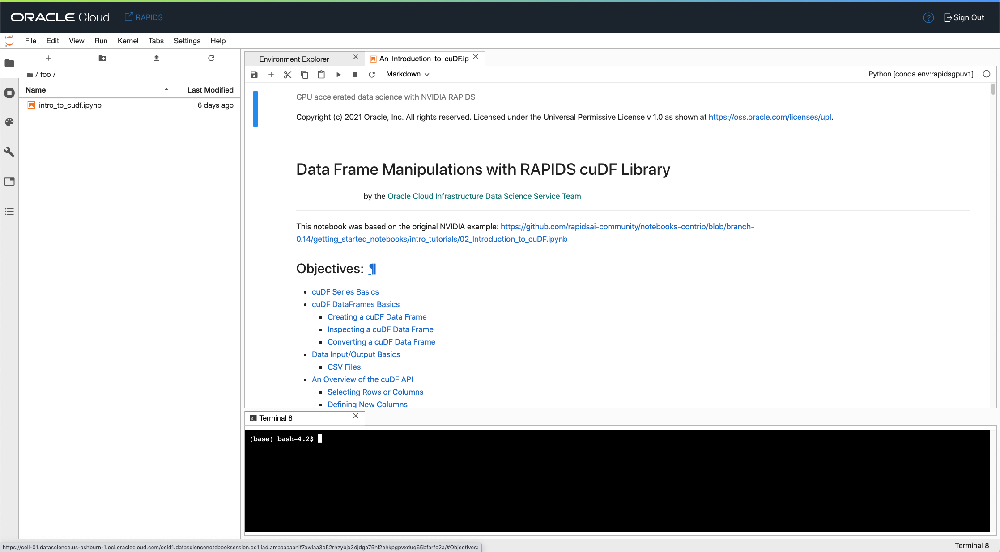

   In that terminal window, execute:

   `gpustat -i 3`

   This command will refresh `gpustat` metrics every 3 seconds.

1. **(Optional)** To monitor the CPU processes I recommend that you run `htop` in a separate terminal window. Launch a new terminal window, drag the new terminal window tab towards the bottom of your JupyterLab browser window. Move the tab to the right of the gpustat terminal window such that the two terminal windows are side-by-side at the bottom of the JupyterLab browser window. You should end up with something similar to this:

  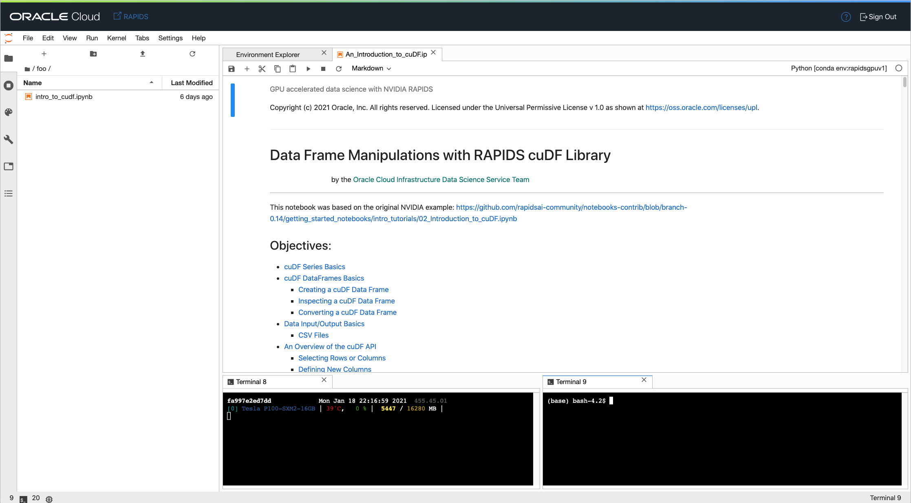

  Execute the command in the new terminal window:

  `htop`

  You should see two side-by-side terminal windows. Similar to this:

  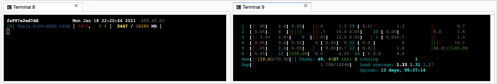

  These two windows are useful to monitor and confirm that the GPU and the CPUs are being truly utilized by various commands. It's also useful to monitor Python processes in general to diagnose potential issues at runtime.

## **STEP 3:** Running the Intro to Clustering notebook

1. Click on the `intro_to_clustering.ipynb` notebook tab. This will activate the notebook file.

1. Read through the notebook. When you encounter a chunk of code, click in the cell and press *shift + enter* to execute it. When the cell is running a ``[*]`` will appear in the top left corner of the cell. When it is finished, a number will appear in ``[ ]``, for example ``[1]``.
    
    

1. Execute the cells in order. If you run into problems and want to start over again, click the **restart** button then click **Restart**.
    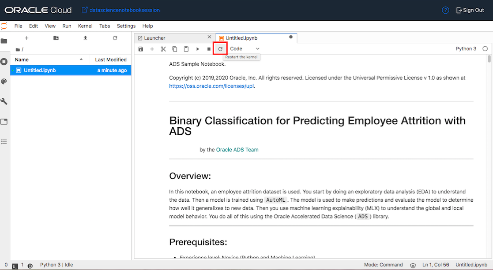
    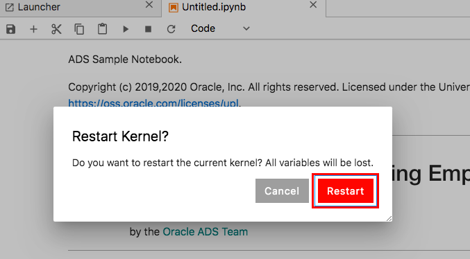

1. Throughout the notebook, useful instructions and additional links are provided. Feel free to execute one cell at a time or all of them at once. We also included a table of content at the top of the notebook to help you navigate through the notebook. cuML is a powerful library with an API that is very similar to `scikit-learn`.

**Congratulations! You have successfully completed the lab**

You may now *proceed to the next lab*.

## A Few Tips When Running Notebooks on GPUs

* It is always a good idea to monitor Python processes running on the GPU using a CLI tool like `gpustat`. When you are running low on available GPU memory, stop the kernels that are associated with the notebooks that are running computations on the GPU. This will automatically free up the GPU memory consumed by that notebook.

## Acknowledgements

* **Author**: [Jean-Rene Gauthier](https://www.linkedin.com/in/jr-gauthier/), Sr. Principal Product Data Scientist
* **Last Updated By/Date**:
    * [Jean-Rene Gauthier](https://www.linkedin.com/in/jr-gauthier/), Sr. Principal Product Data Scientist, January 2021

