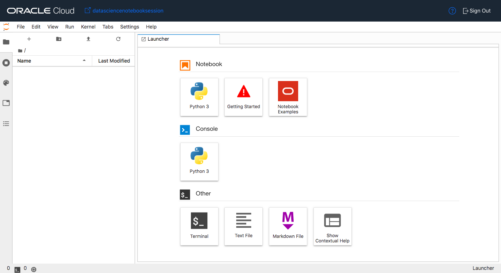

# Binary Classification Model 

## Introduction

Organizations can face significant costs resulting from employee turnover. Some costs are tangible, such as training expenses and the time it takes from when an employee starts to when they become a productive team member. Generally, the most important costs are intangible. Consider what is lost when a productive employee quits, such as corporate knowledge, new product ideas, great project management, and customer relationships. With advances in machine learning and data science, it is possible to not only predict employee attrition but to understand the key variables that influence turnover.

In this lab, an employee attrition dataset is examined. The goal of the model is to predict if an employee is going to resign their position and to understand the important factors that are related to this attrition.

In addition to the modeling aspects, the lab will demonstrate some of the features of the [Oracle Accelerated Data Science (ADS) SDK](https://docs.cloud.oracle.com/iaas/tools/ads-sdk/latest/index.html). ADS offers a friendly user interface, with objects and methods that cover all the steps involved in the lifecycle of machine learning models, from data acquisition to model evaluation and interpretation. In the lab, you will do an Exploratory Data Analysis (EDA) using the ``DatasetFactory`` class. The ``DatasetFactory`` loads data from various sources, profiles the data, determines their data types and uses sampling to prepare visualizations. The ``show_in_notebook()`` method performs an EDA in a single command, generating summary information about the data, intelligent graphs summarizing features, correlation heat maps and warnings about the condition of the data.

The lab also demonstrates the feature engineering abilities in ``ADS``. For example, it can fix class imbalance by up or downsampling. There are many transforms that ADS can also apply. You can have ADS perform an analysis of the data and automatically perform the transformations that it thinks would improve the model. This is done with the ``auto_transform()`` method. The ``suggest_recommendations()`` method allows you to explore the suggested transforms using the notebook's UI and select the transformations that you want it to make.

The Oracle ``AutoML`` package automatically tunes a model class to produce the best models. In this lab, Oracle ``AutoML`` is used to create, tune and select the best supervised binary classification model. Oracle ``AutoML`` supports binary and multi-class classifications, as well as regression problems. It automates three major stages of the ML pipeline, feature selection, algorithm selection, and hyperparameter tuning. These pieces are combined into a pipeline which automatically optimizes the whole process with minimal user interaction.

The ``ADSEvaluator`` class is used to evaluate model performance. Since this is a binary classification problem, ``ADSEvaluator`` is used to create precision-recall, ROC, lift, and gain plots. Each model under study is plotted together. This allows for easy comparison. In addition, the normalized confusion matrices are provided.

After the models have been built and evaluated, it is often important to understand what features are important. This lab examines employee attrition data and an important part of this process is to understand the factors that tend to cause employees to resign. The ``ADSExplainer`` class provides information at the global level, which is the general trends in the behavior of the black-box machine learning model. It does this by providing feature importance data and graphs. It also provides Partial Dependence Plots (PDP) and Individual Conditional Expectations (ICE) plots. The Machine Learning Explainability (MLX) features in ``ADS`` also allow the data scientist to examine the local behavior of the machine learning model. That is, given a single prediction, what were the important features used by the model to make the prediction on a specific observation. This can often be quite different than the feature importance on a global scale.

*Estimated Lab Time*: 90 minutes

### Objectives
In this lab, you will:
* Learn how to execute cells in JupyterLab and perform other basic operations in a notebook.
* Learn how to launch a **Notebook Example**.
* Open a data file using a ``DatasetFactory`` object.
* Perform an Exploratory Data Analysis
* Use automatic feature engineering tools to create model features.
* Use Oracle ``AutoML`` ta build and tune a number of binary classification models.
* Perform model evaluation using the ``ADSEvaluator``.
* Learn about machine learning explainability (MLX) for global and local model behavior.

### Prerequisites
This lab assumes that you have:
* A Data Science notebook session.

## **STEP 1:** Working with JupyterLab

Now that JupyterLab is open, it can be seen that the screen is split into two sections. By default, the left side has the file browser open but it can change based on what navigation icons are selected on the far left side of the screen. The right side of the screen contains the workspace. It will have a notebook, terminal, console, launcher, Notebook Examples, etc..

There is a menu across the top of the screen. For this lab, the most interesting menu item is **Run**. It will allow you to execute code cells in the document. It is recommended that you manually execute the cells one at a time as you progress through the notebook. It is, generally important, that you execute them in order. To do this from the keyboard, press *shift + enter* in a cell and it will execute it and advance to the next cell. Alternatively, you can run all of the cells at once. To do this, click on Run then "Run Selected Cells".

## **STEP 2:** Summary of Commands

The following is a summary of the steps that are covered in this lab along with the most important Python commands. You can use it as a reference guide for when you build your own models.

1. **Open dataset**: ``ds = DatasetFactory.open()``
1. **Visualize dataset**: ``ds.show_in_notebook()``
1. **Automatic feature engineering**: ``transformed_ds = ds.auto_transform()``
1. **Split data into train and test sets**: ``train, test = transformed_ds.train_test_split()``
1. **Train the model with AutoML**: ``model, baseline = automl.train()``
1. **Evaluate the model**: ``evaluator = ADSEvaluator()``
1. **Explain the model**: ``explainer = ADSExplainer(test, model)``
1. **Global explanations**: ``global_explainer = explainer.global_explanation()``
1. **Local explanations**: ``local_explainer = explainer.local_explanation()``
1. **Feature important**: ``global_explainer.feature_importance_summary()`` and ``global_explainer.compute_feature_importance()``

## **STEP 3:** Install a Conda Package

A conda package is a collection of libraries, programs, components and metadata. It defines a reproducible set of libraries that are used in the data science environment. There is an Environment Explore that allows you to learn about the different conda environments that are available. We are going to use the General Machine Learning for CPUs conda.

1. Open a terminal window by clicking on **File**, **New** and then **Terminal**.
1. Run the command: `odsc conda install -s mlcpuv1`
1. You will receive a prompt related to what version number you want. Press `Enter` to select the default.
1. Wait for the conda package to be installed.

## **STEP 4:** Binary Classification Model

To open the notebook, that is used in this lab, have the launcher open. The launcher is open by default but if it is currently closed it can be opened by clicking on **File** and then click on **New Launcher**. 

1. Click on the **Notebook Examples**. A drop down will appear.
    

1. Select the environment **mlcpuv1** and then the notebook **binary\_classification\_attrition.ipynb**. 
    

1. Click **Load Example**. The notebook will open in a new tab.
    

1. Read through the document. When you encounter a chunk of code, click in the cell and press *shift + enter* to execute it. When the cell is running a ``[*]`` will appear in the top left corner of the cell. When it is finished, a number will appear in ``[ ]``, for example ``[1]``.
    
    

1. Execute the cells in order. If you run into problems and want to start over again, click the **restart** button then click **Restart**.
    
    

1. Step through the lab and look at the tools that are provided by Oracle Accelerated Data Science (ADS) SDK. This automates a number of time-consuming and repetitive processes by analyzing the data and creating appropriate outputs.

## **STEP 5:** Next Steps

**Congratulations! You have successfully completed the lab**

There are some other notebooks that you may find interesting. They can be accessed by clicking **File** then clicking **New Launcher**. This will open Launcher. Click **Notebook Examples** and select a notebook then click **Load Example**. Some notebooks of interest are:

* **data\_visualizations.ipynb**: It provides a comprehensive overview of the data visualization tools in ADS. This includes smart data visualization for columns based on data types and values.
* **transforming\_data.ipynb**: Learn about the ``ADSDatasetFactory`` and how it can clean and transform data.
* **model\_from\_other\_library.ipynb**: See the capabilities of the ``ADSModel`` class. See how ``ADSModel`` makes the ADS pipeline completely modular and adaptable to 3rd party models.

You may now *proceed to the next lab*.

## Acknowledgements

* **Author**: [John Peach](https://www.linkedin.com/in/jpeach/), Principal Data Scientist
* **Last Updated By/Date**:
    * [John Peach](https://www.linkedin.com/in/jpeach/), Principal Data Scientist, January 2021

