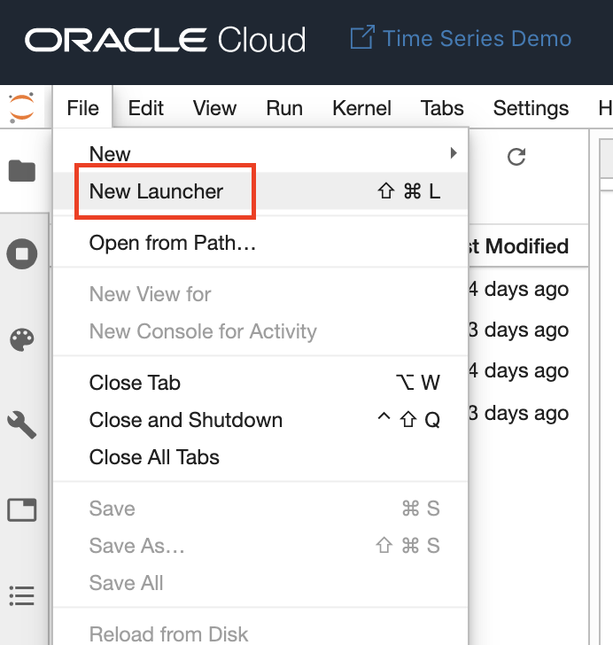
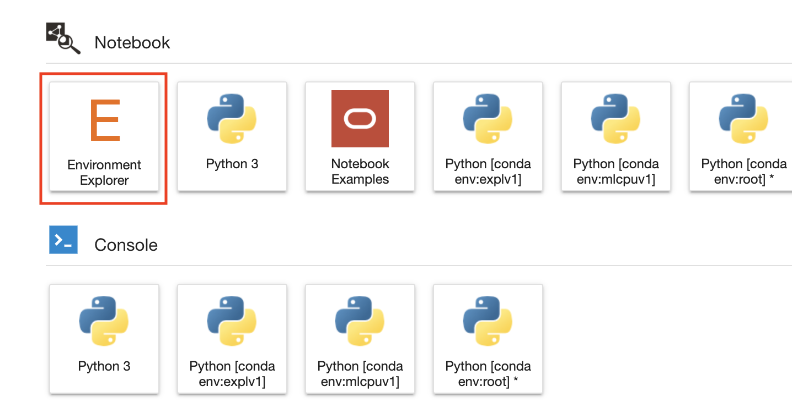
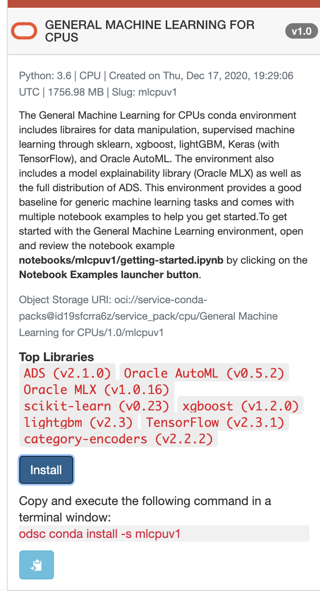

# Conda Environments 

## Introduction

When you log into OCI Data Science, you will be able to to pick and choose which conda environment you want to use in your notebook session from a list of pre-built conda environments or create, install and publish your own environments.

A conda environment is somewhere between a Docker image and a Python virtual environment. It allows users to run processes in isolated environments with different packages and different package versions installed.   In addition, it can manage different versions of Python that are not installed system-wide and support package installation of Python, R, Node.js and Java.  For many ML and AI use cases, conda environments offer the right level of isolation and flexibility.

*Estimated Lab Time*: 15 minutes

### Objectives

In this lab, you will:

* Learn how to select and install pre-built conda environment

### Prerequisites

* A foundational understanding of Python

## **STEP 1:** Launching Environment Explorer

1.  After you log into OCI Data Science and create a Notebook, go to `File` and select `New Launcher`.

    

2.  Click on `Environment Explorer`

    

## **STEP 2:** Downloading a pre-built Conda Environment

1.  Choose from a list of conda environments

    When you click on `Environment Explorer`, you will see each Explorer tab allowing you to filter on either the Data Science, Installed, or Published Conda environments.  The Data Science Conda Environments tab shows a list of pre-built conda environments you can install.  We offer several pre-built condas tailored for specific use cases such as general machine learning and data exploration.

    

2.  Install a pre-built conda environment

    When you have decided on which conda environment to install, click `Install`, copy and execute the command in a terminal window.

    

## **STEP 3:** Selecting Conda Environment for Notebook session

1.  Choose an installed conda environment for notebook

    When you start a new notebook, go to the top right corner to select the conda environment you would like to use for the notebook session.

    

You can *proceed to the next lab*.

## References

For more information, please refer to our:

* [Service Documentation](https://docs.oracle.com/en-us/iaas/data-science/using/data-science.htm)
* [Blog](https://blogs.oracle.com/datascience/conda-environment-data-science)

## Acknowledgements

* **Author**: [Wendy Yip](https://www.linkedin.com/in/wendy-yip-a3990610/), Data Scientist
* **Last Updated By/Date**:
    * [Wendy Yip](https://www.linkedin.com/in/wendy-yip-a3990610/), Data Scientist, January 2021

