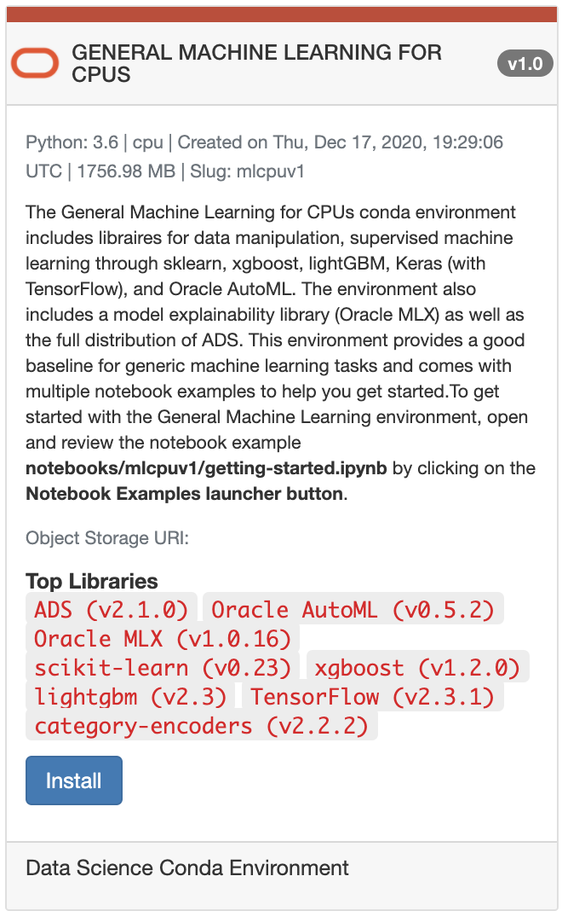
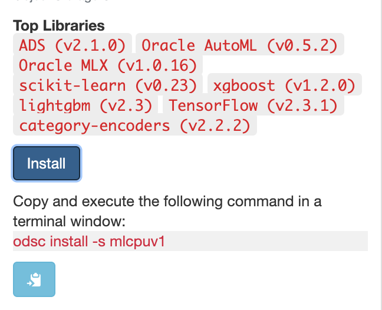
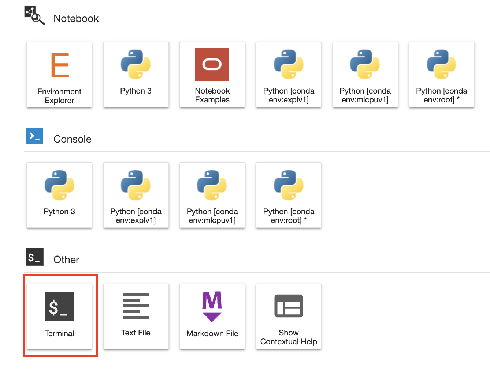
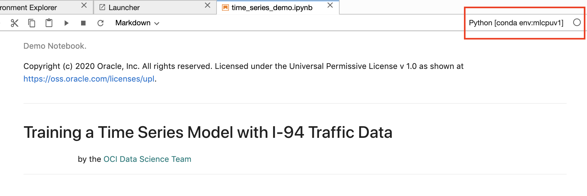

# Time Series Forecasting Models

## Introduction

Time series is a series of data points ordered by time.  Time series analysis and modeling have a wide range of industry applications from finance, retail to transportation.   In time series modeling, the goal is to create a model that describes the pattern of the data as it changes over time.  

In this lab, we are going to demonstrate how to create time series models in the OCI Data Science platform.  We are going to use the [I-94 traffic data set](https://archive.ics.uci.edu/ml/datasets/Metro+Interstate+Traffic+Volume) which contains hourly traffic volume on the Interstate 94 Westbound traffic taken by the Minnesota Department of Transportation station 301 which is approximately midway between Minneapolis and St. Paul. We are going to build a model to predict the traffic volume at a given time.

*Estimated Lab Time*: 60 minutes

### Objectives
In this lab, you will:
* Set up a conda environment and download Facebook Prophet
* Perform Exploratory Data Analysis
* Use Statsmodels to build a time series model
* Learn how to use Prophet
* Perform model evaluation

### Prerequisites
This lab assumes that you have:
* A Data Science notebook session
* A working knowledge of Python

## **STEP 1:** Set up Conda Environment

1.  After you log into OCI Data Science and create a notebook, go to `File` and select `New Launcher`.  You will see the `Environment Explorer`. When you click on `Environment Explorer`, you will see each Explorer tab allowing you to filter on either the Data Science, Installed, or Published Conda environments.  The Data Science Conda Environments tab shows a list of pre-built conda environments you can install.

    

2.  For this lab, we are going to use the General Machine Learning for CPUs conda.  This conda comes with several open source libraries for building machine learning models including Scikit-learn and Statsmodels.  Scroll through the list of pre-built conda environments to find it.

    

3.  Click on `Install`.  Copy the command and execute it in a terminal.  You can launch a new terminal by going to the Launcher and finding the icon for terminal.

    

    

4.  We have to install fb Prophet in this conda because it is not included.  Open a new terminal.  In the terminal, you want to activate the General Machine Learning conda and install Facebook Prophet there.  Please use the command below.  Note:  Each of the conda environment is denoted by a "slug".  For the General Machine Learning CPUs Conda, the slug is "mlcpuv1."

    ```
    conda activate /home/datascience/conda/mlcpuv1
    conda install -c conda-forge fbprophet
    ```

5.  After you have set up your conda environment, when you start a new notebook, go to the top right corner and select the General Machine Learning CPU conda for the notebook session.

    

## **STEP 2:** Download Time Series Forecasting JupyterLab Notebook from Object Storage

1.  To access the time series forecasting JupyterLab notebook, first open a new terminal window.  Copy and paste the following commands in the terminal window and press “Enter”. The commands will create a folder named 'demo' inside the directory 
/home/datascience/conda/notebooks/mlcpuv1 and download the time series notebook file time-series-hol.ipynb in there.

    ```
    cd /home/datascience/conda/notebooks/mlcpuv1
    mkdir demo
    cd demo 
    curl -L -o time-series-hol.ipynb https://bit.ly/3c92tVF
    ```
2.  Navigate to the directory /home/datascience/conda/notebooks/mlcpuv1/demo to find the time series notebook time-series-hol.ipynb

3.  Go through the notebook.  This notebook shows how to build time series models along with exercises you can do.

**Congratulations! You have successfully completed the lab**

## References

For more information, please refer to our:

* [Service Documentation](https://docs.oracle.com/en-us/iaas/data-science/using/data-science.htm)
* [Statsmodels Documentation](https://www.statsmodels.org/stable/index.html)
* [Prophet Documentation](https://facebook.github.io/prophet/)

## Acknowledgements

* **Author**: [Wendy Yip](https://www.linkedin.com/in/wendy-yip-a3990610/), Data Scientist
* **Last Updated By/Date**:
    * [Wendy Yip](https://www.linkedin.com/in/wendy-yip-a3990610/), Data Scientist, January 2021


