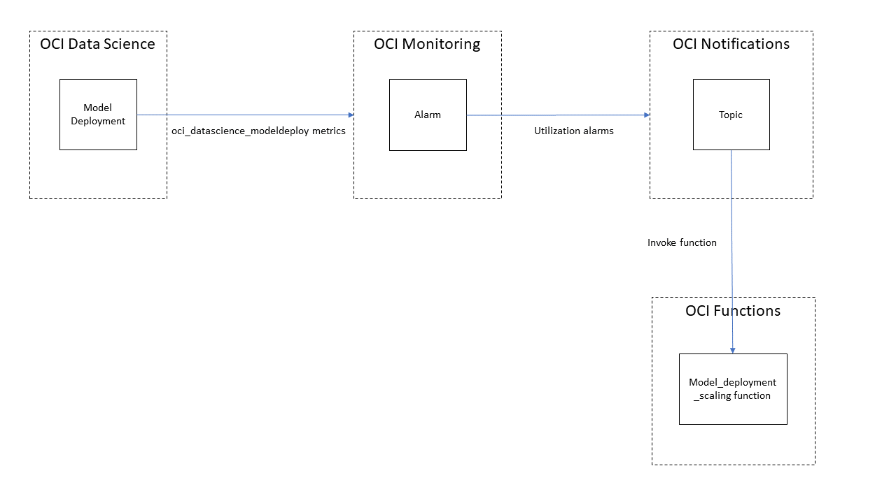

Autoscaling model deployment
============================

* [Overview](#overview)
* [Prerequisites](#prerequisites)
* [Creating the scaling function](#creating-the-scaling-function)
* [Creating the notification topic and subscription](#creating-the-notification-topic-and-subscription)
* [Creating the Alarms](#creating-the-alarms)
* [Testing](#testing)
* [Ideas for improvements](#ideas-for-improvements)

# Overview
This sample demonstrates how to create an autoscaling solution for OCI Data Science Model Deployment. It can be valuable when the load in real-life scenarios is unknown and there is a need to keep the deployment responsive while keeping costs contained.

The solution is built on the following OCI services:
* OCI Functions - For executing the logic code. The function will also create and manage alarms for scaling down so those are not required to be created in advance.
* OCI Monitoring - For catching model deployment events and firing Alarms when thresholds are crossed
* OCI Notifications - For subscribing to the Alarms and activating the relevant Function
* OCI Logging - For collecting all outputs from all the other services

Here is a high level sketch of the solution:


This solution takes a simplistic approach which can be modified easily in the Function code - when a model deployment will report high CPU utilization, it will be scaled horizontally by adding an instance to the deployment. It will also create an alarm (if not already created) to report low CPU utilization to scale the deployment back down when applicable and reserve costs.
When a model deployment reports high memory utilization, it will be scaled vertically by "upgrading" the VM shape to the next supported shape of the same type (e.g. VM.Standard2.4 will be upgraded to VM.Standard2.8). It will also create an alarm (if not already created) to report low memory utilization to scale the model deployment backdown when applicable.


# Prerequisites

First thing first, let's take care of what's needed before we even get started:

## Permissions
Based on the OCI permissions model, there are some policies that need to be in place in order for this solution to work.

First, if you are using dynamicGroups, add OCI Functions to your group so provide it with access to the other resources: Go to the OCI Console, open **Dynamic Groups** in the **Identity** service, select the dynamic group you want to use (or create a new one) and add the following rule:
```
ALL {resource.type = 'fnfunc', resource.compartment.id = '<compartment_OCID>'}
```

Now go to **Policies** (Also in the Identity service) and create a new policy with the following statements:

Allow update of Notification Topics:
```
Allow dynamic-group <dynamic_group_name> to manage ons-topics in compartment <compartment_name>
```

Allow creation and management of Alarms:
```
#       Allow dynamic-group <dynamic_group_name> to manage alarms in compartment <compartment_name>
```

Allow to read metrics. This is a requirement for creating Alarms:
```
#       Allow dynamic-group <dynamic_group_name> to read metrics in compartment <compartment_name> 
```

Allow to log outputs into OCI Logging:
```
#       Allow dynamic-group <dynamic_group_name> to use log-content in compartment <compartment_name>
```

## A Model Deployment
Well, if you want to scale a model deployment, you need to have... a model deployment.
If you don't have one already, follow [these instructions](https://github.com/oracle-samples/oci-data-science-ai-samples/tree/master/labs/model-deploy) to create one.


# Creating the scaling function
We'll use the [func.py](./function/func.py) file already available here. You can modify it to suit your needs. 
<details>
  <summary markdown="span">Expand to take a look at some of the main aspects in the code</summary>

## Main function handler
This function is called when the OCI Function is invoked and the request contains the alarm message.
``` python
def handler(ctx, data: io.BytesIO=None):
```

The alarm processing will only proceed if the the alarm is just started firing (OK_TO_FIRING) or if it was intentionally defiend to refire (REPEAT). The alarm OCID and the model deployment OCID are extracted to be used later. You can learn more about alarms [here](https://docs.oracle.com/en-us/iaas/Content/Monitoring/Concepts/monitoringoverview.htm).
``` python
if alarm_msg["type"] == "OK_TO_FIRING" or alarm_msg["type"] == "REPEAT":      
        alarm_metric_dimension = alarm_msg["alarmMetaData"][0]["dimensions"][0]
        alarm_id = alarm_msg["alarmMetaData"][0]["id"]
        model_deployment_id = alarm_metric_dimension["resourceId"]
```

Create a signer to send signed requests to OCI and create a Data Science Client to communicate with the service and retrieve the model deployment to scale. Learn more about OCI authentication [here](https://docs.oracle.com/en-us/iaas/Content/API/Concepts/sdk_authentication_methods.htm#sdk_authentication_methods_resource_principal) and about Python SDK data science client [here](https://docs.oracle.com/en-us/iaas/tools/python/latest/api/data_science.html)

``` python
signer = oci.auth.signers.get_resource_principals_signer()
data_science_client = oci.data_science.DataScienceClient(config={}, signer=signer)
model_deployment = data_science_client.get_model_deployment(model_deployment_id).data
```

It is possible that the CPU or memory load is happening because the model deployment is updating (i.e. adding/removing isntance, changing VM shapes, etc.) and anyway it can't be updated while it is in an updating state, so we need to make sure it is in ACTIVE state.
``` python
if (model_deployment.lifecycle_state == model_deployment.LIFECYCLE_STATE_ACTIVE):
```

Based on the alarm title, the appropriate function will be called to prepare the update_model_deployment_details object which will be part of the model deployment update request.
``` python
alarm_type = alarm_msg['title']            
    if (alarm_type == 'model_deployment_high_cpu'):
        update_model_deployment_details = scale_instance_up(alarm_id=alarm_id, model_deployment=model_deployment)
    elif (alarm_type == 'model_deployment_low_cpu'):
        update_model_deployment_details = scale_instance_down(alarm_id=alarm_id, model_deployment=model_deployment)
    elif (alarm_type == 'model_deployment_high_mem'):
        update_model_deployment_details = scale_vm_up(alarm_id=alarm_id, model_deployment=model_deployment)
    elif (alarm_type == 'model_deployment_low_mem'):
        update_model_deployment_details = scale_vm_down(alarm_id=alarm_id, model_deployment=model_deployment)
```

Now call the model deployment update API to initiate the scaling
``` python
if (update_model_deployment_details is not None):
    resp = data_science_client.update_model_deployment(
        model_deployment_id=model_deployment_id, 
        update_model_deployment_details=update_model_deployment_details
    )
```

## Scaling functions
There are 4 functions for preparing the update_model_deployment_details, one for each scenario - high cpu, high memory, low cpu, low memory.

Let's take a look at the highlights of each function:

### scale_instance_up
Get the current number of instances in the deployment
``` python
current_instance_count = model_deployment.model_deployment_configuration_details.model_configuration_details.scaling_policy.instance_count
```

If the number of instance is already the maximum allow by the MAX_INSTANCES const then do not update the deployment.
``` python
if new_instance_count > MAX_INSTANCES:
```

Create the update_model_deployment_details object with the new scaling policy
``` python
update_model_deployment_details=oci.data_science.models.UpdateModelDeploymentDetails(
    model_deployment_configuration_details=oci.data_science.models.UpdateSingleModelDeploymentConfigurationDetails(            
        model_configuration_details=oci.data_science.models.UpdateModelConfigurationDetails(
            model_id=model_id, 
            scaling_policy=oci.data_science.models.FixedSizeScalingPolicy(
                policy_type="FIXED_SIZE",
                instance_count=new_instance_count)
        )   
    )
)
```

Create an alarm to report when CPU utilization drops below a threshold to scale the deployment down
``` python
create_cpu_scale_down_alarm(alarm_id=alarm_id, model_deployment=model_deployment)
```

Let's take a look at that function now

### create_cpu_scale_down_alarm

First create a MonitoringClient with the resource princiapl signer to communicate with the Monitoring service, then retrieve the alarm based on the ID in the message
``` python
signer = oci.auth.signers.get_resource_principals_signer()
monitoring_client = oci.monitoring.MonitoringClient(config={}, signer=signer)

current_alarm = monitoring_client.get_alarm(alarm_id=alarm_id).data
```

If the same alarm was alreay created for the **same model deployment**, don't create another one
``` python
alarm_summary_response = monitoring_client.list_alarms(compartment_id=current_alarm.compartment_id, display_name="model_deployment_low_cpu")
if alarm_summary_response.data and (alarm_summary_response.query.find(model_deployment.id) != -1):
```

Now create the alarm in the Monitoring service. Use the same parameters as the firing alarm. The threshold can be changed by changing the LOW_CPU_THRESHOLD value
``` python
alarm_query = 'CpuUtilization[1m]{resourceId = \"' + model_deployment.id + '\"}.max() < ' + str(LOW_CPU_THRESHOLD)
create_alarm_response = monitoring_client.create_alarm(
    create_alarm_details=oci.monitoring.models.CreateAlarmDetails(
        display_name="model_deployment_low_cpu",
        compartment_id=current_alarm.compartment_id,
        metric_compartment_id=current_alarm.metric_compartment_id,
        namespace=current_alarm.namespace,
        query=alarm_query,
        severity=current_alarm.severity,
        destinations=current_alarm.destinations,
        is_enabled=True,
        repeat_notification_duration="PT5M",
        body="Low cpu for model deployment. Instances can be scaled down to reduce costs",
        message_format="ONS_OPTIMIZED"
    )
)
```

### scale_instance_down
This function is mostly the same as scale_instance_up, the only differences are that here the verification is for minimum number of instances (can't have less than 1 in a deployment) and deleting the model_deployment_low_cpu alarm in this case so it does not fire again (a new alarm will be created once the deployment will be scaled up again):
``` python
if current_instance_count == 1:
    ...
    delete_alarm_response = monitoring_client.delete_alarm(alarm_id=alarm_id)
```

### scale_vm_up
As mentioned earlier, adding instances when the memory is overloaded will not help lower the memory load, because the added instance will have the same amount of memory and include the same model exactly. There is a need to add more memory to the server, which means using a different VM shape which has more memory. This is called **vertical scaling** and it is a bit more challenging than scaling horizontally, because of the need to know what is the next or previous VM shape of the same type. To solve that, a list of shapes called VM_SHAPES is available, ordered by the "size" of the shape.

Get the current VM shape and then find its index in the list
``` python
current_vm_shape = model_deployment.model_deployment_configuration_details.model_configuration_details.instance_configuration.instance_shape_name
...
vm_shape_index = VM_SHAPES[VM_STANDARD].index(current_vm_shape)
```

If this is the largest possible shape, there is nowhere to upgrade to.
``` python
if vm_shape_index == VM_STANDARD_LEN:
```

Otherwise find the next shape in the list
``` python
new_vm_shape = VM_SHAPES[VM_STANDARD][vm_shape_index+1]
```

Now prepare the update_model_deployment_details object for the model deployment update
``` python
update_model_deployment_details=oci.data_science.models.UpdateModelDeploymentDetails(
    model_deployment_configuration_details=oci.data_science.models.UpdateSingleModelDeploymentConfigurationDetails(            
        model_configuration_details=oci.data_science.models.UpdateModelConfigurationDetails(
            model_id=model_id,
            instance_configuration=oci.data_science.models.InstanceConfiguration(
                instance_shape_name=new_vm_shape
            )
        )   
    )
)
```

And create the create_mem_scale_down_alarm alarm to report when memory drops below the threshold
``` python
create_mem_scale_down_alarm(alarm_id=alarm_id, model_deployment=model_deployment)
```

Let's take a look at the memory scale down alarm

### create_mem_scale_down_alarm
This function will be mostly the same as the cpu scale down alarm, the only difference will be the title and the query for triggering the alarm:
``` python
alarm_query = 'MemoryUtilization[1m]{resourceId = \"' + model_deployment.id + '\"}.max() < ' + str(LOW_MEM_THRESHOLD)
```

### scale_vm_down
This function will be mostly the same as scale_vm_up, only it will check if the current shape is already the samllest possible and if so will delete the alarm and not scale.
``` python
if vm_shape_index == 0:
...
delete_alarm_response = monitoring_client.delete_alarm(alarm_id=alarm_id)
```

Otherwise it will find the previous shape in the shapes list and prepare the update_model_deployment_details object
``` python
new_vm_shape = VM_SHAPES[VM_STANDARD][vm_shape_index-1]
```

Now that we covered the function code, let's create and deploy it to the OCI Functions service.

</details>
<br>

## Deploy the function to OCI Functions
We'll follow the directions given by OCI Functions for [deploying functions](https://docs.oracle.com/en-us/iaas/Content/Functions/Tasks/functionsquickstartcloudshell.htm) with OCI Cloud Shell which is the recommended method, however feel free to deploy on [Local Host](https://docs.oracle.com/en-us/iaas/Content/Functions/Tasks/functionsquickstartlocalhost.htm) or [OCI Compute Instance](https://docs.oracle.com/en-us/iaas/Content/Functions/Tasks/functionsquickstartocicomputeinstance.htm) if that works better for you:

Make sure you followed the instructions for [setting up the tenancy](https://docs.oracle.com/en-us/iaas/Content/Functions/Tasks/functionsquickstartcloudshell.htm#functionsquickstart_cloudshell_topic_setup_your_tenancy) as we will not list them here and jump directly to the application and function creation.

### Create application
1. In the Console, open the navigation menu and click **Developer Services**. Under Functions, click **Applications**.
1. Click **Create Application**.
1. In the create application window fill in the details:
   * Application name - let's use *model-deployment-scaling* for this example
   * VCN - select a VCN to use. You can use the same VCN you used for the model deployment. Read more about VCNs [here](https://docs.oracle.com/en-us/iaas/Content/Network/Tasks/managingVCNs_topic-Overview_of_VCNs_and_Subnets.htm). There is also a short guide on VCNs in the [Data Science documentation](https://docs.oracle.com/en-us/iaas/data-science/data-science-tutorial/get-started.htm#create-vcn).
   * Click **Create**

### Set up your Cloud Shell dev environment
Click the application you just created to display the application details page, then select **Getting Started** and then click **Cloud Shell Setup**. Follow the guidelines in that page (set the context, generate auth token and login with the token) up to the section of **Create, deploy, and invoke your function**. Then proceed here.

### Enable function logs
1. In your *model-deployment-scaling* application, click on **Logs** on the left side panel.
1. Click the toggle switch on the right side of the table to open the **Enable Log** panel.
1. Select the compartment
1. Select the Log Group to use. Create one if you don't already have one.
1. Select the log name to use for the function log
1. Select the Log retention. you can leave the default.
1. Click **Enable Log**

All outputs from the function (stdout, stderr) will be captured in the log from now.

### Create and deploy your function
1. Generate a 'model-deployment-autoscale' function
```
fn init --runtime python model-deployment-autoscale
```

2. Switch into the generated directory
```
cd model-deployment-autoscale
```

3. replace the files with the files in the **function** folder: func.py, requirements.txt (leave func.yaml as is)

4. Deploy the function
```
fn -v deploy --app model-deployment-scaling
```

# Creating the notification topic and subscription
Since Alarms only fire events to the Notification service, we need to create a topic in the Notification service and subscribe the function to it. Let's take care of that now:
1. Open the navigation menu and click **Developer Services**. Under **Application Integration**, click **Notifications**.
1. Choose the compartment you want to work in (on the left side of the page). preferably use the same compartment as your Function and your Model Deployment.
1. Click **Topics** on the left panel and the click **Create Topic** at the top of the topic list.
1. Configure your topic:
   * Name: Let's use *model-deployment-autoscaling* for this example
   * Description: Optional. Enter a description for the topic.
   * Click **Create**.
1. Now let's create the subscription to invoke the function when the topic is invoked. In the details page of the topic you just created, click **Create Subscription** and configure the subscription:
   * Protocol: choose **Function**
   * Function compartment: select the compartment where the function was created
   * Function application: select *model-deployment-scaling*
   * Function: select *model-deployment-autoscale*
   * Click **Create**.

You can read more about subscriptions, topics, and the Notification service [here](https://docs.oracle.com/en-us/iaas/Content/Notification/Tasks/managingtopicsandsubscriptions.htm).

Now that the notification is configured, it is time to create the alarm.

# Creating the Alarms
We'll create one alarm to fire when the CPU utilization raises above some threshold for the horizontal scaling, and one alarm to fire when the memory utilization raises above some threshold for the vertical scaling. You can change those thresholds, frequency of sampling, or any other part of the alarm to your likings.

## Creating the high CPU alarm
Open the navigation menu and click **Observability & Management**. Under **Monitoring**, click **Alarm Definitions**.
1. Click **Create Alarm**.
2. Configure the alarm:
   * **Alarm name**: *model_deployment_high_cpu*. It is important to use that exact name as it is the identifier of the alarm in the function
   * **Alarm severity**: *Info*
   * Metric description:
      * **Compartment**: select the compartment to use, preferable the same as the function and the model deployment
      * **Metric namespace**: *oci_datascience_modeldeploy*. This is the source service the alarm will monitor
      * **Resource group**: this is optional, leave blank for this example.
      * **Metric name**: *CpuUtilization*. This is the specific metric to monitor, in this case we want to monitor the CPU utilization
      * **Interval**: *5m*. This is the interval in which the metric aggregations will be calculated. In our case, we want to be able to filter out burst outliers, so 5 minutes should suffice for averaging. Of course feel free to change this according to your liking.
      * **Statistic**: *Mean*. This is the aggregation strategy to use for calcualting the metric during the interval. We'll use mean to filter out outliers.
   * Metric dimensions:
      * **Dimension name**: *resourceId*. We are monitoring the entire model deployment resource
      * **Dimension value**: select the OCID of your model deployment. The OCID of the model deployment will appear in the details page of the model deployment in the OCI UI console.
   * Trigger rule:
      * **operator**: *greater than*
      * **Value**: *80*. We want to get an alarm when the Cpu utilization of the deployment exceeds 80% so the deployment will be scaled up
      * **Trigger delay minutes**: *1*.  The number of minutes that the condition must be maintained before the alarm is in firing state.
   * Notifications:
      * **Destination service**: *Notifications Service*
      * **Compartment**: select the compartment where your topic was created
      * **Topic**: select the topic you created for invoking the function
      * **Message Format**: *Send formatted messages*
      * **Repeat notification?**: *check this option*. We want the alarm to fire again even if the utilization remains high after the deployment scaling.
      * **Suppress notifications**: *leave unchecked*
   * **Enable this alarm?**: *leave checked*
3. Click **Save alarm**

## Creating the high memory alarm
Repeat the same steps for creating the CPU alarm, with these two differences:
   * **Alarm name**: *model_deployment_high_mem*
   * **Metric name**: *MemoryUtilization*


# Testing
Now that the function is deployed and the alarms are in place, we can test them by simulating Alarm messages.
Use the [*test-alarm-scale-cpu-up.json*](./test-alarm-scale-cpu-up.json) and [*test-alarm-scale-mem-up.json*](test-alarm-scale-mem-up.json) to simulate an alarm which invokes the function.
You need to fill in your own information in the <YOUR_HIGH_CPU_ALARM_OCID> and <YOUR_MODEL_DEPLOYMENT_OCID> placeholders.
Then, from the Cloud shell, invoke the function with the payload:
```
cat test-alarm-scale-cpu-up.json | fn invoke model-deployment-sca
ling model-deployment-autoscaling
```

This will invoke the function with the json payload, which will in turn cause the function to initiate a model deployment update to increase the number of instances by one. It will also create the low cpu alarm to scale the deployment down, this alarm will probably fire shortly after it is created and will eventually scale the deployment back down.

You do the same with the test-alarm-scale-mem-up.json to test the vertical scale up and down.

**That's it!** Congrats! You now have an autoscaling solution for your model deployment. Rinse and repeat for your other model deployments.

# Ideas for improvements
* Monitor PredictBandwidth for network utilization and scale the [Load Balancer](https://docs.oracle.com/en-us/iaas/tools/python/latest/api/data_science/models/oci.data_science.models.ModelConfigurationDetails.html#oci.data_science.models.ModelConfigurationDetails.bandwidth_mbps) accordingly
* Create the entire solution via code by using the OCI SDK to create and manage [OCI Functions](https://docs.oracle.com/en-us/iaas/tools/python/latest/api/functions.html), [OCI Notification](https://docs.oracle.com/en-us/iaas/tools/python/latest/api/ons.html), [OCI Monitoring](https://docs.oracle.com/en-us/iaas/tools/python/latest/api/monitoring.html).
* Send an [email/Slack](https://docs.oracle.com/en-us/iaas/Content/Notification/Concepts/notificationoverview.htm#concepts__email) every time the deployment is scaled
