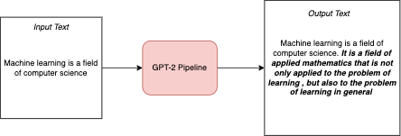
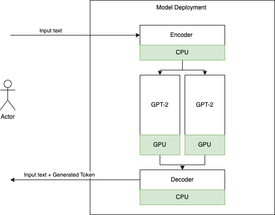

# Overview

A step-by-step walkthrough of deploying [GPT-2](https://huggingface.co/gpt2) using Nvidia [Triton inference server](https://developer.nvidia.com/nvidia-triton-inference-server) in [Oracle Cloud Infrastrcture (OCI) Model Deployment](https://docs.oracle.com/en-us/iaas/data-science/using/model-dep-about.htm).

# About GPT-2 Model Pipeline

GPT-2 is a transformer based model capable to generating texts from an input text corpus. GPT-2 is very compute intensive; the smallest variant has 124M parameters. Here, the GPT-2 pipeline has three components -

1. Encoder - The encoder part of the pipeline converts the user input text corpus to word embedding vectors

2. GPT2 - The core unsupervised model that can generate the most probable output token from given word embedding vectors

3. Decoder - The decoder part converts the input + generated token embeddings to output text



# Model Deployment Multi Compute Backends (CPU-GPU) and Nvidia Triton Inference Server

We can utilize Nvidia Triton Inference Server's model ensemble capablity to break the model's components and deploy it in OCI Model Deployment's multi compute backends option to get the following computation graph, where encoder and decoder utilizes the CPU while GPT-2 uses GPU for inference compuation



## Install Dependecies

`pip install -r requirements.txt`

## Download GPT-2 Model

Save the following script in _model_downloader.py_

```
from transformers import GPT2Tokenizer, TFGPT2LMHeadModel

tokenizer = GPT2Tokenizer.from_pretrained("gpt2")
model = TFGPT2LMHeadModel.from_pretrained(
    "gpt2", from_pt=True, pad_token_id=tokenizer.eos_token_id
)
model.save_pretrained("./gpt2model", saved_model=True)
```

```
python model_downloader.py
```

## Save GPT-2 Tokenizers vocab

Save the following script in _vocab_downloader.py_

```
from transformers import GPT2Tokenizer
tokenizer = GPT2Tokenizer.from_pretrained("gpt2")
tokenizer.save_vocabulary("./vocab")
```

```
python model_downloader.py
```

It would generate _vocab.json_ and _merges.txt_ in the vocab folder

## Transform tensorflow model to ONNX format

```
python -m tf2onnx.convert --saved-model ./gpt2model/saved_model/1 --opset 11  --output model.onnx
```

## Triton Supported Model Artifact

### Prepare Model Artifact

To use Triton, we need to build a model repository. For the above pipeline, we need to build the following dir structure

```
model_repository
|
+-- encoder
    |
    +-- config.pbtxt
    +-- 1
        |
        +-- merges.txt  (copy here from saved vocab folder)
        +-- config.json (copy here from saved vocab folder)
        +-- model.py
        +-- vocab.json
+-- decoder
    |
    +-- config.pbtxt
    +-- 1
        |
        +-- merges.txt  (copy here from saved vocab folder)
        +-- config.json (copy here from saved vocab folder)
        +-- model.py
        +-- vocab.json
+-- gpt2
    |
    +-- config.pbtxt
    +-- 1
        |
        +-- model.onnx (saved from above step)
+-- ensemble_model (connects the pipeline steps)
    |
    +-- config.pbtxt
```

### Build Triton Server

```
docker build -t triton-server:1.0.0 . -f Dockerfile
```

### Upload NVIDIA base triton server image to OCI Container Registry

```
docker login $(OCIR_REGION).ocir.io
docker tag triton-server:1.0.0 $(OCIR_REGION).ocir.io/$(OCIR_NAMESPACE)/$(REPOSITORY_NAME)/onnx-runtime:1.0.0
docker push $(OCIR_REGION).ocir.io/$(OCIR_NAMESPACE)/$(REPOSITORY_NAME)/triton-server:1.0.0
```

### Upload model artifact to Model catalog

Compress model_repository folder created in Step 1.1 in zip format and upload it to model catalog. Refer to https://docs.oracle.com/en-us/iaas/data-science/using/models_saving_catalog.htm for details

### Create Model Deployment

OCI Data Science Model Deployment has a dedicated support for Triton image, to make it easier to manage the Triton image by mapping of service-mandated endpoints to the Triton's inference and health HTTP/REST endpoint. To enable this support, enter the following environment variable when creating the Model Deployment:

```
CONTAINER_TYPE = TRITON
```

#### Using python sdk

```
# Create a model configuration details object
model_config_details = ModelConfigurationDetails(
    model_id= <model_id>,
    bandwidth_mbps = <bandwidth_mbps>,
    instance_configuration = <instance_configuration>,
    scaling_policy = <scaling_policy>
)

# Create the container environment configuration
environment_config_details = OcirModelDeploymentEnvironmentConfigurationDetails(
    environment_configuration_type="OCIR_CONTAINER",
    environment_variables={'CONTAINER_TYPE': 'TRITON'},
    image="$(OCIR_REGION).ocir.io/$(OCIR_NAMESPACE)/$(REPOSITORY_NAME)/triton-server:1.0.0",
    image_digest=<image_digest>,
    cmd=[
        "/entrypoint.sh",
        "/opt/ds/model/deployed_model"
        "None",
        "5000"
    ],
    server_port=5000,
    health_check_port=5000
)

# create a model type deployment
single_model_deployment_config_details = data_science.models.SingleModelDeploymentConfigurationDetails(
    deployment_type="SINGLE_MODEL",
    model_configuration_details=model_config_details,
    environment_configuration_details=environment_config_details
)

# set up parameters required to create a new model deployment.
create_model_deployment_details = CreateModelDeploymentDetails(
    display_name= <deployment_name>,
    model_deployment_configuration_details = single_model_deployment_config_details,
    compartment_id = <compartment_id>,
    project_id = <project_id>
)
```

Please make sure that you choose a GPU instance shape in instance configuration detail.

## Test Inference

```
import requests
import oci
from oci.signer import Signer

md_ocid = "<<MD_OCID>>"
url = f"https://<<get_the_endpoint_from_model_deployment>>/{md_ocid1}/predict"

count = 0
max_gen_len = 10
gen_sentence = data

config = oci.config.from_file("~/.oci/config")
auth = Signer(
   tenancy=config['tenancy'],
   user=config['user'],
   fingerprint=config['fingerprint'],
   private_key_file_location=config['key_file'],
   pass_phrase=config['pass_phrase'])

data = "Machine learning is a field of computer science"


count = 0
max_gen_len = 10
gen_sentence = data

while count < max_gen_len:
    payload = {
            "inputs": [
                {
                    "name": "TEXT",
                    "datatype": "BYTES",
                    "shape": [1],
                    "data": [gen_sentence],
                }
            ]
        }

    headers = {"model_name": "ensemble_model", "model_version": "1"}

    ret = requests.post(
            url,
            json=payload,
            auth=auth,
            headers=headers
        )

    print(ret.status_code)
    res = ret.json()
    next_seq = str(res["outputs"][0]['data'][0])
    gen_sentence += " " + next_seq

    count += 1

print("Input Seq::", data)
print("Out Seq::", gen_sentence)

```

You will see 50 generated tokens from in case of above test input.

```
Input Seq:: Machine learning is a field of computer science.
Out Seq:: Machine learning is a field of computer science. It is a field of applied mathematics that is not only applied to the problem of learning , but also to the problem of learning in general
```
