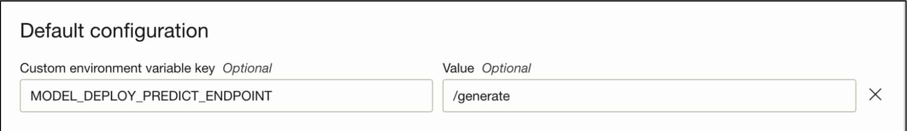
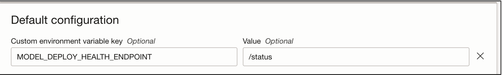

# Overview

This repo provides two approaches to deploy the Llama-2 LLM:

* [Text Generation Inference](https://github.com/huggingface/text-generation-inference) from HuggingFace.
* [vLLM](https://github.com/vllm-project/vllm) developed at UC Berkeley

## Prerequisites
* Configure your [API Auth Token](https://docs.oracle.com/en-us/iaas/Content/Registry/Tasks/registrygettingauthtoken.htm) to be able to run and test your code locally.
* Install [Docker](https://docs.docker.com/get-docker) or [Rancher Desktop](https://rancherdesktop.io/) as docker alternative.

## OCI Logging
When experimenting with new frameworks and models, it is highly advisable to attach log groups to model deployment in order to enable self assistance in debugging. Follow below steps to create log groups.

* Create logging for the model deployment (if you have to already created, you can skip this step)
  * Go to the [OCI Logging Service](https://cloud.oracle.com/logging/log-groups) and select `Log Groups`
  * Either select one of the existing Log Groups or create a new one
  * In the log group create ***two*** `Log`, one predict log and one access log, like:
    * Click on the `Create custom log`
    * Specify a name (predict|access) and select the log group you want to use
    * Under `Create agent configuration` select `Add configuration later`
    * Then click `Create agent configuration`

## Required IAM Policies

Public [documentation](https://docs.oracle.com/en-us/iaas/data-science/using/policies.htm).

### Generic Model Deployment policies
`allow group <group-name> to manage data-science-model-deployments in compartment <compartment-name>`

`allow dynamic-group <dynamic-group-name> to manage  data-science-model-deployments in compartment <compartment-name>`

### Allows a model deployment to emit logs to the Logging service. You need this policy if you’re using Logging in a model deployment
`allow any-user to use log-content in tenancy where ALL {request.principal.type = 'datasciencemodeldeployment'}`

### Bring your own container [policies](https://docs.oracle.com/en-us/iaas/data-science/using/model-dep-policies-auth.htm#model_dep_policies_auth__access-logging-service#model_dep_policies_auth__access-custom-container)
`ALL { resource.type = 'datasciencemodeldeployment' }`

`allow dynamic-group <dynamic-group-name> to read repos in compartment <compartment-name> where ANY {request.operation='ReadDockerRepositoryMetadata',request.operation='ReadDockerRepositoryManifest',request.operation='PullDockerLayer' }`

#### If the repository is in the root compartment, allow read for the tenancy

`allow dynamic-group <dynamic-group-name> to read repos in tenancy where ANY {
request.operation='ReadDockerRepositoryMetadata',
request.operation='ReadDockerRepositoryManifest',
request.operation='PullDockerLayer'
}`

#### For user level policies

`allow any-user to read repos in tenancy where ALL { request.principal.type = 'datasciencemodeldeployment' }`

`allow any-user to read repos in compartment <compartment-name> where ALL { request.principal.type = 'datasciencemodeldeployment'}`

### Model Store [export API](https://docs.oracle.com/en-us/iaas/data-science/using/large-model-artifact-export.htm#large-model-artifact-export) for creating model artifacts greater than 6 GB in size

`allow service datascience to manage object-family in compartment <compartment> where ALL {target.bucket.name='<bucket_name>'}`

`allow service objectstorage-<region> to manage object-family in compartment <compartment> where ALL {target.bucket.name='<bucket_name>'}`

### Policy to check Data Science work requests
`allow group <group_name> to manage data-science-work-requests in compartment <compartment_name>`

For all other Data Science policies, please refer these [details](https://github.com/oracle-samples/oci-data-science-ai-samples/blob/main/distributed_training/README.md#3-oci-policies).

* Create an entry into the model catalog with your token key
  * Open your [OCI Data Science Projects](https://cloud.oracle.com/data-science/projects/)
  * Create a project if one does not exist yet
  * Click on the project to enter it
  * From the left side under `Resources` select ***Models***
  * Click on `Create model` button
  * Specify a name, like `llama2-token`
  * Under `Model artifact` click on the `Select` button and locate the `token.zip` file, then click `Upload`
  * Click on `Create` to store the artifact

### One time download to OCI Model Catalog
* Download/Clone the model's repository that we are targeting to deploy, from huggingface repository. This can be done in Notebooks session for faster downloads and upload to bucket.
     ```bash
    git lfs install
    git clone https://huggingface.co/meta-llama/Llama-2-13b-hf
    ```
* Zip all items of the folder using zip/tar utility, preferably using below command to avoid creating another hierarchy of folder structure inside zipped file.
    ```bash
    zip <Filename>.zip * -0
    ```
* Upload the zipped artifact created in an object storage bucket in your tenancy. Tools like [rclone](https://rclone.org/), can help speed this upload. Using rclone with OCI can be referred from [here](https://docs.oracle.com/en/solutions/move-data-to-cloud-storage-using-rclone/configure-rclone-object-storage.html#GUID-8471A9B3-F812-4358-945E-8F7EEF115241)
* Next step is to create a model catalog item, using python script [create-large-modelcatalog.py](./create-large-modelcatalog.py). This script needs few inputs from users like Compartment OCID, Project OCID & Bucket details where we uploaded the model. You can run this script either from Notebook session using resource principal, or using config file with user credentials with necessary policies. There are multiple language SDK alternatives available as well, other than python. The documentation of policies required to success execute this script, is mentioned in the python file.
    ```bash
    python create-large-modelcatalog.py
    ```
* Depending on the size of the model, model catalog item will take time to be prepared before it can be utilised to be deployed using Model Deploy service. The script above will return the status SUCCEEDED, once the model is completely uploaded and ready to be used in Model Deploy service.

## Build TGI Container
To construct the required containers for this deployment and retain the necessary information, please complete the following steps:

* Checkout this repository
* Enter the path `model-deployment/containers/llama2`

    ```bash
    cd model-deployment/containers/llama2
    ```
* This example uses [OCI Container Registry](https://docs.oracle.com/en-us/iaas/Content/Registry/Concepts/registryoverview.htm) to store the container image required for the deployment. For the `Makefile` to execute the container build and push process to Oracle Cloud Container Registry, you have to set up in your local terminal the  `TENANCY_NAME` and `REGION_KEY` environment variables.`TENANCY_NAME` is the name of your tenancy, which you can find under your [account settings](https://cloud.oracle.com/tenancy) and the `REGION_KEY` is a 3 letter name of your tenancy region, you consider to use for this example, for example IAD for Ashburn, or FRA for Frankfurt. You can find the region keys in our public documentation for [Regions and Availability Domains](https://docs.oracle.com/en-us/iaas/Content/General/Concepts/regions.htm)

    ```bash
    export TENANCY_NAME=<your-tenancy-name>
    export REGION_KEY=<region-key>
    ```

You can find the official documentation about OCI Data Science Model Deployment: [https://docs.oracle.com/en-us/iaas/data-science/using/model_dep_create.htm]

* Build the TGI container image, this step would take a while

    ```bash
    make build.tgi
    ```

* Before we can push the new built container make sure that you've created the `text-generation-interface-odsc` repository in your tenancy.
  * Go to your tenancy [Container Registry](https://cloud.oracle.com/compute/registry/containers)
  * Click on the `Create repository` button
  * Select `Private` under Access types
  * Set `text-generation-interface-odsc` as a `Repository name`
  * Click on `Create` button

* You may need to `docker login` to the Oracle Cloud Container Registry (OCIR) first, if you haven't done so before been able to push the image. To login, you have to use your [API Auth Token](https://docs.oracle.com/en-us/iaas/Content/Registry/Tasks/registrygettingauthtoken.htm) that can be created under your `Oracle Cloud Account->Auth Token`. You need to login only once.

    ```bash
    docker login -u '<tenant-namespace>/<username>' <region>.ocir.io
    ```

  If `your tenancy` is **federated** with Oracle Identity Cloud Service, use the format `<tenancy-namespace>/oracleidentitycloudservice/<username>`

* Push the container image to the OCIR

    ```bash
    make push.tgi
    ```

## Build vLLM Container

You can find the official documentation about OCI Data Science Model Deployment: [https://docs.oracle.com/en-us/iaas/data-science/using/model_dep_create.htm]

* Build the vLLM container image, this step would take a while

    ```bash
    make build.vllm
    ```

* Before we can push the newly build container make sure that you've created the `vllm-odsc` repository in your tenancy.
  * Go to your tenancy [Container Registry](https://cloud.oracle.com/compute/registry/containers)
  * Click on the `Create repository` button
  * Select `Private` under Access types
  * Set `vllm-odsc` as a `Repository name`
  * Click on `Create` button

* You may need to `docker login` to the Oracle Cloud Container Registry (OCIR) first, if you haven't done so before been able to push the image. To login you have to use your [API Auth Token](https://docs.oracle.com/en-us/iaas/Content/Registry/Tasks/registrygettingauthtoken.htm) that can be created under your `Oracle Cloud Account->Auth Token`. You need to login only once.

    ```bash
    docker login -u '<tenant-namespace>/<username>' <region>.ocir.io
    ```

  If `your tenancy` is **federated** with Oracle Identity Cloud Service, use the format `<tenancy-namespace>/oracleidentitycloudservice/<username>`

* Push the container image to the OCIR

    ```bash
    make push.vllm
    ```

## Deploy on OCI Data Science Model Deployment

Once you built and pushed the TGI or the vLLM container, you can now use the `Bring Your Own Container` Deployment in OCI Data Science to deploy the Llama2 models.


### Deploy with TGI

* To deploy the model now in the console, go back to your [OCI Data Science Project](https://cloud.oracle.com/data-science/project)
  * Select the project you created earlier and then select `Model Deployment`
  * Click on `Create model deployment`
  * Models downloaded from model catalog, will be mounted and made available to the model server container at location: /opt/ds/model/deployed_model as part of Model Deploy BYOC contract. So under `Default configuration` set following custom environment variables
    * For `7b llama2` parameter model use the following environment variables
      * default PARAMS are going as `--max-batch-prefill-tokens 1024`, for custom requirement, set custom environment variable key `PARAMS` with value `--max-batch-prefill-tokens 1024` as needed.
    * For `13b llama2` parameter model use the following environment variables, notice this deployment uses quantization
      * set custom environment variable key `PARAMS` with value `--max-batch-prefill-tokens 1024 --quantize bitsandbytes --max-batch-total-tokens 4096`. More details can be referred from official [doc](https://huggingface.co/docs/text-generation-inference/basic_tutorials/using_cli).
    * Since TGI by default works on /generate for prediction endpoint, we need to map custom endpoints to model deploy service oriented endpoint. We can achieve this by mentioning the following environment variables in configuration section
      * Key: `MODEL_DEPLOY_PREDICT_ENDPOINT`, Value: `/generate`
    * Under `Models` click on the `Select` button and select the Model Catalog entry we created earlier
    * Under `Compute` and then `Specialty and previous generation` select the `VM.GPU.A10.2` instance
    * Under `Networking` leave the Default option
    * Under `Logging` select the Log Group where you've created your predict and access log and select those correspondingly
    * Click on `Show advanced options` at the bottom
    * Select the checkbox `Use a custom container image`
    * Select the OCIR repository and image we pushed earlier
    * No need to change port, as default port is mentioned 8080. But is available as ENV variable in Dockerfile, so feel free to change as needed.
    * Leave CMD and Entrypoint blank
    * Click on `Create` button to create the model deployment

* Once the model is deployed and shown as `Active`, you can execute inference against it. The easier way to do it would be to use the integrated `Gradio` application in this example
  * Go to the model you've just deployed and click on it
  * Under the left side under `Resources` select `Invoking your model`
  * You will see the model endpoint under `Your model HTTP endpoint` copy it
  * Open the `config.yaml` file
  * Depending on which model you decided to deploy the 7b or 13b change the endpoint URL with the one you've just copied
  * Install the dependencies

    ```bash
    pip install gradio loguru
    ```

  * run the Gradio application with

    ```bash
    make app
    ```

    * You should be able to open the application now on your machine under `http://127.0.0.1:7861/` and use start chatting against the deployed model on OCI Data Science Service.

* Alternatively, you can run inference against the deployed model with oci cli

```bash
oci raw-request --http-method POST --target-uri https://<MD_OCID>/predict  --request-body '{"inputs":"Tell me about Data Science","parameters":{"max_new_tokens":20}}'
```

### Deploy with vLLM
Model Catalog steps will be common for vLLM. Users can use python script [create-large-modelcatalog.py](./create-large-modelcatalog.py) and execute as a python executable after inputting required values like compartment OCID, project OCID and source bucket details.
The Container creation process is going to be the same as TGI. All associated files are present in vllm directory. Once the container is pushed on OCIR, follow below steps:

* To deploy the model now in the console, go back to your [OCI Data Science Project](https://cloud.oracle.com/data-science/project)
  * Select the project you created earlier and then select `Model Deployment`
  * Click on `Create model deployment`
  * Models downloaded from model catalog, will be mounted and made available to the model server container at location: /opt/ds/model/deployed_model as part of Model Deploy BYOC contract. So under `Default configuration` set following custom environment variables
    * For `7b llama2` model, use the following environment variables
      * Default values in docker file are sufficient to handle the model deployment with tensor parallelism as 1
    * For `13b llama2` model, use the custom environment variable to override the default tensor parallelism as 2, to shard the model on 2 GPU cards.
      * Set custom environment variable key `TENSOR_PARALLELISM` with value `2`
      * You can override more vllm bootstrapping configuration using `PARAMS` environment configuration. For details of configurations, please refer the official vLLM [doc](https://vllm.readthedocs.io/en/latest/getting_started/quickstart.html).
    * Since in the api server file, we have already changed the prediction endpoint to /predict, we don't need any other overrides.
    * Under `Models` click on the `Select` button and select the Model Catalog entry we created earlier
    * Under `Compute` and then `Specialty and previous generation` select the `VM.GPU3.2` instance
    * Under `Networking` leave the Default option
    * Under `Logging` select the Log Group where you've created your predict and access log and select those correspondingly
    * Click on `Show advanced options` at the bottom
    * Select the checkbox `Use a custom container image`
    * Select the OCIR repository and image we pushed earlier
    * No need to change port, as default port is mentioned 8080. But is available as ENV variable in Dockerfile, so feel free to change as needed.
    * Leave CMD and Entrypoint blank
    * Click on `Create` button to create the model deployment

* Once the model is deployed and shown as `Active`, you can execute inference against it.
```bash
oci raw-request --http-method POST --target-uri https://<MD_OCID>/predict --request-body '{"inputs": "Tell me about Data Science"}'
```

## Inference

* Once the model is deployed and shown as `Active` you can execute inference against it, the easier way to do it would be to use the integrated `Gradio` application in this example
  * Go to the model you've just deployed and click on it
  * Under the left side under `Resources` select `Invoking your model`
  * You will see the model endpoint under `Your model HTTP endpoint` copy it
  * Open the `config.yaml` file
  * Depending on which model you decided to deploy the 7b or 14b change the endpoint URL with the one you've just copied
  * Install the dependencies

    ```bash
    pip install -r requirements.txt
    ```

  * Run the Gradio application with

    ```bash
    make app
    ```

    * You should be able to open the application now on your machine under `http://127.0.0.1:7861/` and use start chatting against the deployed model on OCI Data Science Service.

* Alternatively, you can run inference against the deployed model with oci cli from your OCI Data Science Notebook or your local environment

  * TGI Inference

    ```bash
    oci raw-request \
      --http-method POST \
      --target-uri "https://modeldeployment.eu-frankfurt-1.oci.customer-oci.com/ocid1.datasciencemodeldeployment.oc1.eu-frankfurt-1.amaaaaaanif7xwiahljboucy47byny5xffyc3zbkpfk4jtcdrtycjb6p2tsa/predict" \
      --request-body '{
        "inputs": "Write a python program to randomly select item from a predefined list?",
        "parameters": {
          "max_new_tokens": 200
        }
      }' \
      --auth resource_principal
    ```

  * vLLM Inference

    ```bash
    oci raw-request \
      --http-method POST \
      --target-uri "https://modeldeployment.eu-frankfurt-1.oci.customer-oci.com/ocid1.datasciencemodeldeployment.oc1.eu-frankfurt-1.amaaaaaanif7xwiaje3uc4c5igep2ppcefnyzuab3afufefgepicpl5whm6q/predict" \
      --request-body '{
        "inputs": "are you smart?",
        "use_beam_search": true,
        "n": 4,
        "temperature": 0
      }' \
      --auth resource_principal
    ```
## Advanced configuration options

### Custom BYOC endpoint contracts

For large model inference, Open source containers such as TGI is preferred by many customers as it best suits LLM use cases. These containers often do not comply with MD BYOC contracts. For example, TGI containers expose /generate for predict endpoint whereas MD BYOC contracts mandates /predict as the predict endpoint. In this release following overrides are provided for customers to customise BYOC contracts

#### MODEL_DEPLOY_PREDICT_ENDPOINT



#### MODEL_DEPLOY_HEALTH_ENDPOINT



### STREAMING - Enable Real time transmission of output tokens from model(In Limited Preview)
This is a Limited Available feature. Please reach out to us via email `ask-oci-data-science_grp@oracle.com`  to ask to be allow-listed for this LA feature.

By default, the predict/http endpoint of the model deployment service as highlighted earlier returns a single response which in case of LLMs can be very huge. The model can also take secs/mins to generate the output response which means the calling user of this endpoint will have to both wait for the entire response to be generated first and then process all of them together at once. This may not provide the best user experience, especially when dealing with conversation interfaces or applications that involve real-time data processing. To provide a better UX and avoid these delays in handling of data, the service exposes an optional streaming feature in the same endpoint to allow real-time transfer of data from model. Please open a service support ticket to learn more and enable this feature on your deployments.

Here are some benefits of streaming:
* Reduced Latency:

  * Streaming allows data to be sent in smaller chunks as it becomes available, reducing the overall latency of the response.
  * Clients can start processing and displaying partial results before the entire response is received.

* Bandwidth Efficiency:

  * Streaming can be more bandwidth-efficient, especially for large datasets or continuous data streams.
  * Clients can start processing and displaying data while it's being streamed, reducing the need to buffer and store large amounts of data.

* Handling Large Data Sets:

  * Streaming is beneficial when dealing with large datasets that may not fit comfortably in memory.
  * Clients can process and display data incrementally, avoiding the need to load the entire dataset into memory before presenting it to the user.

* Long-Running Operations:

  * For long-running operations, streaming allows clients to receive updates or partial results during the operation's execution.
  * Clients can be informed about progress, and they can take action based on intermediate results.

## Deploying using ADS

Instead of using the console, you can also deploy using the ADS from your local machine. Make sure that you've also created and setup your [API Auth Token](https://docs.oracle.com/en-us/iaas/Content/Registry/Tasks/registrygettingauthtoken.htm) to execute the commands below.

* Make sure you have installed the ADS on your local machine

    ```bash
    python3 -m pip install oracle-ads
    ```

* Refer to the `ads-md-deploy-*.yaml` for configurations and change with the OCIDs of the resources required for the deployment, like project ID, compartment ID etc. All the configurations with `<UNIQUE_ID>` should be replaced with your corresponding ID from your tenancy, the resources we created in the previous steps.

You can create a deployment by first creating a security token and then running one of:

### TGI

```bash
ads opctl run -f ads-md-deploy-tgi.yaml
```

### vLLM

```bash
ads opctl run -f ads-md-deploy-vllm.yaml
```

## Troubleshooting

The Following are identified as the most probable failure cases while deploying large models.

### Create/Update Model deployment failure

#### Reason
Container timeout.

#### Symptoms
The Work Request logs will show the following error: Errors occurred while bootstrapping the Model Deployment

#### Mitigation
Customer should check the predict and health check endpoints, if defined through environment variables, are valid for container image specified. They can also check the predict and access logs for more information.

### Advanced debugging options: Code debugging inside the container using job
For more detailed level of debugging, user can refer [README-DEBUG.md](./README-DEBUG.md).

## Additional Make Commands

### TGI containers

`make build.tgi` to build the container

`make run.tgi` to run the container

`make shell.tgi` to launch container with shell prompt

`make stop.tgi` to stop the running container

### vLLM containers

`make build.vllm` to build the container

`make run.vllm` to run the container

`make shell.vllm` to launch container with shell prompt

`make stop.vllm` to stop the running container