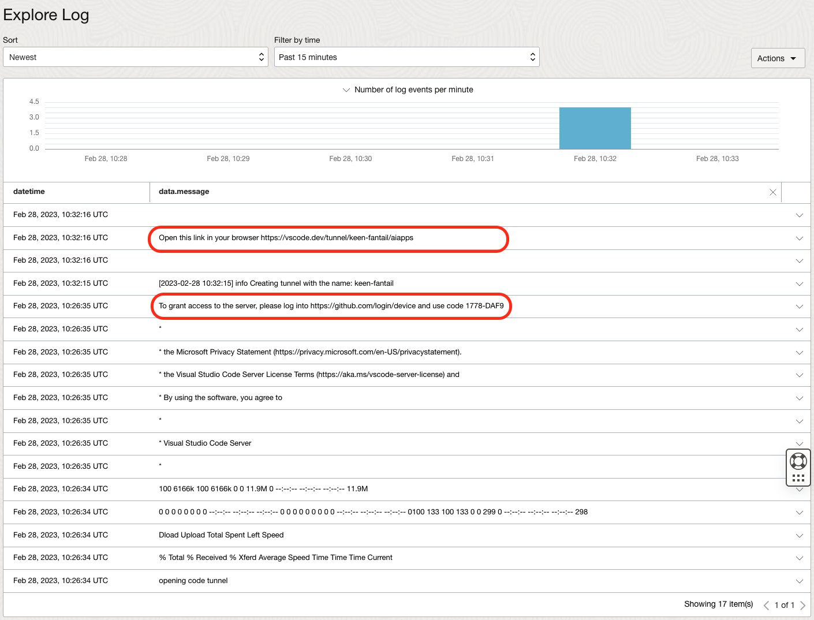

# Overview

This repo provides two approaches to deploy the Llama-2 LLM:

* [Text Generation Inference](https://github.com/huggingface/text-generation-inference) from HuggingFace.
* [vLLM](https://github.com/vllm-project/vllm) developed at UC Berkeley

The models are downloaded from the internet during the deployment process, which requires custom networking setup while creating Oracle Cloud Infrastructure Data Science Model Deployment.

## Prerequisites

* Configure your [API Auth Token](https://docs.oracle.com/en-us/iaas/Content/Registry/Tasks/registrygettingauthtoken.htm) to be able to run and test your code locally.
* Install [Docker](https://docs.docker.com/get-docker) or [Rancher Desktop](https://rancherdesktop.io/) as docker alternative.
* This is Limited Available feature. Please reach out to us via email `ask-oci-data-science_grp@oracle.com`  to ask to be allowlisted for this LA feature.

## Methods for model weight downloads

### Direct Download
The model will be downloaded at container startup time, we just need to provide authentication token to connect to model repository. Follow below steps to host the token:
* Create a file called `token` in the same folder and store your Hugging Face user access token inside, which you can locate under your [Hugging Face Setting](https://huggingface.co/settings/tokens)

    ```bash
    echo 'your-huggingface-token-comes-here' >> token
    ```

* Zip the `token` file we created in the earlier step

    ```bash
    zip token.zip token
    ```

* Create an entry into the model catalog with your token key
  * Open your [OCI Data Science Projects](https://cloud.oracle.com/data-science/projects/)
  * Create a project if one does not exist yet
  * Click on the project to enter it
  * From the left side under `Resources` select ***Models***
  * Click on `Create model` button
  * Specify a name, like `llama2-token`
  * Under `Model artifact` click on the `Select` button and locate the `token.zip` file, then click `Upload`
  * Click on `Create` to store the artifact

### One time download to OCI Model Catalog
* Download/Clone the model's repository that we are targetting to deploy, from huggingface repository. This can be done in Notebooks session for faster downloads and upload to bucket.
     ```bash
    git lfs install
    git clone https://huggingface.co/meta-llama/Llama-2-13b-hf
    ```
* Zip all items of the folder using zip/tar utility, preferrably using below command to avoid creating another hierarchy of folder structure inside zipped file.
    ```bash
    zip <Filename>.zip * -0
    ```
* Upload the zipped artifact created in an object storage bucket in your tenancy. Tools like [rclone](https://rclone.org/), can help speed this upload. Using rclone with OCI can be referred from [here](https://docs.oracle.com/en/solutions/move-data-to-cloud-storage-using-rclone/configure-rclone-object-storage.html#GUID-8471A9B3-F812-4358-945E-8F7EEF115241)
* Next step is to create a model catalog item, using python script [create-large-modelcatalog.py](./create-large-modelcatalog.py). This script needs few inputs from users like Compartment OCID, Project OCID & Bucket details where we uploaded the model. You can run this script either from Notebook session using resource principal, or using config file with user credentails with necessary policies. There are multiple language SDK alternatives available as well, other than python. The documentation of policies required to success execute this script, is mentioned in the python file.
    ```bash
    python create-large-modelcatalog.py
    ```
* Depending on the size of the model, model catalog item will take time to be prepared before it can be utilised to be deployed using Model Deploy service. The script above will return the status SUCCEEDED, once the model is completely uploaded and ready to be used in Model Deploy service.


## Requirements

To construct the required containers for this deployment and retain the necessary information, please complete the following steps:

* Checkout this repository
* Enter the path `model-deployment/containers/llama2`

    ```bash
    cd model-deployment/containers/llama2
    ```

* Create logging for the model deployment (if you have to already created, you can skip this step)
  * Go to the [OCI Logging Service](https://cloud.oracle.com/logging/log-groups) and select `Log Groups`
  * Either select one of the existing Log Groups or create a new one
  * In the log group create ***two*** `Log`, one predict log and one access log, like:
    * Click on the `Create custom log`
    * Specify a name (predict|access) and select the log group you want to use
    * Under `Create agent configuration` select `Add configuration later`
    * Then click `Create agent configuration`

* If you are choosing to download the model directly from source, you will need to configure a VCN with access to internet. Create a subnet for the model deployment
  * Go to the [Virtual Cloud Network](https://cloud.oracle.com/networking/vcns) in your Tenancy
  * Select one of your existing VCNs
  * Click on `Create subnet` button
  * Specify a name
  * As `Subnet type` select `Regional`
  * As IP CIDR block set `10.0.32.0/19`
  * Under `Route Table` select the routing table for private subnet
  * Under `Subnet Access` select `Private Subnet`
  * Click on `Create Subnet` to create it

* This example uses [OCI Container Registry](https://docs.oracle.com/en-us/iaas/Content/Registry/Concepts/registryoverview.htm) to store the container image required for the deployment. For the `Makefile` to execute the container build and push process to Oracle Cloud Container Registry, you have to setup in your local terminal the  `TENANCY_NAME` and `REGION_KEY` environment variables.`TENANCY_NAME` is the name of your tenancy, which you can find under your [account settings](https://cloud.oracle.com/tenancy) and the `REGION_KEY` is a 3 letter name of your tenancy region, you consider to use for this example, for example IAD for Ashburn, or FRA for Frankfurt. You can find the region keys in our public documentation for [Regions and Availability Domains](https://docs.oracle.com/en-us/iaas/Content/General/Concepts/regions.htm)

    ```bash
    export TENANCY_NAME=<your-tenancy-name>
    export REGION_KEY=<region-key>
    ```

## Build TGI Container

You can find the official documentation about OCI Data Science Model Deployment: [https://docs.oracle.com/en-us/iaas/data-science/using/model_dep_create.htm]

* Build the TGI container image, this step would take awhile

    ```bash
    make build.tgi
    ```

* Before we can push the newly build container make sure that you've created the `text-generation-interface-odsc` repository in your tenancy.
  * Go to your tenancy [Container Registry](https://cloud.oracle.com/compute/registry/containers)
  * Click on the `Create repository` button
  * Select `Private` under Access types
  * Set `text-generation-interface-odsc` as a `Repository name`
  * Click on `Create` button

* You may need to `docker login` to the Oracle Cloud Container Registry (OCIR) first, if you haven't done so before been able to push the image. To login you have to use your [API Auth Token](https://docs.oracle.com/en-us/iaas/Content/Registry/Tasks/registrygettingauthtoken.htm) that can be created under your `Oracle Cloud Account->Auth Token`. You need to login only once.

    ```bash
    docker login -u '<tenant-namespace>/<username>' <region>.ocir.io
    ```

    If `your tenancy` is **federated** with Oracle Identity Cloud Service, use the format `<tenancy-namespace>/oracleidentitycloudservice/<username>`

* Push the container image to the OCIR

    ```bash
    make push.tgi
    ```

## Build vLLM Container

You can find the official documentation about OCI Data Science Model Deployment: [https://docs.oracle.com/en-us/iaas/data-science/using/model_dep_create.htm]

* Build the vLLM container image, this step would take awhile

    ```bash
    make build.vllm
    ```

* Before we can push the newly build container make sure that you've created the `vllm-odsc` repository in your tenancy.
  * Go to your tenancy [Container Registry](https://cloud.oracle.com/compute/registry/containers)
  * Click on the `Create repository` button
  * Select `Private` under Access types
  * Set `vllm-odsc` as a `Repository name`
  * Click on `Create` button

* You may need to `docker login` to the Oracle Cloud Container Registry (OCIR) first, if you haven't done so before been able to push the image. To login you have to use your [API Auth Token](https://docs.oracle.com/en-us/iaas/Content/Registry/Tasks/registrygettingauthtoken.htm) that can be created under your `Oracle Cloud Account->Auth Token`. You need to login only once.

    ```bash
    docker login -u '<tenant-namespace>/<username>' <region>.ocir.io
    ```

    If `your tenancy` is **federated** with Oracle Identity Cloud Service, use the format `<tenancy-namespace>/oracleidentitycloudservice/<username>`

* Push the container image to the OCIR

    ```bash
    make push.vllm
    ```

## Deploy on OCI Data Science Model Deployment

Once you build and pushed the TGI or the vLLM container, you can now use the `Bring Your Own Container` Deployment in OCI Data Science to the deploy the Llama2 models.


### Deploy with TGI

* To deploy the model now in the console, go to back your [OCI Data Science Project](https://cloud.oracle.com/data-science/project)
  * Select the project you created earlier and than select `Model Deployment`
  * Click on `Create model deployment`
  * Models downloaded from model catalog, will be mounted and made avilable to the model server container at location: /opt/ds/model/deployed_model as part of Model Deploy BYOC contract. So under `Default configuration` set following custom environment variables
    * For `7b llama2` parameter model use the following environment variables
      * default PARAMS are going as `--max-batch-prefill-tokens 1024`, for custom requirement, set custom environment variable key `PARAMS` with value `--max-batch-prefill-tokens 1024` as needed.
    * For `13b llama2` parameter model use the following environment variables, notice this deployment uses quantization
      * set custom environment variable key `PARAMS` with value `--max-batch-prefill-tokens 1024 --quantize bitsandbytes --max-batch-total-tokens 4096`. More details can be referred from official [doc](https://huggingface.co/docs/text-generation-inference/basic_tutorials/using_cli).
    * Since TGI by default works on /generate for prediction endpoint, we need to map this custom endpoints to model deploy service oriented endpoint. We can achieve this by mentioning following environment variables in configuration section
      * Key: `MODEL_DEPLOY_PREDICT_ENDPOINT`, Value: `/generate`
    * If you are downloading models directly from source, we will need these additional environment variable configurations:
      * Set custom environment variable key `TOKEN_FILE` with value `/opt/ds/model/deployed_model/token`, as the token will be available at this path.
      * Set custom environment variable key `MODEL` with value `meta-llama/Llama-2-13b-hf`, this is the model that will be downloaded during container start.
      * Set custom environment variable key `STORAGE_SIZE_IN_GB` with value `950` for 7b model. This is required as model will be downloaded at runtime, so we need to keep extra storage size to accomodate various model sizes.
    * Under `Models` click on the `Select` button and select the Model Catalog entry we created earlier
    * Under `Compute` and then `Specialty and previous generation` select the `VM.GPU.A10.2` instance
    * Under `Networking` leave the Default option
    * Under `Logging` select the Log Group where you've created your predict and access log and select those correspondingly
    * Click on `Show advanced options` at the bottom
    * Select the checkbox `Use a custom container image`
    * Select the OCIR repository and image we pushed earlier
    * No need to change port, as default port is mentioned 8080. But is is available as ENV variable in Dockerfile, so feel free to change as needed.
    * Leave CMD and Entrypoint blank
    * Click on `Create` button to create the model deployment

* Once the model is deployed and shown as `Active`, you can execute inference against it, the easier way to do it would be to use the integrated `Gradio` application in this example
  * Go to the model you've just deployed and click on it
  * Under the left side under `Resources` select `Invoking your model`
  * You will see the model endpoint under `Your model HTTP endpoint` copy it
  * Open the `config.yaml` file
  * Depending on which model you decided to deploy the 7b or 13b change the endpoint URL with the one you've just copied
  * Install the dependencies

    ```bash
    pip install gradio loguru
    ```

  * run the Gradio application with

    ```bash
    make app
    ```

    * You should be able to open the application now on your machine under `http://127.0.0.1:7861/` and use start chatting against the deployed model on OCI Data Science Service.

* Alternatively you can run inference against the deployed model with oci cli

```bash
oci raw-request --http-method POST --target-uri https://<MD_OCID>/predict  --request-body '{"inputs":"Tell me about Data Science","parameters":{"max_new_tokens":20}}'
```

### Deploy with vLLM
Model Catalog steps will be common for vLLM. Users can use python script [create-large-modelcatalog.py](./create-large-modelcatalog.py) and execute as a python excutable after inputting required values like compartment OCID, project OCID and source bucket details.
Container creation process is going to be same as TGI. All associated files are present in vllm directory. Once the container is pushed on OCIR, follow below steps:

* To deploy the model now in the console, go to back your [OCI Data Science Project](https://cloud.oracle.com/data-science/project)
  * Select the project you created earlier and than select `Model Deployment`
  * Click on `Create model deployment`
  * Models downloaded from model catalog, will be mounted and made avilable to the model server container at location: /opt/ds/model/deployed_model as part of Model Deploy BYOC contract. So under `Default configuration` set following custom environment variables
    * For `7b llama2` model, use the following environment variables
      * Default values in docker file are sufficient to handle the model deployment with tensor parallelism as 1
    * For `13b llama2` model, use the custom environment variable to override the default tensor parallelism as 2, to shard the model on 2 GPU cards.
      * Set custom environment variable key `TENSOR_PARALLELISM` with value `2`
      * You can override more vllm bootstrapping configuration using `PARAMS` environment configuration. For details of configurations, please refer the official vLLM [doc](https://vllm.readthedocs.io/en/latest/getting_started/quickstart.html).
    * If you are downloading models directly from source, we will need these additional environment variable configurations:
      * Set custom environment variable key `TOKEN_FILE` with value `/opt/ds/model/deployed_model/token`, as the token will be available at this path.
      * Set custom environment variable key `MODEL` with value `meta-llama/Llama-2-13b-hf`, this is the model that will be downloaded during container start.
      * Set custom environment variable key `STORAGE_SIZE_IN_GB` with value `950` for 7b model. This is required as model will be downloaded at runtime, so we need to keep extra storage size to accomodate various model sizes.
    * Since in api server file, we have already changed the prediction endpoint to /predict, we don't need any other overrides.
    * Under `Models` click on the `Select` button and select the Model Catalog entry we created earlier
    * Under `Compute` and then `Specialty and previous generation` select the `VM.GPU3.2` instance
    * Under `Networking` leave the Default option
    * Under `Logging` select the Log Group where you've created your predict and access log and select those correspondingly
    * Click on `Show advanced options` at the bottom
    * Select the checkbox `Use a custom container image`
    * Select the OCIR repository and image we pushed earlier
    * No need to change port, as default port is mentioned 8080. But is is available as ENV variable in Dockerfile, so feel free to change as needed.
    * Leave CMD and Entrypoint blank
    * Click on `Create` button to create the model deployment

* Once the model is deployed and shown as `Active`, you can execute inference against it.
```bash
oci raw-request --http-method POST --target-uri https://<MD_OCID>/predict --request-body '{"inputs": "Tell me about Data Science"}'
```

## Inference

* Once the model is deployed and shown as `Active` you can execute inference against it, the easier way to do it would be to use the integrated `Gradio` application in this example
  * Go to the model you've just deployed and click on it
  * Under the left side under `Resources` select `Invoking your model`
  * You will see the model endpoint under `Your model HTTP endpoint` copy it
  * Open the `config.yaml` file
  * Depending on which model you decided to deploy the 7b or 14b change the endpoint URL with the one you've just copied
  * Install the dependencies

    ```bash
    pip install -r requirements.txt
    ```

  * Run the Gradio application with

    ```bash
    make app
    ```

    * You should be able to open the application now on your machine under `http://127.0.0.1:7861/` and use start chatting against the deployed model on OCI Data Science Service.

* Alternatively you can run inference against the deployed model with oci cli from your OCI Data Science Notebook or you local environment

  * TGI Inference

    ```bash
    oci raw-request \
      --http-method POST \
      --target-uri "https://modeldeployment.eu-frankfurt-1.oci.customer-oci.com/ocid1.datasciencemodeldeployment.oc1.eu-frankfurt-1.amaaaaaanif7xwiahljboucy47byny5xffyc3zbkpfk4jtcdrtycjb6p2tsa/predict" \
      --request-body '{
        "inputs": "Write a python program to randomly select item from a predefined list?",
        "parameters": {
          "max_new_tokens": 200
        }
      }' \
      --auth resource_principal
    ```

  * vLLM Inference

    ```bash
    oci raw-request \
      --http-method POST \
      --target-uri "https://modeldeployment.eu-frankfurt-1.oci.customer-oci.com/ocid1.datasciencemodeldeployment.oc1.eu-frankfurt-1.amaaaaaanif7xwiaje3uc4c5igep2ppcefnyzuab3afufefgepicpl5whm6q/predict" \
      --request-body '{
        "inputs": "are you smart?",
        "use_beam_search": true,
        "n": 4,
        "temperature": 0
      }' \
      --auth resource_principal
    ```

## Deploying using ADS

Instead of using the console, you can also deploy using the ADS from your local machine. Make sure that you've also created and setup your [API Auth Token](https://docs.oracle.com/en-us/iaas/Content/Registry/Tasks/registrygettingauthtoken.htm) to execute the commands below.

* Make sure you have installed the ADS on your local machine

    ```bash
    python3 -m pip install oracle-ads
    ```

* Refer to the `ads-md-deploy-*.yaml` for configurations and change with the OCIDs of the resources required for the deployment, like project ID, compartment ID etc. All of the configurations with `<UNIQUE_ID>` should be replaces with your corresponding ID from your tenancy, the resources we created in the previous steps.

You can create a deployment by first creating a security token and then running one of:

### TGI

```bash
ads opctl run -f ads-md-deploy-tgi.yaml
```

### vLLM

```bash
ads opctl run -f ads-md-deploy-vllm.yaml
```

## Debugging

You could debug the code in the container utilizing the [Visual Studio Code Remote - Tunnels](https://code.visualstudio.com/docs/remote/tunnels) extension, which lets you connect to a remote machine, like a desktop PC or virtual machine (VM), via a secure tunnel. You can connect to that machine from a VS Code client anywhere, without the requirement of setting up your own SSH, including also using the Oracle Cloud Infrastructure Data Science Jobs.

The tunneling securely transmits data from one network to another. This can eliminate the need for the source code to be on your VS Code client machine since the extension runs commands and other extensions directly on the OCI Data Science Job remote machine.

### Requirements

To use the debugging you have to finalize the steps of building and pushing the container of your choice to the Oracle Cloud Container Registry.

## Run for Debugging

For debugging purposes we will utilize the OCI Data Science Jobs service. Once the TGI or the vLLM container was build and published to the OCIR, we can run it as a Job, which would enable us take advance of the VSCode Remote Tunneling. To do so follow the steps:

* In your [OCI Data Science](https://cloud.oracle.com/data-science/projects) section, select the project you've created for deployment
* Under the `Resources` section select `Jobs`
* Click on `Create job` button
* Under the `Default Configuration` select the checkbox for `Bring your own container`
  * Set following environment variables:
  * `CONTAINER_CUSTOM_IMAGE` with the value to the OCI Container Registry Repository location where you pushed your container, for example: `<your-region>.ocir.io/<your-tenancy-name>/vllm-odsc:0.1.3`
  * `CONTAINER_ENTRYPOINT` with the value `"/bin/bash", "--login",  "-c"`
  * `CONTAINER_CMD` with the value `/aiapps/runner.sh`
  * The above values will override the default values set in the `Dockerfile` and would enable to launch the tunneling
* Under `Compute shape` select `Custom configuration` and then `Specialty and previous generation` and select the `VM.GPU.A10.2` shape
* Under `Logging` select the log group you've created for the model deployment and keep the option `Enable automatic log creation`
* Under `Storage` set 500GB+ of storage
* Under `Networking` keep the `Default networking` configuration

With this we are now ready to start the job

* Select the newly created job, if you have not done so
* Click on the `Start a job run` 
* Keep all settings by default and click on `Start` button at the bottom left

Once the job is up and running, you will notice in the logs, the authentication code appears, you can copied and use it to authorize the tunnel, few seconds later the link for the tunnel would appear.



Copy the link and open it in a browser, which should load the VSCode Editor and reveals the code inside the job, enabling direct debugging and coding.

`Notice` that you can also use your local VSCode IDE for the same purpose via the [Visual Studio Code Remote - Tunnels](https://code.visualstudio.com/docs/remote/tunnels) extension

## Additional Make Commands

### TGI containers

`make build.tgi` to build the container

`make run.tgi` to run the container

`make shell.tgi` to launch container with shell prompt

`make stop.tgi` to stop the running container

### vLLM containers

`make build.vllm` to build the container

`make run.vllm` to run the container

`make shell.vllm` to launch container with shell prompt

`make stop.vllm` to stop the running container
