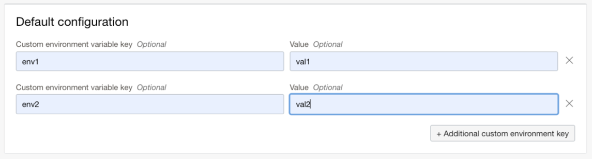
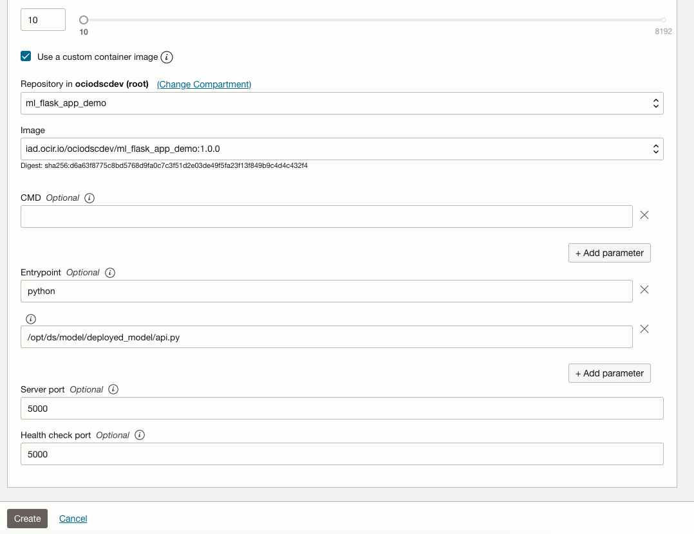

# Quick Start
This is a step-by-step walk-through in creating a model deployment using custom container support.


## 1. Build the container image
1. You can use an existing image in OCI Registry or create a new image using the sample Dockerfile. 
Here is a sample Dockerfile that uses Flask server,
   ```dockerfile
   FROM jupyter/scipy-notebook
    
   USER root
   RUN \
     apt-get update && \
     apt-get -y install curl
    
   ENV WORK_DIRECTORY=/opt/ds/model/deployed_model
   ENV MODEL_DIR=$WORK_DIRECTORY/models
   RUN mkdir -p $MODEL_DIR
    
   ENV MODEL_FILE_LDA=clf_lda.joblib
    
   COPY requirements.txt /opt/requirements.txt
   RUN pip install -r /opt/requirements.txt
   ```

   The server in our sample image will be a flask based app which runs on port `5000` by default.
   ```text
   Note: curl package must be installed in the container image for the docker HEALTHCHECK policy to work
   ```


2. Create a `requirements.txt` file with the following packages in the same directory as Dockerfile.
   ```text
   flask
   flask-restful
   joblib
   ```

3. Run the docker build command,
   ```shell
   docker build -t ml_flask_app_demo:1.0.0 -f Dockerfile .
   ```


## 2. Test the container image
1. Before testing the container image in local, make sure to copy the contents from the `model_artifact` directory and 
save it in the same directory as Dockerfile. The structure of the filesystem will look like this,
   ```
   > ls -l
   total 9048
   drwxr-xr-x  18 user  staff      576 Oct 11 12:57 ..
   -rwxrwxrwx@  1 user  staff       27 Oct 11 13:00 requirements.txt
   -rwxrwxrwx@  1 user  staff  4611361 Oct 11 13:00 test.json
   -rwxrwxrwx@  1 user  staff     2367 Oct 12 00:32 api.py
   drwxr-xr-x   4 user  staff      128 Oct 12 01:50 models
   -rwxrwxrwx   1 user  staff      356 Oct 12 09:23 Dockerfile
    
    
   > ls -l models
   total 4624
   -rw-r--r--  1 user  staff   101675 Oct 11 13:19 clf_lda.joblib
   ```

2. Run the image locally with Entrypoint script.
   ```shell
   docker run -p 5000:5000 \
     --health-cmd='curl -f http://localhost:5000/health || exit 1' \
     --health-interval=30s \
     --health-retries=3 \
     --health-timeout=3s \
     --health-start-period=1m \
     --mount type=bind,src=$(pwd),dst=/opt/ds/model/deployed_model \
     ml_flask_app_demo:1.0.0 python /opt/ds/model/deployed_model/api.py
   ```

   The following are the logs from running server,
   ```text
   Loading model from: /opt/ds/model/deployed_model/models/clf_lda.joblib
    * Serving Flask app 'api'
    * Debug mode: on
   WARNING: This is a development server. Do not use it in a production deployment. Use a production WSGI server instead.
    * Running on all addresses (0.0.0.0)
    * Running on http://127.0.0.1:5000
    * Running on http://172.17.0.3:5000
   Press CTRL+C to quit
    * Restarting with stat
    * Debugger is active!
    * Debugger PIN: 110-151-754
   127.0.0.1 - - [12/Oct/2022 21:57:46] "GET /health HTTP/1.1" 200 -
   ```

3. Send a prediction request
   ```shell
   curl -H "Content-type: application/json" -X  POST http://localhost:5000/predict --data '{"line" : "12"}'  
   ```
   *Response:*
   ```
   {
     "prediction LDA": 21
   }
   ```

4. Send a health request
   ```shell
   curl -vf http://localhost:5000/health
   ```
   *Response:*
   ``` 
   *   Trying 127.0.0.1...
   * TCP_NODELAY set
   * Connected to localhost (127.0.0.1) port 5000 (#0)
   > GET /health HTTP/1.1
   > Host: localhost:5000
   > User-Agent: curl/7.64.1
   > Accept: */*
   >
   < HTTP/1.1 200 OK
   < Server: Werkzeug/2.2.2 Python/3.10.6
   < Date: Wed, 12 Oct 2022 06:56:05 GMT
   < Content-Type: application/json
   < Content-Length: 26
   < Connection: close
   <
   {
     "status": "success"
   }
   * Closing connection 0
   ```

5. Validate the container is healthy.
   ```text
   CONTAINER ID  IMAGE                    COMMAND                 CREATED             STATUS                      PORTS                                                    NAMES
   e1627f09ddd2  ml_flask_app_demo:1.0.0  "tini -g -- python /…"  About a minute ago  Up About a minute (healthy) 0.0.0.0:5000->5000/tcp, :::5000->5000/tcp, 8888/tcp      inspiring_keldysh
   ```


## 3. Push the container image to OCI Container Registry
Follow [these instructions](https://docs.oracle.com/en-us/iaas/Content/Registry/Tasks/registrygettingauthtoken.htm) to generate an auth token to login to OCI Registry.

1. Create a repository in OCI Registry called `ml_flask_app_demo`.

2. Log-in to Oracle Container Repository (OCI Registry)
   ```shell
   docker login -u '<tenant_namespace>/<username>' <region>.ocir.io
   ```
   See [documentation](https://docs.oracle.com/en-us/iaas/Content/Registry/Tasks/registrypushingimagesusingthedockercli.htm) for more details on log-in.

3. Tag the local docker image with the region URL and namespace,
   ```shell
   docker tag ml_flask_app_demo:1.0.0 iad.ocir.io/testtenancy/ml_flask_app_demo:1.0.0
   ```
   *Format:*
   ```text
   docker tag <local_image_name>:<local_version> <region>.ocir.io/<tenancy_ocir_namespace>/<repo>:<version>
   ```
   See [documentation](https://docs.oracle.com/en-us/iaas/Content/Registry/Tasks/registrypushingimagesusingthedockercli.htm) for more details on tagging.

4. Push the tagged image to OCI Container Registry
   ```shell
   docker push iad.ocir.io/testtenancy/ml_flask_app_demo:1.0.0
   ```
   *Format:*
   ```text
   docker push <region>.ocir.io/<tenancy_ocir_namespace>/<repo>:<version>
   ```
   See [documentation](https://docs.oracle.com/en-us/iaas/Content/Registry/Tasks/registrypushingimagesusingthedockercli.htm) for more details.


## 4. Create the model artifact and save to the model catalog
Create the artifact zip file adhering to current zip layout format. In this example, zip the contents inside `model_artifact` directory and upload to the Data Science Model Catalog service. 
In an ideal case we recommend to pack the ML Model inside the zipped model artifact.

The Server file `api.py` in the model artifact defines the `/health` and `/predict` endpoints using port `5000`.

## 5. Create the model deployment
Before creating a model deployment, make sure that you have policies added to allow model deployment resource to pull the image from customer tenancy. 
Refer [Policy Setup](https://docs.oracle.com/en-us/iaas/data-science/using/model-dep-policies-auth.htm).

### From the Console UI
1. Create a `Project`.

2. Create and upload the zipped Model Artifact.

3. Create the `Model Deployment`. 

    a. It's optional to pass the environment variables. 
   
   
   ```text
   Note: To add a new environment variable key-value combination, click on "+ Additional custom environment key"
   ```
   
   b. Click on `Advanced Options` and check the `Use a custom container image` checkbox.

   c. Displays the container configuration. 
   
   
   
   d. Choose the image that was imported to OCI Registry. The image digest will be auto-populated after image selection.

   e. Pass the Entrypoint and Ports as shown in the screenshot.
   ```text
   Note: For CMD and Entrypoint, each parameter must be passed in a separate text box. Use "+ Add parameter" to create a new text box.
   ```
   **Entrypoint:** `python`, `/opt/ds/model/deployed_model/api.py`
      
   **Ports:** Pass `5000` as both server port and health check port
   
### From the SDK
#### 1. Python SDK code
```python
           # create a model configuration details object
           model_config_details = ModelConfigurationDetails(
               model_id=<model_id>,
               bandwidth_mbps=<bandwidth_mbps>,
               instance_configuration=<instance_configuration>,
               scaling_policy=<scaling_policy>
           )
 
           # create the container environment configiguration
           environment_config_details = OcirModelDeploymentEnvironmentConfigurationDetails(
               environment_configuration_type="OCIR_CONTAINER",
               environment_variables={'key1': 'value1', 'key2': 'value2'},
               image="iad.ocir.io/testtenancy/ml_flask_app_demo:1.0.0",
               image_digest="sha256:243590ea099af4019b6afc104b8a70b9552f0b001b37d0442f8b5a399244681c",
               entrypoint=[
                   "python",
                   "/opt/ds/model/deployed_model/api.py"
               ],
               server_port=5000,
               health_check_port=5000
           )
 
           # create a model type deployment
           single_model_deployment_config_details = data_science.models.SingleModelDeploymentConfigurationDetails(
               deployment_type="SINGLE_MODEL",
               model_configuration_details=model_config_details,
               environment_configuration_details=environment_config_details
           )
 
           # set up parameters required to create a new model deployment.
           create_model_deployment_details = CreateModelDeploymentDetails(
               display_name=<deployment_name>,
               model_deployment_configuration_details=single_model_deployment_config_details,
               compartment_id=<compartment_id>,
               project_id=<project_id>
           )
```

#### 2. Java SDK code
```java
   public static void createBYOCModelDeployment() {
 
        final String projectId = "<projectId>";
        final String modelId = "<modelId>";
        final String tenantId = "<tenantId>";
        final String logGroupId = "<logGroupId>";
        final String accessLogId = "<accessLogId>";
        final String predictLogId = "<predictLogId>";
 
 
        /**
        * Create a default authentication provider that uses the DEFAULT
        * profile in the configuration file.
        * Refer to <see href="https://docs.cloud.oracle.com/en-us/iaas/Content/API/Concepts/sdkconfig.htm#SDK_and_CLI_Configuration_File>the public documentation</see> on how to prepare a configuration file.
        */
        final ConfigFileReader.ConfigFile configFile = ConfigFileReader.parseDefault();
 
        final AuthenticationDetailsProvider provider = new ConfigFileAuthenticationDetailsProvider(configFile);
 
        /* Create a service client */
        DataScienceClient client = new DataScienceClient(provider);
 
        /* Create a request and dependent object(s). */
        CreateModelDeploymentDetails createModelDeploymentDetails = CreateModelDeploymentDetails.builder()
                .displayName("BYOC Model Deployment 1")
                .description("BYOC Model Deployment 1")
                .projectId(projectId)
                .compartmentId(tenantId)
                .modelDeploymentConfigurationDetails(SingleModelDeploymentConfigurationDetails.builder()
                        .modelConfigurationDetails(ModelConfigurationDetails.builder()
                                .modelId(modelId)
                                .instanceConfiguration(InstanceConfiguration.builder()
                                        .instanceShapeName("VM.Standard.E4.Flex")
                                        .modelDeploymentInstanceShapeConfigDetails(ModelDeploymentInstanceShapeConfigDetails.builder()
                                                .ocpus(6.0f)
                                                .memoryInGBs(16.0f).build()).build())
                                .scalingPolicy(FixedSizeScalingPolicy.builder()
                                        .instanceCount(1).build())
                                .bandwidthMbps(10).build())
                        .environmentConfigurationDetails(OcirModelDeploymentEnvironmentConfigurationDetails.builder()
                                .environmentVariables(new HashMap<java.lang.String, java.lang.String>() {
                                    {
                                        put("key","value");
                                    }
                                })
                                .image("iad.ocir.io/testtenancy/ml_flask_app_demo:1.0.0")
                                .imageDigest("sha256:243590ea099af4019b6afc104b8a70b9552f0b001b37d0442f8b5a399244681c")
                                .entrypoint(new ArrayList<>(Arrays.asList("python", "/opt/ds/model/deployed_model/api.py")))
                                .serverPort(5000)
                                .healthCheckPort(5000)
                                .build())
                        .build())
                .categoryLogDetails(CategoryLogDetails.builder()
                        .access(LogDetails.builder()
                                .logId(accessLogId)
                                .logGroupId(logGroupId).build())
                        .predict(LogDetails.builder()
                                .logId(predictLogId)
                                .logGroupId(logGroupId).build()).build())
                .freeformTags(new HashMap<java.lang.String, java.lang.String>() {
                    {
                        put("key2","value2");
                    }
                })
                .build();
 
        CreateModelDeploymentRequest createModelDeploymentRequest = CreateModelDeploymentRequest.builder()
                .createModelDeploymentDetails(createModelDeploymentDetails)
                .opcRequestId(UUID.randomUUID().toString())
                .opcRetryToken(UUID.randomUUID().toString()).build();
 
        /* Send request to the Client */
        CreateModelDeploymentResponse response = client.createModelDeployment(createModelDeploymentRequest);
    }
```

## 6. Test the deployment
See `Invoking your model` section in the Model Deployment details page for the deployment's URI.

#### Request
```shell
oci raw-request --http-method POST --target-uri <Model Deployment URI> --request-body '{"line" : "12"}'
```

#### Response
```json
{
  "data": {
    "prediction LDA": 21
  },
  "headers": {
    "Connection": "keep-alive",
    "Content-Length": "61",
    "Content-Type": "application/json",
    "Date": "Wed, 12 Oct 2022 19:10:49 GMT",
    "Server": "Werkzeug/2.2.2 Python/3.10.6",
    "X-Content-Type-Options": "nosniff",
    "opc-request-id": "E37C7DBC592C42E88BB6A36FC4DE5F53/D5A0A256FF3654790FA30192E4A5B675/0B9724CFDAED06103B2AF4DCD26D69C5"
  },
  "status": "200 OK"
}
```
