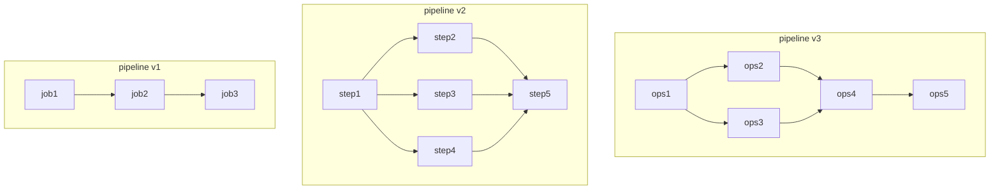

# OCI Data Science ML Pipelines

This folder contains samples for using OCI Data Science ML Pipelines

Machine learning pipelines are a crucial component of the modern data science workflow. They help automate the process of building, training, and deploying machine learning models, allowing data scientists to focus on more important tasks such as data exploration and model evaluation.

At a high level, a machine learning pipeline consists of several steps, each of which performs a specific task, working together to complete a workflow. For example, the first step might be data preprocessing, where raw data is cleaned and transformed into a format that can be fed into a machine learning algorithm. The next step might be model training, where the algorithm is trained on the processed data to learn the patterns and relationships within it. Steps can be executed in sequence or in parallel, speeding up the time to complete the workflow.
One of the key advantages of using machine learning pipelines is the ability to easily repeat and reproduce the entire workflow. This is important for ensuring the reliability and reproducibility of the results, and for making it easier to experiment with different algorithms and parameters finding the best model for a given problem.

Using pipelines, you can:

- Create ML pipeline by defining the workflow of the steps
- Write reusable code for each pipeline step or use existing ML Jobs as steps.
- Execute the pipeline, set parameters for each run.
- Monitor the execution of the pipeline and review logs outputted from the steps

Pipelines also enables the ability to orchestrate OCI Data Science Jobs, for example:



:bulb: Product documentation can be found [here](https://docs.oracle.com/iaas/data-science/using/pipelines-about.htm).

**NOTE**: You need `ADS` [(Accelerated Data Science) SDK](https://accelerated-data-science.readthedocs.io/en/latest/user_guide/pipeline/overview.html) `version 2.8` or above to use pipelines.

To check ADS version in your environment, open a termial window and run the command: ```pip show oracle-ads```

To update ADS version in your environment, open a terminal window and run the command: ```pip install oracle-ads --upgrade```

## Available Samples

### Simple pipeline with data sharing between steps

[simple pipeline](./samples/simple)
This is a very simple sample with 3 consecutive steps, each passes data to the next step for additional processing.

### Employee attrition sample

[employee attrition](./samples/employee-attrition)
This is a full featured pipeline, with data processing, parallel training of models, evaluating the models and deploying the best one into a real time Model Deployment.
